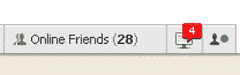

```yaml

分类：未分类

日期：2024-05-18 04:51:49

-->

# Magmasystems Blog: Facebook Notifier

> 来源：[`magmasystems.blogspot.com/2009/09/facebook-notifier.html#0001-01-01`](http://magmasystems.blogspot.com/2009/09/facebook-notifier.html#0001-01-01)

好吧，我已经无可救药地沉迷于 Facebook...我承认。

昨晚，外面下着大雨，美国公开赛网球比赛推迟，我决定写一些我长期以来一直想要的东西。一个坐在 Windows 系统托盘中的应用程序，当我有新的 Facebook 通知时通知我。我所说的“通知”是指带有数字'4'的红气球：

（[点击这里](http://steveconroy.files.wordpress.com/2008/12/facebook-notification-icon.jpg)）

有了这个功能，我就不用一直浏览到 Facebook 主页去检查我的动态。

幸运的是，有一个.NET Toolkit for Facebook

在这里：[`www.codeplex.com/FacebookToolkit`](http://www.codeplex.com/FacebookToolkit)

使用这个工具包，我从开始到完成我的通知器只花了大约两个小时。我又花了另一个小时来清理代码和将一些硬编码的东西如我的用户 ID、我的应用的秘密代码以及通知声音的播放周围的内容参数化。

我发现我必须使用 FQL（这是 Facebook 提供的类似于 SQL 的查询功能）来正确地检索我的 Facebook 通知的状态。Facebook 工具包给我的函数总是告诉我我没有通知。

我还增加了测试目的下的自定义通知功能。

这个应用程序只是为我一个人设计的，我不认为我会发布它。如果我真的想做一些严肃的事情，我会创建一个通用的通知工具包，能够跨越 Facebook、GMail、Yahoo Mail 等。每个这些服务都会有它自己的“输入适配器”作为通知框架的一部分。而且，我可能会将此与某种 CEP 引擎集成，以便可以将警报发送到 Facebook 账户。

也许将来有一天...

©2009 Marc Adler - 版权所有。

这里所有的观点都是个人的，并且与我的雇主无关。
