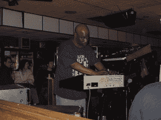

<!--yml

分类：未分类

日期：2024-05-18 05:21:28

-->

# Magmasystems 博客：RIP：道格·沃克（外星行星景观）

> 来源：[`magmasystems.blogspot.com/2006/04/rip-doug-walker-alien-planetscapes.html#0001-01-01`](http://magmasystems.blogspot.com/2006/04/rip-doug-walker-alien-planetscapes.html#0001-01-01)

道格·沃克，纽约太空摇滚场景的长期支柱和乐队外星行星景观的创始人，于 4 月 4 日星期二在家中去世。道格多年来患有心脏病，最终它找上了他。

道格是我最老的朋友之一。我 1975 年遇见了道格，并在 70 年代中后期与他一起在几支具有影响力的自由爵士乐队中演奏，包括伟大的第三太阳。

道格两年前在一场恐怖的车祸中失去了妻子弗兰。

道格留下了他的儿子埃文，他出生在我儿子出生三周后。

愿上帝保佑你，道格。现在你可以和罗伯特·莫格一起即兴演奏了。

©2006 马克·阿德勒 - 版权所有
