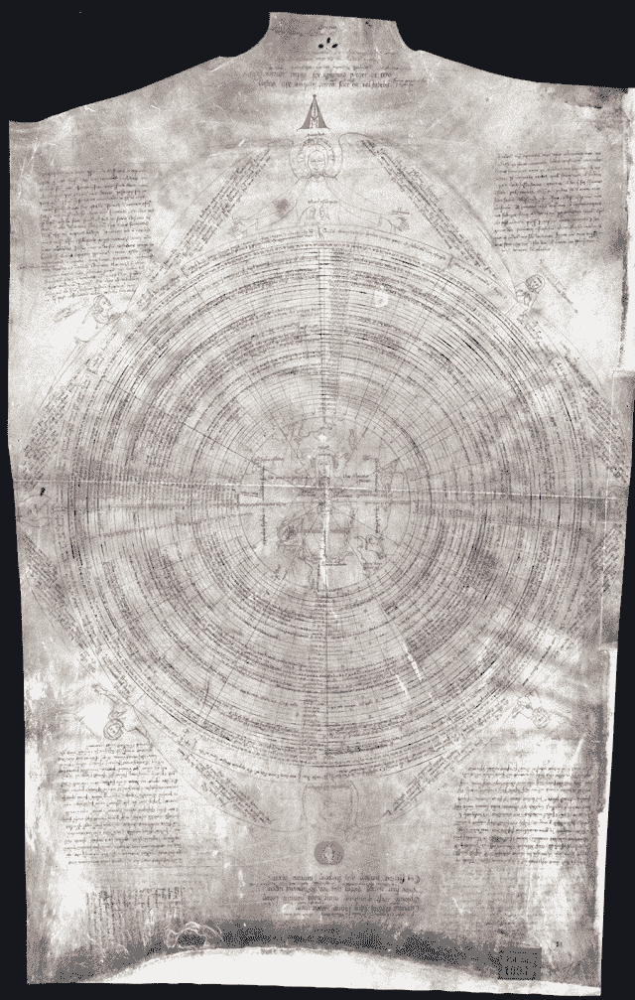

<!--yml

分类：未分类

日期：2024-05-18 14:14:17

-->

# 绘制心灵地图—— Mahwah 狙击手与朋友们

> 来源：[`sniperinmahwah.wordpress.com/2015/07/14/mapping-the-mind/#0001-01-01`](https://sniperinmahwah.wordpress.com/2015/07/14/mapping-the-mind/#0001-01-01)

这个博客已经相当安静了。年底真的很忙（我承担了太多的学术责任，我旅行得太多了，并且出版了[太多](http://www.zones-sensibles.org/livres/) [书籍](http://www.vies-paralleles.org) [书籍](http://www.theatre-operations.com/portfolio/dictionnaire-historique-et-critique/)）。像往常一样，我只在有空的时候（晚上和周末）研究市场结构和 HFT，但在九月中旬之前我不会休假，所以我将整个夏天都在工作，并且会有时间发布一些文字——关于时间的本质，关于为什么我在微秒、匹配引擎和订单流支付方面徘徊（有些人真的很想知道为什么一个人类学家会在微秒、匹配引擎和订单流支付方面徘徊），关于我最近尝试的[模式识别实验](http://www.theatre-operations.com/portfolio/dictionnaire-historique-et-critique/)，关于一个涉及一个侵犯了知识产权的男人的迷人故事（这个案例比 Aleynikov 案更有吸引力，尽管这个案例最近的[事件](http://www.reuters.com/article/2015/07/06/us-goldman-sachs-aleynikov-appeal-idUSKCN0PG1L020150706)也很惊人），以及其他事情。

说到这里，我仍然在访问高频交易楼层，与量化分析师讨论，了解新的电子交易池（即匹配引擎）并在我家后院寻找菜园。我将在九月初分三集发布“我家后院的高频交易”第二季——有些人可能认为我过于狂热，但相信我：研究那些微波网络真的很有趣，这个小世界值得一个*补充*。因为*创造者*在六天内塑造了世界，我将在十月初发布一篇长达六部分的系列文章，关于“QUANTLAB TECHNOLOGIES LTD. (BVI), AND QUANTLAB FINANCIAL, LLC, 原告，versus VITALIY GODLEVSKY, ANDRIY KUHARSKY, ANNA MARAVINA, PING AN, EMMANUEL MAMALAKIS, AND SXP ANALYTICS, LLC, 被告”，案件编号 4:09-cv-04039。几个月前，Quantlab 的名字出现在这里，因为公司里的某人访问了这个博客，然后我读了《华尔街日报》的 Bradley Hope 写的*非常好*的报道。[这里](http://www.wsj.com/articles/SB10001424052702303563304579445381552266144)访问楼层是一件事，阅读来自这样一个案件的成千上万的法庭文件是另一件事。通过将调查扩展到其他事务和其他法庭文件，这些成千上万的页面塑造了高频交易世界的有趣视角。

对于 SXP/Quantlab 案例，其有趣之处不仅在于世界的复杂性，还在于宗教。我正在研究市场结构与宗教之间的关系，这也是这个博客变得相当沉默的一个原因：我花太多时间阅读那些旧哲学家，例如，他们在 12 世纪末定义了“风险”这个词。多亏了这些中世纪僧侣，出现了新的视野，哲学答案也出现了（我会在*圣彼得堡的《Xenia》*系列中尝试谈论那些哲学家）。

第一个[追溯](http://www.ffsa.fr/webffsa/risques.nsf/html/Risques_81-82_0007.htm)这个词源的法国历史学家成了我的朋友，我们决定合作写一本与经济学无关的书：一本关于一位中世纪僧侣的书籍，他设计了一些我最难忘的插图：[奥皮钦诺·德·卡尼斯特里斯](https://en.wikipedia.org/wiki/Opicinus_de_Canistris)。奥皮钦诺（1296-1353），可能是因为他患有精神分裂症，留下了两份手稿（现在在梵蒂冈图书馆），里面有很多非常复杂的图表。以下是他的自传：

还有更多美丽的插图，我本可以在这里放置其他图片（一家日本制药公司的资助，他们研发抗精神分裂症药物，允许我们购买梵蒂冈的高分辨率文件），但我认为梵蒂冈的人不会喜欢这样。他们在权利方面非常严格（当书完成后，我会发布一些书籍的照片）。无论如何，这本书（预计将在十月份用法语出版，然后明年用意大利语、英语、德语等出版）可能是第一本不偏不倚地展示奥皮钦诺·德·卡尼斯特里斯的生活和工作作品的书。问题是，当你开始沉浸在这些图表中，当你花几个小时去理解它们，意识到它们都塑造了一个疯狂头脑的地图时，你会在某个时刻失去自己的理智。研究奥皮钦诺就像吸毒一样，是一场进入迷人世界的旅程——正如莎士比亚所写，“虽然这是疯狂，但其中却有方法”。我会尝试保持清醒。无论如何，接下来的几个月似乎都将与宗教有关。我是一个无神论者，但那些试图出于宗教原因玩高频交易游戏的人的故事表明，上帝从不遥远。这是一件好事。
