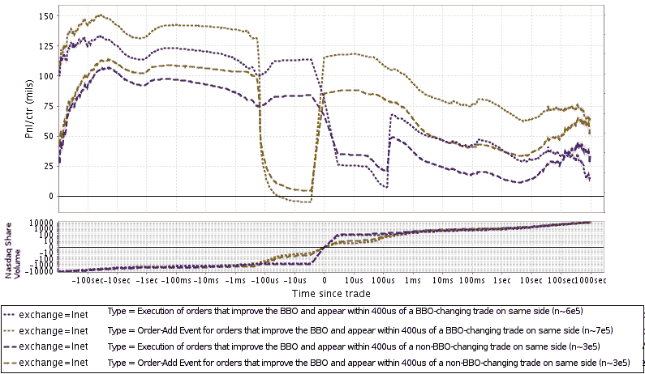
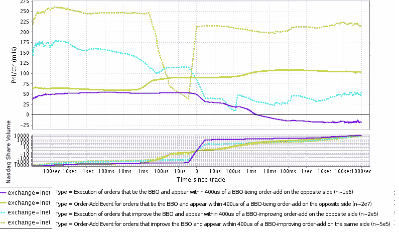
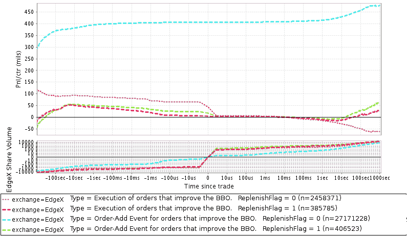

<!--yml

类别：未分类

日期：2024-05-18 06:43:31

-->

# 市场数据模式、订单预期和一个交易策略示例 | 机械市场

> 来源：[`mechanicalmarkets.wordpress.com/2015/04/30/market-data-patterns-order-anticipation-and-an-example-trading-strategy/#0001-01-01`](https://mechanicalmarkets.wordpress.com/2015/04/30/market-data-patterns-order-anticipation-and-an-example-trading-strategy/#0001-01-01)

我最近[讨论](https://mechanicalmarkets.wordpress.com/2015/04/12/spoofing-corrupts-markets-a-reply-to-john-arnold/)了预测工具价格与预期订单流不可分割的问题。但是，有时可以直接从执行算法或某些交易所订单类型的签名中预测订单流。在这篇文章中，我们将看到市场数据中与未来订单有关的一些常见模式。我还将概述一个以这些模式之一为主要特征的简单交易策略。

# 保留订单

保留订单（也称为“冰山订单”或[“MaxShow 订单](http://www.cmegroup.com/confluence/display/EPICSANDBOX/iLink+-+Order+Qualifiers#iLink-OrderQualifiers-Tag210-MaxShow)”）是一种在执行后以某种方式重新填充数量的休息订单。我相信保留订单的存在是由参与者隐藏其交易意图的全文的愿望所驱动的。例如，保留订单可能在任何时候显示 200 股，而其全部大小是那个数字的好几倍。下面是一个简化的工作原理说明：

1.  交易员提交了一个保留订单，购买 AAPL 的 5000 股，价格为 100 美元，设置订单在任何时候显示 200 股。

1.  市场数据显示一个新的 100 美元的出价，为 200 股。

1.  别人与那个 100 美元的出价进行了交易。

1.  市场数据显示一个新的 200 股的 100 美元出价。

1.  步骤 3 和 4 重复执行，直到 5000 股全部成交，价格变动，或者交易员取消订单。

想了解更详细的例子，请看纳斯达克北欧的这份[文件](http://www.nasdaqomx.com/digitalAssets/75/75620_nasdaqomxnordicmarketmodel2.6.pdf)的第 56-60 页。

你可能猜测，因为保留订单通常较大且需要隐藏，所以它具有大量的 alpha。你也许还能看出它们在市场数据中可能留下相当明显的签名。所以我们来查一下。下面是几种补单类型的绩效图表。

顶部面板：平均每股利润或损失与市场事件时间距离的关系。对于标记为“订单增加”的事件，线条遵循相对于订单价格和出现时间的市场价格轨迹。标记为“执行”的事件遵循后来成交的这些订单的价格轨迹，相对于执行价格和时间。这里的“市场价格”是指纳斯达克的 midpoint，而不是像之前的帖子中的最后交易价格，并且根据订单增加/执行的量分别加权。查看 midpoint 可以很容易地看到价格水平的交易穿透和随后的市场价格反弹。图表是 8 月份 6 天内的数据，不包括费用和回扣。底部面板：纳斯达克交易的股票与事件时间（包括这些事件任何部分的成交量）。

这些因补单而产生的订单确实具有明显的 alpha，即使它们被执行了。这在某种程度上令人惊讶，因为市场的大部分人应该知道这些订单可能是潜在的冰山。你可能期望在第一次补单后，只有非常有信心的参与者才会愿意与它们交易，而在几次补单后，交易者会变得越来越谨慎。大约 67%的这些展示的股票最终被成交，这个比例在任何标准下都很高。一般来说，高的成交率与更大的市场影响相关；然而，我们当然没有任何关于未被执行的这些订单隐藏部分的信息。

最重要的是，注意市场 midpoint 在交易后是如何倾向于反弹的，这或多或少证实了许多补单在后续交易后仍然继续被补单。同时，注意反弹的时间尺度在 200~400us 范围内，这比在纳斯达克交易的 HFT 的通常往返时间要长得多。我的猜测是纳斯达克通过其核心匹配引擎外的计算机处理保留订单。这可以解释这种延迟以及保留订单[不可用](http://nasdaqtrader.com/content/ProductsServices/Trading/Protocols_quickref.pdf)在高速[OUCH](http://www.nasdaqtrader.com/Trader.aspx?id=ouch)订单输入界面上的原因。当然，这些补单也可能是因为独立于纳斯达克的执行算法，但我怀疑事实上许多其实是保留订单。

# 预期订单流动

如果是这样，这是交易所订单处理可能对迈克尔·刘易斯所说的前端运行开放的一个很好的例子[3]。如果储备订单需要交易所大约 250 微秒来加油，那么如果有人试图在预期加油之前提交一个订单会发生什么？交易所延迟因情况而异，我自己没有在这些情况下测试过，但我敢打赌，在纳斯达克加油之前，一个 HFT 可以有自己的订单保持活动状态。 [4] HFT 甚至可以在几百微秒后删除他们的订单，如果储备订单在他们后面没有加油。我*不是*说这种情况正在发生，但如果如此，假设的 HFT 在他们没有在队列中后面的订单的情况下成交的风险相当有限，这通常被认为是可取的。

我的感觉是，这种由 HFT 进行的交易完全是合法的，即使它看起来有些可疑。HFT 的合规部门可能会禁止在没有人与其价格水平成交的情况下闪烁并快速删除订单，部分原因是这种活动可能表明一个策略希望通过其订单引发市场的反应。这不是我们在讨论的内容，但合规部门希望对任何类似市场操纵的交易保持高度警惕。

但是，如果我们模拟下一件最简单的事情呢？我们在这里并没有试图做太复杂的事情，所以让我们 just 选择一种最高性能的加油事件类型来模仿我们的策略。在加油时能提高 BBO 的事件的表现优于那些与 BBO 持平的事件（对于后者群体，这里同样的[分析](https://mechanicalmarkets.wordpress.com/wp-content/uploads/2015/04/inet_sfa_reserve_midpt_nontoxic_1366.png)如上）。加油订单显示超过 101 股的性能也显著更好。我们的策略将本质上是要复制这些订单。以下是模拟交易的结果，在发生这些加油事件之一后添加一个 100 股订单，模拟使其订单保持活动状态，直到它看到疑似的储备订单停止加油：

顶部面板：平均市场价格每股利润或损失与上述描述的策略模拟交易的时间距离。这里的“市场价格”是最后交易价格的度量，这就是为什么你在交易后看不到价格的快速反弹。图表是在 8 月份的 8 天（不同于上面的图表中的日子）。底部面板：纳斯达克交易的股票与交易时间（不包括模拟交易）。

即使这个简单的交易策略似乎也是盈利的。上述图表未包含费用和大约 0.30 美分/股的纳斯达克回扣，这些回扣显著提高了盈利能力。总的来说，至少在模拟中，这可以使每天的收入接近 20,000 美元。仅通过向纳斯达克发送 100 股订单，并以纳斯达克回填作为唯一信号，就有其他具有非常相似行为的交易所适用于这种策略。

# 自动化模式检测

在模拟中，在模拟订单之前的重新填充订单执行后，通常会在模拟订单后面再次出现重新填充。所以，这种模拟策略仍然在很明确地预期订单流。再次强调，我相信这种交易活动是合法的（并不是我是律师）。但这确实让我感到有些不舒服，我和我的公司也从未在实际交易中使用过这种信号或类似信号。但是，很容易想象这种市场数据模式在没有操作者意识到的情况下被用于交易策略。 [5] 量化分析师可以创建一个模型，该模型会自动在市场数据中寻找模式，并将其统计地结合起来进行预测，而不必实际查看这些模式是什么。 [6] 这种特定模式发生得相当频繁，所以我认为许多模式检测方法都会很容易地找到它。

我还要提到，有时市场数据中的某些模式并不明显类似于交易所订单类型，但仍然具有与我们的储备订单示例类似的预测能力。如下，我们可以看到在另一个订单出现在相反侧后不久添加的订单表现异常优异。

顶部面板：平均每股利润或亏损与市场事件时间距离的关系。“市场价格”此处仍为纳斯达克中点价格，并非最后交易价格。图表覆盖了八月份的 6 天，未包含费用和回扣。底部面板：纳斯达克交易的股票与事件时间关系（包括这些事件任何部分的成交量）。

作为此类事件序列的一部分订单 alpha 值相当高，如你所见。可能有各种各样的原因，包括：

1.  执行算法在看到价差缩小时使他们的报价更加激进

1.  其中一些可能是像上面那样的储备订单，并在一个方向上的交易和新订单之后进行回填（其他算法可能在该交易中添加该订单）。

1.  我不熟悉的交易所订单类型

1.  或者，考虑到[最近的事件](http://www.bloombergview.com/articles/2015-04-21/guy-trading-at-home-caused-the-flash-crash)，垃圾邮件发送。 （希望不是，我怀疑不是）。[编辑：关于垃圾邮件发送可能诱导某人与保留订单在相反方向上交易的例子，请参阅此[CME 纪律通知](http://www.cmegroup.com/tools-information/lookups/advisories/disciplinary/NYMEX-10-07963-BC-IGOR-OYSTACHER.html#pageNumber=1)]

# 算法交易工具使用签名的道德问题

使用这种特定的信号，它与交易所订单类型没有直接联系，在交易策略中是否不道德？我自己或我的公司都没有使用过它（或类似的东西），但我看不出这样做有什么问题。如果有人想要使用一个在市场数据中留下明显签名的执行算法，很难表示太多同情。

最终，对于这些订单的有效性，是提交这些订单的交易员负责。在理想的世界里，负责大量交易的交易员会对他们的执行方法进行仔细分析，并选择最适合特定情况的最佳方法。像冰山这样的订单类型是设计给 sophisticated participants 的算法工具。我认为重要的是要注意，许多最响亮地反对订单预期策略的人也有[市场的达尔文主义观点](http://johnhcochrane.blogspot.com/2015/04/just-when-you-thought-financial.html)并认为算法交易者不应该受到垃圾邮件发送者的保护。这种观点似乎与反对预测其他算法行为的订单预期策略的反对意见相冲突。上述市场数据模式，即使部分来自保留订单，也是算法交易的签名。如果你不介意算法交易者被垃圾邮件发送者欺骗，那么你不应该介意他们的订单流被他们向市场发布的信息所预期。

# 交易所改进

说到这里，我认为如果交易所能对其订单处理过程更加透明会很有帮助。例如，如果模仿执行算法的订单类型因为它们与撮合引擎在不同的计算机上运行而有较高的延迟，那么交易所也许应该提供延迟统计数据，这样用户就可以做出更加明智的选择。同样地，如果交易所能够添加一个简单的功能来帮助隐藏保留订单，为什么不这样做呢？例如，纳斯达克提供了保留订单用随机数量重新填充的功能， presumably with the intention of obfuscation. Why not offer functionality for reserve orders to be refilled at a random time interval as well? If refills didn’t just occur in a tight range of 200-400us, they would have been much harder for me to detect. Of course, many traders could just implement that functionality in their own iceberg algorithms if they wanted it. But it’s worth mentioning that some market data patterns, that are likely from traders’ algorithms (rather than exchanges’ algorithms), also seem to be due to the use of non-random timers – so exchanges are certainly not outside the mainstream here.

一些人可能还会说，我们的市场变得过于复杂，交易者越来越多地被迫使用他们不理解的订单类型。我对这种情绪有些同情，并且有[建议](http://www.ft.com/intl/cms/s/0/e9c66ddc-be7a-11e3-b44a-00144feabdc0.html)减少订单类型。但是，即使市场简化，大型交易者仍应该阅读交易所撮合引擎和计划使用的任何订单类型的文档。通常最详细的交易所文档不超过几百页，具体的订单类型通常在几页文档中说明——所有这些，虽然乏味，可能都可以在一天内读完。在纳斯达克对保留订单的情况下，[订单类型指南](http://nasdaqtrader.com/content/ProductsServices/Trading/OrderTypesG.pdf)中提供的简短描述可能足以让交易者理解，当保留订单重新填充时可能会泄露有价值的信息。市场专业人士得到的报酬相当丰厚，也许应该花时间阅读手册。

# 在 DirectEdge 上明确标记保留订单

更一般地说，交易所可能在订单类型范围内尽可能地保护客户信息。而且，当它们不能做到这一点时，它们可能应该尽可能清楚地解释，以防有些交易者没有阅读每个交易所文件。在 DirectEdge 的旧市场数据协议中（[p9](https://mechanicalmarkets.wordpress.com/wp-content/uploads/2015/04/denextgenmdmulticast-1-1-5.pdf)），有一个字段（“Replenish Flag”）揭示了新订单是否与保留订单相关：

> 这条消息表示对现有保留订单的补充。

我知道交易所为了保护客户信息而努力，所以我看到这个感到惊讶。正如我们所见，识别储备订单并不困难。但即便如此，如果一些冰山用户因为这个订单标志而感到不安，我也不会感到惊讶。市场数据分布的一种哲学是，更多的披露总是更好的；当 DirectEdge 选择包含这个标志时，他们可能就是基于这种假设在运作。

这个字段据我所知，在新市场数据协议中并没有传播，该协议是在 DirectEdge 与 Bats 平台整合后使用的。实际上，Bats 的[文档](https://www.batstrading.com/resources/membership/BATS_MC_PITCH_Specification.pdf)似乎强调保持这些信息保密的重要性：

> 为了更好地保护储备订单，BATS 按照以下方式处理与储备订单的执行：…
> 
> 当显示的储备订单部分刷新时，在 PITCH 馈送中为订单分配一个新的 OrderID。当剩余部分不为零时，这是通过一个 Add Order(0x21, 0x22, 或 0x2F)报告的。

在任何情况下，这是在标记订单添加和执行时市场的外观：

顶部面板：每股平均利润或亏损与市场事件时间距离的关系。这里的“市场价格”是指 EdgeX 的最新交易价格。图表覆盖了八月份的 6 天，不包含费用和回扣。底部面板：EdgeX 上交易的股份与事件时间的关系（包括这些事件中任何部分的成交量）。

看来这些订单也携带有价值的信息。与怀疑的纳斯达克储备订单一样，[带有此标志的大订单具有更大的 alpha](https://mechanicalmarkets.wordpress.com/wp-content/uploads/2015/04/edgex_sfa_bboimprove-addflag_reserve_feedaddqty_1366.png)。一个简单的策略，只是复制它们，在模拟中也是盈利的。我要说明的是，我和我的公司都没有使用这个标志（或类似的东西）作为信号。

# 添加与移除流动性

我喜欢模仿储备订单（或其他模式）的策略的一点是，尽管使用它们可能会让人感到尴尬（再次说明，尴尬并不暗示任何非法行为），但它们仍然发布流动性。被动交易，通常被称为增加流动性或市场制造，通常是被尊敬的活动，被看作是对市场的一项服务。作为显式订单预期策略的一部分增加流动性，颠覆了这一观念。 [7]

早期在本博客上发布的交易策略都移除了流动性，这是媒体经常不赞成的。那些专注于与[旧](https://mechanicalmarkets.wordpress.com/2015/01/20/identifying-trader-type-pt-2/)、[大](https://mechanicalmarkets.wordpress.com/2015/02/09/order-size-in-the-hft-era-identifying-trade-type-pt-3/)或[MPID 标记](https://mechanicalmarkets.wordpress.com/2015/02/16/protecting-client-interests-anonymity-in-us-equities/)的订单交易的激进策略，选择与表现出人类或零售起源特征的交易对手进行交易。所以，这些策略可能实际上移除了流动性，但就对手方而言，它们提供了值得称为市场造市商的有价值服务。

从纳斯达克北欧的[市场模型文档](http://www.nasdaqomx.com/digitalAssets/75/75620_nasdaqomxnordicmarketmodel2.6.pdf)第 28 页可以找到[1]。

> 订单的所有更改，包括保留订单的成交量（可见和总成交量）的更改，都是通过先取消订单然后插入新订单来完成的。此外，当订单簿中的可展示部分完全执行时，订单的非展示部分会递减（保持时间优先级），并发送一个新的可展示订单到订单簿中（具有新的时间优先级）。
> 
> 某些订单功能的技术实现意味着这些功能是以尽力而为为基础提供的。这意味着执行可能受到所谓的“竞态条件”的影响，并且结果可能受到其他（传入）订单的影响。例如，保留订单的开盘量或展示量的更新是在其他订单可能进入订单簿的时间完成的，从而使更新订单的优先级非确定性。

纳斯达克北欧使用 Inet 技术，因此可以合理猜测它们的美国市场具有类似的订单处理逻辑。但是，如果纳斯达克能提供一些澄清指导，那就太好了。美国交易所的披露状态（近年来有了显著改善）有时需要阅读外国类似产品的文档，以了解它们是如何运作的，这是令人担忧的。

保留订单在[纽约证券交易所 Arca](https://www.nyse.com/publicdocs/nyse/markets/nyse-arca/NYSE_Arca_Order_Type_Usage.pdf)的成交量约为 8%，在[纽约证券交易所](https://www.nyse.com/publicdocs/nyse/markets/nyse/NYSE_Order_Type_Usage.pdf)约为 4%。如果它们在纳斯达克也非常普遍，我也不会感到惊讶[2]。

我和其他人[认为高频交易并非如此](http://www.bloombergview.com/articles/2014-06-20/why-i-love-high-speed-trading)，当然不会那样称呼它。

4 参见 1 关于纳斯达克北欧对预留订单补给在队列中具有非确定性优先级的描述。

5 这件事对我来说或我的公司并不适用。

6 这并非建议，但合规部门要求开发者列出所有在交易策略中使用的类似模式的信号，这个想法并不糟糕。开发者可能会不假思索地自动添加信号，但合规部门在它们被用于实际交易之前审查这些信号是有道理的。除非有数万这样的特征，否则仍然可能创建自动工具来检查它们是否存在潜在的问题行为。

7 当然，你可以想象在其他消除流动性的策略中使用我们见过的订单模式。我觉得简单复制预期订单是捕捉它们部分阿尔法最纯粹的方法。
