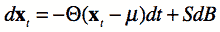
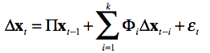
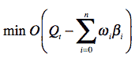
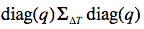
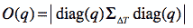
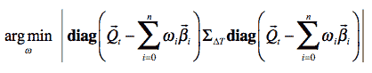
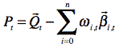

<!--yml

分类：未分类

日期：2024-05-18 15:27:44

-->

# 市场制造投资组合与对冲 | Tr8dr

> 来源：[`tr8dr.wordpress.com/2015/05/02/market-making-portfolio-hedging/#0001-01-01`](https://tr8dr.wordpress.com/2015/05/02/market-making-portfolio-hedging/#0001-01-01)

通过市场制造，我们可以尝试保持中性，通过倾斜价格以保持中性头寸。 在市场可能变得单边（在动量上）或者如果以不同的大小提供，可能会有大量请求的情况下，投资组合可能需要显式对冲。

在一个实时的市场制造场景中，我们可以根据情况确定如何对冲，并考虑在哪里实现对冲最便宜。 在外汇组合中，有机会用一个或多个其他货币对的头寸对冲一个货币的过剩头寸，可能会承担一些基差风险。

我的一个同事提出了一个有趣的反问题。 假设一个人知道投资组合历史上每个时间步长的净位置，并且想要推导出最保守的观点：

1.  投资组合是否对冲。

1.  它运行的位置（假设它没有对冲）

这个问题无法 definitive 地解决，因为任何关于对冲或风险的观点都假设了正向价格动态的模型。 然而，我认为一个合理的方法是：

1.  **确定资产之间均值回归的多变量模型**

    1.  这会使我们可以更灵活地配对那些倾向于均值回归而不是限制我们在紧密耦合动态（即接近 100%相关）的资产上进行对冲的资产。

1.  **确定残余投资组合的风险度量（在扣除均值回归位置后）**

    1.  即，我们通过缩放均值回归子组合来减少投资组合头寸。 如果完全对冲，在这些减少之后，剩余的投资组合头寸将接近 0。

**均值回归模型**

均值回归模型有多种选择。 其中一些最简单的是：

1.  多变量奥恩斯坦-乌伦贝克过程：

    

1.  向量误差修正模型（VECM）

    

1.  基于主成分分析（PCA）或独立成分分析（ICA）的分解。

    1.  可以使用分解中产生的向量产生均值回归的子组合

无论我们始于哪种表述，都可以将套期保值表示为资产子集上缩放投资组合的组合**x**。 也就是说，可以确定稀疏权重向量 β[0]，β[1]，…，β[n]，使得每个β[i]**x**的线性组合都是均值回归的，可能是协整的。 请注意，由于均值回归有不同的周期性以及资产之间的交叉关系，所以可以有多个包括相同资产的均值回归向量。

例如，在一个包含 EUR，JPY，CHF 的投资组合中，一个（协整）权重向量将是：[ 1.0, 0.0, -1.0 ]。

**优化问题**

假设我们有：

1.  均值回归向量β[0]，β[1]，…，β[n]

1.  在期间ΔT 的 x 回报的协方差矩阵，**Σ**[ΔT]

1.  净组合头寸：**Q**[t]

目标是找到在某些目标函数 O(q)减去缩放均值回归向量**ω**[i]**β**[i]后的最小净组合：

最合适的目标函数是一个表达组合残余风险的函数。为了简单起见，定义风险目标为寻找具有最小协方差矩阵体积（即行列式）的残余组合。直观地说，协方差矩阵中的向量高度对齐（相关）将具有较小的体积。同样，较低的方差将减少向量的大小（因此体积）。

给定单位头寸的协方差矩阵**Σ**[ΔT]，可以根据残差头寸向量**q**缩放协方差矩阵：

因此确定目标函数 O(q)为残差协方差的行列式：

将其全部组合在一起，我们希望最小化：

给定一个最小化向量**ω**，我们可以确定在时间步长**t**的残差未对冲头寸为：

**解决方案**

优化问题与打包问题类似，我们在其中尝试确定每种物品的多少单位，我们有 K 种不同的物品类型（我们的β向量），最优地填充一个袋子。

在我们的情况下，要装载的物品是β向量，而袋子是我们试图减少的头寸。我们试图确定使用每种β向量的多少单位与其他β向量结合，以实现最佳的减少（打包）。

为了将组合可能性减少到有限的数量，我们可以假设只使用了β向量的某些缩放方式。对于 FX 组合，市场通常会在一种货币（通常是基础货币）上交易 100K 的倍数。在股票中，通常的单位会是 100。

我们可以用组合方法（指数）解决，或者用贪心算法（多项式）或元启发式优化方法近似解决。

**附加说明**

我应该提一下，在评估投资组合风险时有很多方法可以采用。加里·贝斯因建议查看投资组合的 PCA 分解。PCA 绝对是确定投资组合方差的主要决定因素的一个有用的方法。我选择使用一种能够让我提取均值回归的子投资组合的方法。关于这一点，有很多方法，实在无法评论哪种是最好的。
