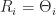

<!--yml

类别：未分类

date: 2024-05-18 14:01:29

-->

# 市场中性 - 量子金融家

> 来源：[`quantumfinancier.wordpress.com/2010/11/27/market-neutrality/#0001-01-01`](https://quantumfinancier.wordpress.com/2010/11/27/market-neutrality/#0001-01-01)

市场中性是金融领域经常提及的那些热门词汇之一；多家对冲基金宣称他们的策略是市场中性，并将其作为其主要营销工具。一些量化策略也旨在实现这一目标；配对交易是一个典型的例子，但那广阔领域中也可以包括统计套利的部分。

这引发了为什么要市场中性化的疑问？要回答这个问题，我们首先要讨论市场中性化意味着什么。考虑股票的日收益表示为。我们可以将收益分解为市场相关（系统性）部分和股票特定（个体差异）部分，得出以下方程：

这不过是普通最小二乘回归模型将股票的收益分解为系统性组件和一个不相关（不相关）组件。市场中性化是通过消除收益的系统性部分来实现的，等同于说：

暗示：

实质上，消除市场暴露，只暴露基于股票特定剖面的一部分收益，因此市场中性化。现在回到最初的问题：为什么要市场中性？简单地说；我们希望对一个证券下注，同时不对市场的方向下注。在像配对交易这样的相对价值策略中，我们是在对相对于彼此的表现超越的证券下注，无论市场如何变化，市场中性化都变得有意义。

然而市场中性化不仅在相对价值策略中考虑。想象一个交易策略组合的投资者。这个特定投资者的市场暴露可以认为是单个策略贝塔的资本加权平均：

其中是对策略的投资金额。

记住第一个方程，我们也可以以类似的方式分解投资组合的回报，包括系统性和特异性（策略组合特定）成分。为了获得市场中性，投资者可以空头（多头）市场期货或相应的 ETF，以满足第二个方程，有效地使投资组合回报的市场暴露中性化。

虽然这种方法并不一定能提高回报，但它通过降低暴露度，有可能更好地保护投资者免受市场风暴的影响。追求市场中性方法的好处之一是产生不相关的回报。Marketsci 最近的一篇帖子[Marketsci](http://marketsci.wordpress.com/2010/09/07/investors-don%E2%80%99t-really-want-absolute-returns/)解释说，大多数投资者似乎并不寻求绝对回报，但是如果你发现自己属于那种更喜欢绝对回报而非相对回报的类别，那么研究市场中性可能是值得的。我个人喜欢市场中性策略，如果感兴趣的话，我可以深入研究不同的技术，以获得比普通最小二乘法更可靠的市场中性，比如分位数回归。

量化因子（QF）
