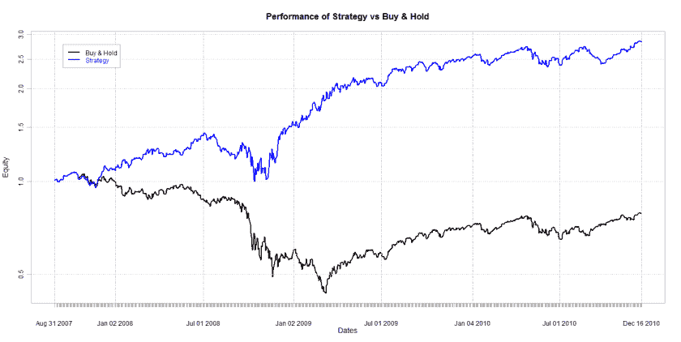
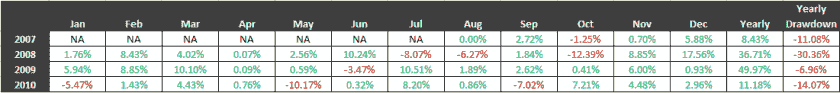

<!--yml

分类：未分类

日期：2024-05-18 14:01:05

-->

# 市场回放情绪扩散混音 - 量子金融家

> 来源：[`quantumfinancier.wordpress.com/2010/12/20/market-rewind%e2%80%99s-sentiment-spreads-remix/#0001-01-01`](https://quantumfinancier.wordpress.com/2010/12/20/market-rewind%e2%80%99s-sentiment-spreads-remix/#0001-01-01)

在这篇文章中，我想在评论区对这个帖子进行深入讨论：[使用市场回放“情绪扩散”的 S&P500 跨市场组合模型](http://cssanalytics.wordpress.com/2010/09/19/creating-an-ensemble-intermarket-spy-model-with-etf-rewinds-sentiment-spreads/)。ETF 先知的贡献者和 spreads 的最初构想者，皮特施先生在 CSS 使用情绪 spreads 来预测 S&P 500 方面发表了评论。引起我兴趣的是最后一个问题：*你能告诉我们如何使用弱学习者方法进一步提高性能吗？* 虽然最初是针对瓦拉迪先生的，但我感到有必要尝试这个想法。

上述帖子中提出的设置是支持向量机预测模型的一个好候选。你可以将这个过程视为将关于跟踪标普 500 的 ETF 的 spreads 的信息进行映射。这种方法，作为一种弱的集成学习形式，是单一指标/变量模型之后的下一个级别。从概念上讲，可以把市场运动视为大量（非常）信息的聚合。试图使用单个原始滤波器/信号/策略来处理市场并生成信号，没有适应性调整的话，长时间成功的机会很小。采用多变量适应性模型/策略往往有助于增加我们有利的概率。我会争论说，需要考虑的两个最重要的变量是价格行动和跨市场效应。大多数技术指标涵盖了价格行动方面。这些情绪 spreads 是一种简单的方式，将另一个非常重要的部分引入到量化策略中。目前，我只会考虑这些，但我计划扩展这个主题，并展示我们如何将价格行动和跨市场效应结合起来以获得最佳利益。以下结果是使用-svm 分类模型，在 spread 的最后 100 天进行训练得到的。请注意，由于我想把所有的七个 spreads 放在一起，样本非常小，随着更多数据的使用和日内数据的测试，将会很有趣来看看它的表现如何。

 [点击查看](https://quantumfinancier.wordpress.com/wp-content/uploads/2010/12/sentimentspread.png)

 [点击查看](https://quantumfinancier.wordpress.com/wp-content/uploads/2010/12/sentimentspread-restable.png)

QF
