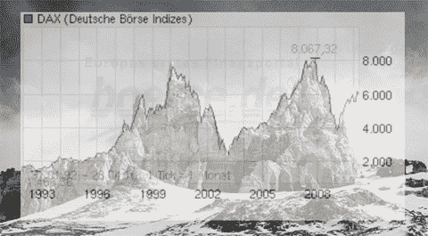
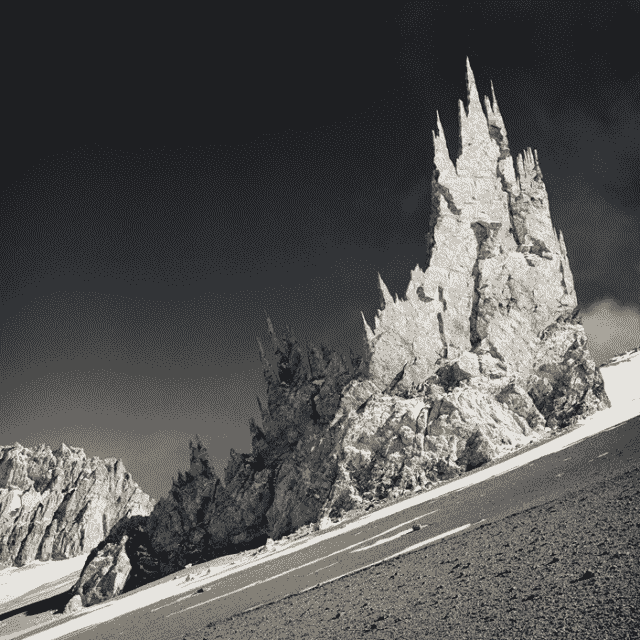
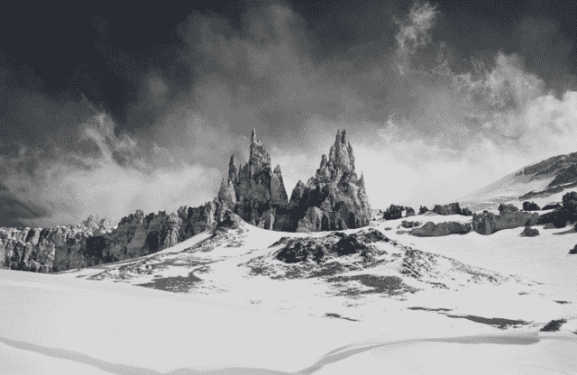
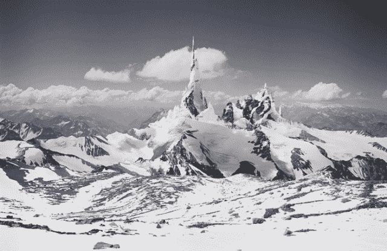

<!--yml

category: 未分类

date: 2024-05-18 14:24:54

-->

# 市场营销与艺术 - Sniper In Mahwah & friends

> 来源：[`sniperinmahwah.wordpress.com/2013/11/13/marketing-versus-art/#0001-01-01`](https://sniperinmahwah.wordpress.com/2013/11/13/marketing-versus-art/#0001-01-01)

阅读*[Traders Magazine](http://www.tradersmagazine.com)*总是令人愉悦，尤其是因为可以在其中找到广告。对这些广告进行符号学分析（类似于 Roland Barthes 的*Mythologiques*）是相当容易的，因为所使用的图像呼应了一些粗俗的符号，这标志着一种相当透明的市场营销……尤其是当涉及到流动性时。

让我们从 [Jones Trading](http://www.jonestrading.com/Home.php) 开始，他们的幽默不容忽视，正如这两则广告所证明的那样。第一则广告提到了 Bats Global Markets 在 2012 年 3 月 23 日的上市失败，该上市仅持续了一秒半；第二则广告暗指了 2013 年 4 月 23 日的 #hashcrash 事件，当时市场在 Twitter 账号被黑事件后暴跌，尽管这次小型崩盘实际上并非由机器引起 - “*people think, machines still don’t*” 也提醒了 IBM 的这个口号，*人们应该思考，机器应该工作*，在 1967 年的这则[广告](http://www.youtube.com/watch?v=PyBNR8ThrNQ)中也提到了这一点。

这则广告暗示了 Facebook 在 2012 年 5 月 18 日的上市表现，由于纳斯达克遇到的“技术问题”，该公司的股票上市表现相当糟糕：

还有所有围绕着市场*流动性*的广告，将硅谷交易员拟人化为冲浪者或滑雪者：

有时，旧的广告会变得非常讽刺，比如为 Knight Capital 所做的这个，他们声称“*Being Smarter is a Key*”，尽管 2012 年 8 月 1 日，Knight 显然并不是“最聪明的”，我在这篇文章[这里](https://sniperinmahwah.wordpress.com/2013/11/02/good-knight/)讲述了原因：

也有那种让你误以为机器能思考的 animist 广告：

还有一些广告会让你突然想去参加芝加哥期权交易所的会议，以便在讨论风险管理的同时，还能在泳池边享受阳光：

高盛银行（Traders Magazine 的第四大订阅者）有时会显得更有概念性（？!）：

当 Deutsche Bank 吹嘘它的 Stealth 算法时，我们突然间仿佛置身于 1982 年的电影《Tron》中：

这一切——实事求是地说——有些沉重。但幸运的是，还有其他擅长 Photoshop 的人，他们以更微妙的方式描绘了自然与金融市场之间的联系，比如这里：

© Michael Najjar

这幅照片是艺术家[迈克尔·纳贾尔](http://www.michaelnajjar.com)的作品，出自他的*高海拔*系列。纳贾尔花了三周时间在安第斯山脉最高的山峰阿空加瓜山一侧徒步，拍摄了数千张照片，然后用 Photoshop 进行再创作，将山峰之巅变成市场曲线，正如上面的图表所解释的那样：

（[来源](https://sniperinmahwah.wordpress.com/wp-content/uploads/2013/11/najjar_overlay.jpg)）

© Michael Najjar

高海拔*系列作品*既基于某些指数（如 DAX、日经 225、道琼斯工业平均指数等）的变化，也基于某些金融机构*波动不定的曲线*，正如下面这张展示雷曼兄弟从 1992 年到其 2008 年（突然）破产的*石板般*的视觉演变图所示：

（[来源](https://sniperinmahwah.wordpress.com/wp-content/uploads/2013/11/10.jpg)）

另一张照片展示了 DAX 指数（参见上面的图表，1993-2009 年）的变化：

（[来源](https://sniperinmahwah.wordpress.com/wp-content/uploads/2013/11/08.jpg)）

在这里，纳斯达克，从 1980 年到 2009 年：

（[来源](https://sniperinmahwah.wordpress.com/wp-content/uploads/2013/11/01.jpg)）

对于收藏家来说，这个系列的一张照片打印版价值在 5000 到 10000 美元之间。*高海拔*系列[在这里](http://www.michaelnajjar.com/ipad/gallery_high_altitude.html)展示，还有其他一些照片。最后，让我们以迈克尔·纳贾尔的话作为结尾：“*信息社会已经在我们的空间和时间理解上引起了翻天覆地的变化。人类面临着一个如此动态复杂的过程，以至于我们似乎在一瞬间识别出的边界在下一刻已经升华。在未来，虚拟价值体系可能在现实世界中要求其恰当的重生.*“
