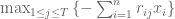
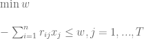
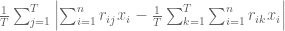
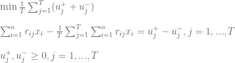

<!--yml

类别：未分类

日期：2024-05-18 14:48:29

-->

# 最大损失和平均绝对偏差风险度量 | Systematic Investor

> 来源：[`systematicinvestor.wordpress.com/2011/10/14/maximum-loss-and-mean-absolute-deviation-risk-measures/#0001-01-01`](https://systematicinvestor.wordpress.com/2011/10/14/maximum-loss-and-mean-absolute-deviation-risk-measures/#0001-01-01)

在典型[有效边界](http://en.wikipedia.org/wiki/Efficient_Frontier)的构建过程中，风险通常是通过投资组合收益的标准偏差来衡量的。最大损失和[平均绝对偏差](http://en.wikipedia.org/wiki/Median_absolute_deviation)是我将用来构建[有效边界](http://en.wikipedia.org/wiki/Efficient_Frontier)的替代风险度量。我将使用[Krokhmal, P., S. Uryasev 和 G. Zrazhevsky（2001）的论文](http://papers.ssrn.com/sol3/papers.cfm?abstract_id=297639)中提出的方法来构建最优投资组合。

让 x.i, i= 1,…,n 为投资组合中工具的权重。我们假设有 j= 1,…,T 个具有相等概率的回报情景可用。我将使用历史资产回报作为情景。我们将 r.ij 表示为情景 j 中第 i 个资产的回报。投资组合的最大损失（第 34 页）可以写成



这可以被表述为线性规划问题



这个线性规划问题可以很容易地实现

```

min.maxloss.portfolio <- function
(
	ia,		# input assumptions
	constraints	# constraints
)
{
	n = ia$n
	nt = nrow(ia$hist.returns)

	# objective : maximum loss, w
	f.obj = c( rep(0, n), 1)

	# adjust constraints, add w
	constraints = add.variables(1, constraints)

	#  - [ SUM <over i> r.ij * x.i ] < w, for each j = 1,...,T 
	a = rbind( matrix(0, n, nt), 1)
		a[1 : n, ] = t(ia$hist.returns)
	constraints = add.constraints(a, rep(0, nt), '>=', constraints)

	# setup linear programming	
	f.con = constraints$A
	f.dir = c(rep('=', constraints$meq), rep('>=', len(constraints$b) - constraints$meq))
	f.rhs = constraints$b

	# find optimal solution
	x = NA
	sol = try(solve.LP.bounds('min', f.obj, t(f.con), f.dir, f.rhs, 
							lb = constraints$lb, ub = constraints$ub), TRUE)

	if(!inherits(sol, 'try-error')) {
		x = sol$solution[1:n]

	}

	return( x )
}

```

投资组合的平均绝对偏差（MAD）（第 33 页）可以写成



这可以被表述为线性规划问题



这个线性规划问题可以被实现

```

min.mad.portfolio <- function
(
	ia,		# input assumptions
	constraints	# constraints
)
{
	n = ia$n
	nt = nrow(ia$hist.returns)

	# objective : Mean-Absolute Deviation (MAD)
	# 1/T * [ SUM  (u+.j + u-.j) ]
	f.obj = c( rep(0, n), (1/nt) * rep(1, 2 * nt) )

	# adjust constraints, add u+.j, u-.j
	constraints = add.variables(2 * nt, constraints, lb = 0)

	# [ SUM <over i> r.ij * x.i ] - 1/T * [ SUM <over j> [ SUM <over i> r.ij * x.i ] ] = u+.j - u-.j , for each j = 1,...,T 
	a = rbind( matrix(0, n, nt), -diag(nt), diag(nt))
		a[1 : n, ] = t(ia$hist.returns) - repmat(colMeans(ia$hist.returns), 1, nt)
	constraints = add.constraints(a, rep(0, nt), '=', constraints)			

	# setup linear programming	
	f.con = constraints$A
	f.dir = c(rep('=', constraints$meq), rep('>=', len(constraints$b) - constraints$meq))
	f.rhs = constraints$b

	# find optimal solution
	x = NA
	sol = try(solve.LP.bounds('min', f.obj, t(f.con), f.dir, f.rhs, 
							lb = constraints$lb, ub = constraints$ub), TRUE)

	if(!inherits(sol, 'try-error')) {
		x = sol$solution[1:n]
	}

	return( x )
}

```

让我们使用[资产配置介绍](https://systematicinvestor.wordpress.com/2011/10/13/introduction-to-asset-allocation/)中提供的历史输入假设来检查使用不同风险度量计算的有效边界：

```

###############################################################################
# Create Efficient Frontier
###############################################################################
	n = ia$n

	# 0 <= x.i <= 0.8 
	constraints = new.constraints(n, lb = 0, ub = 0.8)

	# SUM x.i = 1
	constraints = add.constraints(rep(1, n), 1, type = '=', constraints)

	# create efficient frontier(s)
	ef.risk = portopt(ia, constraints, 50, 'Risk')
	ef.maxloss = portopt(ia, constraints, 50, 'Max Loss', min.maxloss.portfolio)
	ef.mad = portopt(ia, constraints, 50, 'MAD', min.mad.portfolio)

	# Plot multiple Efficient Frontiers
	layout( matrix(1:4, nrow = 2) )
	plot.ef(ia, list(ef.risk, ef.maxloss, ef.mad), portfolio.risk, F)
	plot.ef(ia, list(ef.risk, ef.maxloss, ef.mad), portfolio.maxloss, F)
	plot.ef(ia, list(ef.risk, ef.maxloss, ef.mad), portfolio.mad, F)

	# Plot multiple Transition Maps
	layout( matrix(1:4, nrow = 2) )
	plot.transition.map(ef.risk)
	plot.transition.map(ef.maxloss)
	plot.transition.map(ef.mad)

```


**平均绝对偏差**和**标准差**这两种风险度量在结构上非常相似——它们都衡量平均偏差([The Mean-Absolute Deviation and Standard Deviation risk measures are very similar by construction – they both measure average deviation](http://www.leeds.ac.uk/educol/documents/00003759.htm))，因此它们的有效前沿和转换图接近并不令人意外。另一方面，**最大损失**度量的是极端偏差，其有效前沿和转换图与前两者非常不同。

要查看此例的完整源代码，请查看[github 上 aa.test()函数的代码](https://github.com/systematicinvestor/SIT/blob/master/R/aa.test.r)。
