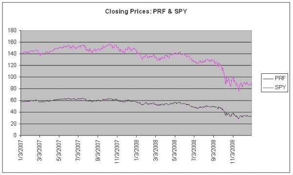
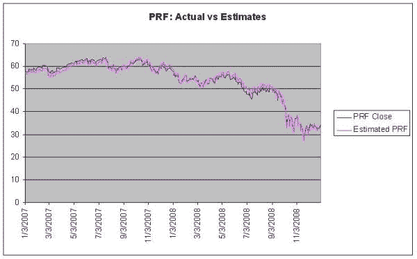
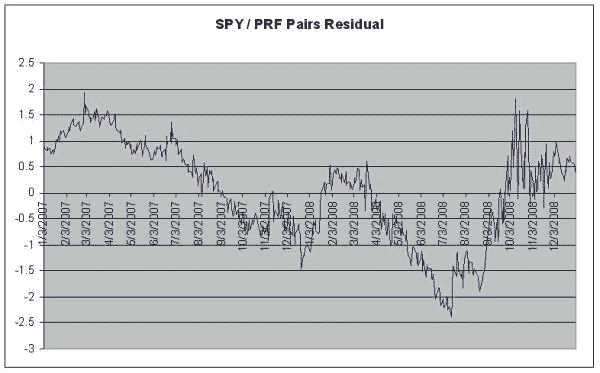

<!--yml

分类：未分类

日期：2024-05-18 13:56:12

-->

# [均值回归](https://quantivity.wordpress.com/2009/07/19/mean-reversion/#0001-01-01) | 量化性

> 来源：[`quantivity.wordpress.com/2009/07/19/mean-reversion/#0001-01-01`](https://quantivity.wordpress.com/2009/07/19/mean-reversion/#0001-01-01)

继续介绍金融市场的基本现象，或量化交易的底层风格事实。

均值回归是推动价格的两大力量中的第二股：

> “价格倾向于随时间平均。”([维基百科](http://en.wikipedia.org/wiki/Mean_reversion_(finance)))

理解金融市场的一个智力挑战是内化看似基本的矛盾：价格同时受到动量和均值回归的*相反*力量的*同时*推动。上升就是下降，左就是右。

均值回归是最普遍的现象之一，在各个不同的主题中以无数美丽的方式展现。例如，[奥恩斯坦-乌伦贝克过程](http://en.wikipedia.org/wiki/Ornstein%E2%80%93Uhlenbeck_process)是用于模拟均值回归的连续时间随机过程。[协整](http://en.wikipedia.org/wiki/Cointegration)来自时间序列计量经济学是线性组合系列的一个平稳性属性。[布林带](http://en.wikipedia.org/wiki/Bollinger_bands)是一个基于[标准差](http://en.wikipedia.org/wiki/Standard_deviation)的上下边界技术指标。均值回归也是[统计套利](http://en.wikipedia.org/wiki/Statistical_arbitrage)和[波动率套利](http://en.wikipedia.org/wiki/Volatility_arbitrage)等整个交易学科的基础。

均值回归很好地通过[配对交易](http://en.wikipedia.org/wiki/Pairs_trading)来展示，这是一种经典的统计套利交易策略。为了简单起见，考虑 2007-2008 年期间[SPY](http://finance.yahoo.com/q?s=SPY)和[PRF](http://finance.yahoo.com/q?s=PRF)的收盘价。这一关系潜在地很有趣，因为两者都是大型市值指数；它们的区别在于权重：PRF 是通过基本面加权，而 SPY 是通过市值加权。这一时期的股价图表是：

通过[最小二乘法回归](http://en.wikipedia.org/wiki/Least_squares)估算表明以下关系：

`PRF = -7.356 + (0.455 * SPY)`

这解释了观察到的 98.8%的方差（调整 R²），两项都是显著的（p 值<< 0.05）。请注意，标准的协整测试和相关分析有意被略过，以节省篇幅。PRF 的估计与实际收盘价图表表明相当好的拟合度：

从这张图中，计算 PRF 实际和预测收盘价之间的差异（或者，使用上述 OLS 的残差），这可以被看作在前一张图上两条线之间的垂直差异：

这个残差图美丽地展示了均值回归：SPY 和 PRF 之间有一个长期关系，其残差差异会回归到零（受限于由-7.356 截距值捕捉的偏移量，这代表了交易头寸每股的资本成本）。根据均值回归的知识，可以设计出许多交易策略。例如，当残差差异超过-2 时，做多 SPY/PRF 组合；相反，当残差差异超过+1 时，做空该组合。

这个例子说明了几个在依赖均值回归的策略中普遍存在的属性：

+   多 instrument 策略：两个或更多 instrument 之间的稳定性关系被利用

+   残差系列：使用一种统计技术（经典的是 OLS，现代技术从状态空间模型到贝叶斯估计器不等），生成由多种 instrument 组合（线性或非线性）组成的残差时间序列。

+   统计倾向：策略是由动态历史数据的统计概率收敛所驱动的

许多算法利用均值回归，无论是明确地还是隐含地。
