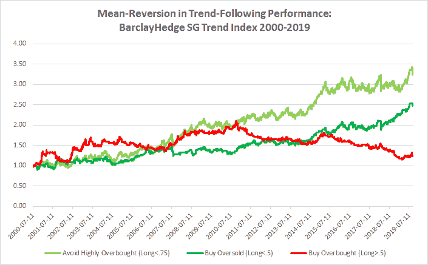
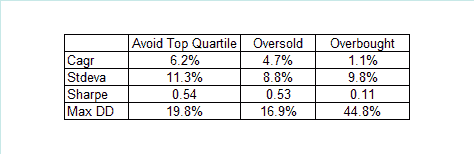

<!--yml

分类：未分类

日期：2024-05-12 17:40:16

-->

# 趋势追踪表现中的均值回归 | CSSA

> 来源：[`cssanalytics.wordpress.com/2019/09/18/mean-reversion-in-trend-following-performance/#0001-01-01`](https://cssanalytics.wordpress.com/2019/09/18/mean-reversion-in-trend-following-performance/#0001-01-01)

在[最近的一篇博客](https://cssanalytics.wordpress.com/2019/09/12/when-should-you-buy-momentum-mean-reversion-in-the-momentum-factor/)中，我展示了短期趋势中动量因子呈现均值回归的现象，并且这一效应可以有效用于交易因子和动量策略。一个明显的扩展是看看趋势追踪作为因子是否也呈现均值回归。毕竟，时间序列动量和动量在研究中已被证明是有关系的。

为了表示趋势追踪因子，我使用了 BarclayHedge SG 趋势追踪指数的数据，该指数捕捉了遵循系统趋势追踪方法的 CTA 的盈利性。为了保持一致性，我使用了原始文章中的相同方法：我取了 10 天的回报，并使用 5 期简单移动平均进行平滑，以减少噪音。然后我取了使用当时可用的所有历史数据点的平滑回报的百分位排名。超卖被认为是在回报的百分位排名低于中位数（<.5）时，超买是在回报的百分位排名高于中位数（>.5）时。持仓直到百分位排名再次超过（低于）中位数。作为第三种策略，我测试了避免表现最好的四分之一的策略（<.75），这是一种较低的换手率，或许是一种更现实的策略。

总的来说，我们看到趋势追踪表现（使用各种参数）呈现均值回归的证据（这在 2014 年初变得最为明显）。避免表现最好的四分之一的策略（当趋势追踪最近表现不佳时持有多头头寸）在较长时间内是有效的。

**最近帖子中强调的教训是，要在现代环境中有效行动，你必须成为一个逆向投资者**——在动量和趋势追踪策略表现不佳后买入它们。这种异常可能存在的原因是因为人们倾向于根据最近的表现来雇佣和解雇经理。作为一个轶事证据：很久以前我从事咨询工作时，我经常和同事开玩笑说某些客户特别擅长判断何时进入或退出策略：他们一不高兴，策略可能就触底了，他们一想要增加分配，策略可能就到顶了。在做出几次糟糕的分配/时机决策后，他们通常会完全放弃这个策略，声称它无效。

我在 2010 年的一次会议上做了一个关于策略表现均值回归的演讲，用的样本超过一百个不同的策略（包括均值回归和趋势追踪以及其他许多策略）。2010 年之后我在资金管理方面的经验没有丝毫改变。不幸的是，所有的市场营销都倾向于关注近期的表现，因此存在利益冲突：如果你理解策略在短期内会均值回归，那么你会在客户最不可能赚钱的时候进行市场营销。资产管理规模（AUM）的流动往往反映了这种方法的有效性。因此，[DALBAR 的研究](https://www.dalbar.com/)显示，平均投资者（其中大部分有顾问）明显低于他们的风险基准表现，这并不令人惊讶。
