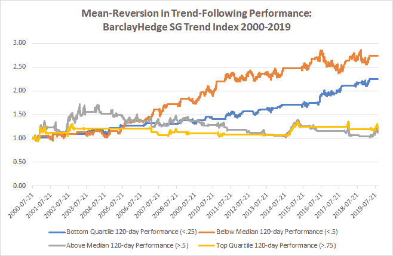
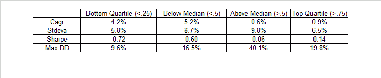

<!--yml

分类：未分类

日期：2024-05-12 17:40:00

-->

# 趋势追踪性能中的均值回归使用 120 天回溯 | CSSA

> 来源：[`cssanalytics.wordpress.com/2019/09/19/mean-reversion-in-trend-following-performance-using-a-120-day-lookback/#0001-01-01`](https://cssanalytics.wordpress.com/2019/09/19/mean-reversion-in-trend-following-performance-using-a-120-day-lookback/#0001-01-01)

在[上一篇文章](https://cssanalytics.wordpress.com/2019/09/18/mean-reversion-in-trend-following-performance/)中，我们展示了趋势追踪在短期内往往具有均值回归的特性。数据分析还表明，使用相同的方法，趋势追踪在使用 6 个月或 120 天的窗口时具有更强的均值回归效应。请查看下面使用 BarclayHedge SG 趋势指数的图表：

在前一篇帖子中，我假设均值回归效应存在是因为投资者倾向于追逐近期表现。但实际上，驱动趋势追踪者绩效的因素还有很多，包括较低的利率、较高的相关性，以及通常不太明显趋势。全球货币政策也可能起到了一定作用。 [Spring Valley 的一篇非常好的论文](https://www.springvalleyam.com/ctas-in-perspective)分析了一些影响趋势追踪绩效的因素。最终数据表明，你需要将这种效应纳入你的策略或资产配置方法，以便在使用趋势追踪方法时能够更一致地获得利润。
