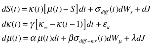
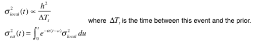
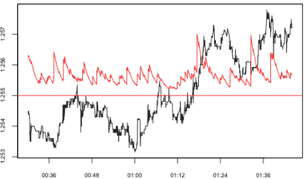
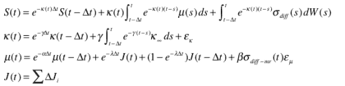

<!--yml

类别：未分类

日期：2024-05-18 15:36:27

-->

# 在平均回归背景下的均值| Tr8dr

> 来源：[`tr8dr.wordpress.com/2009/12/02/mean-in-the-context-of-mean-reversion-take-3/#0001-01-01`](https://tr8dr.wordpress.com/2009/12/02/mean-in-the-context-of-mean-reversion-take-3/#0001-01-01)

2009 年 12 月 2 日 晚上 7:45

我希望有一个运行均值估计器，在目标振幅或频率的平均回归周期中起到模式的作用。   关键特性应该包括：

+   **适应局部波动性**

    +   确定扩散相关平方回报

    +   确定跳跃相关平方回报

    +   确定跳跃应吸收多少到均值中

+   **平均回归模型**

    +   校准到期望的平均回归率

    +   允许回归常数和长期回归的变化

+   **均值模型**

    +   自回归

    +   创新按 sigma 项缩放（去除 MR 组件和跳跃）

+   **递归向后估计 ML**

    +   隐式决定创新如何在均值、平均回归和噪声之间分配

**基于 SDE 的方法**

该模型是熟悉的*奥恩斯坦*–*乌伦贝克*过程的扩展变体，具有特殊的平均回归、均值和波动过程。   它还试图修正跳跃。   让我们从以下 SDE（在连续时间）开始：

（图片 5）

**方差**

有许多建模波动性的方法（都有问题）。   最初，我以为要使用一个基于以下预测模型：

+   **强度过程**（基于“首次退出”持续时间）

    这是一个非常复杂的过程。   首先的近似是使用 ACD，一个基于持续时间的 AR 模型家族。   ACD 模型在 HF 数据上表现非常差。   似乎一个识别模式的马尔可夫链模型将是最合适的。

+   **振幅过程**

    平方回报的振幅似乎主要遵循一个 AR 过程。   这似乎相当行为良好。

在完全致力于复杂的波动模型之前，先尝试使用一个非预测的实际方差度量似乎是合理的。   我将使用：

（图片 7）](https://tr8dr.wordpress.com/wp-content/uploads/2009/12/picture-7.png)

α的选择决定了平滑程度，基于我们想要这个函数有多局部（或多噪声）。   例如，这里是用平滑因子 60 和阈值 3e-5 的估计：

（图片 3）

**离散化**

使用伊藤公式，我们将过程如下离散化：

（图片 8）

简化 S(t) 中的波动率项，我们首先要确定 SDE 的方差：

我们可以重新组织成如下形式：

**综合起来**

我们现在可以将其离散化，作为一个基于状态空间滤波器的模型，寻找适合后验理想化观点的参数，关于模式和均值回归过程。在参数化之后，该过程可以实时用于提供模式估计。

**最终说明**

正如您可能已经看到的，我在回到基于 SDE 的方法之前先暂时偏离了大约 2-3 周（这个过程很有用）。这绝不是一个最终的模型，但我认为它是一个扎实的起点。上述内容是我在一个多因子策略中的一个因素，我想要进一步优化这个策略。
