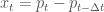

<!--yml

分类：未分类

日期：2024-05-18 06:45:01

-->

# 机械市场

> 来源：[`mechanicalmarkets.wordpress.com#0001-01-01`](https://mechanicalmarkets.wordpress.com#0001-01-01)

经济学中的一个核心挑战是理解价格如何影响供需量，这种关系通常被假设为大约是线性的。但是，有些市场中这种线性的观念，有时被称为“弹性”，可能不成立。在一份[论文](https://arxiv.org/abs/1506.03758)中，Donier 和 Bouchaud 展示迅速清算市场（具有布朗运动价格过程）的供需曲线平均形状是局部的二次的，没有线性项。

以下是总供给和需求随价格变化而变化的经典说明：

总需求随价格下降而减少——总供给随价格上升而增加。曲线在处相交，这是体积最大化的市场价格。 [1] 在市场价格附近，供给和需求随价格变化而线性变化。

如果我们“清算”市场，使得在处的供应与在处的需求相交易，那么曲线将看起来像：

这与第一个图表相同，只是向下移动了交易量。曲线在附近仍然是线性的。如果我们放大，平均供需曲线将看起来像 [2]:

但是，Donier 和 Bouchaud [3] 表明，具有某些特征的市场实际上将具有局部的二次平均供需曲线。即：

在这个阶段，一个市场订单的价格影响将与其大小的平方根成比例，平均而言。

他们的结果也引发了这样一个问题：一些市场是否在其生产和消费曲线的鞍点处运作，这可能看起来像：

其中是“鞍区”的粗糙宽度，曲线主要是二次的区域。

这让我觉得与经典经济画面有质的区别。这也直观地讲得通：当一个资产波动大时，很难确切知道供求平衡的价格。唐耶尔和布绍 aud 没有推测的大小，但至少有可能他们的结果适用于比预期更广泛的价格范围。如果任何实际市场有一个大的，估计其价格弹性将是困难的或不可能的。这也可能解释金融市场的冷漠——在那里，产生头条的价格变动对实际世界的供求没有多大影响。 [4]

# 唐耶尔-布绍 aud 模型

唐耶尔和布绍 aud（以及之前的合作者）使用了一个反应-扩散模型来得出这个结果。简单来说：

1.  以概率在时间间隔创建新的买入订单，其中是新订单价格()与市场价格()之间的差。卖出订单以概率创建。

1.  现有订单以概率取消。

1.  市场在每个周期时间间隔时清除——当买入和卖出订单的价格相交时，从市场中匹配并移除。

1.  价格的基础过程是布朗运动。

当很小时，他们显示供求曲线在局部是二次的，对于任何合理的和。

当然，现实世界的市场并不会立即清除交叉的元订单，即使市场在连续时间内交易。例如：一个交易者可能打算以任何低于$100/股的价格购买 1 亿美元的股票，而另一个交易者则打算以任何高于$90/股的价格出售 1 亿美元的股票。这两个交易者可能会在几周内逐渐发出他们的订单流，而不是立即以$90 至$100 每股的价格相互交易。 [5]

尽管如此，可以想象一些市场的行为仿佛它们处于小的极限。在比特币市场，交易者可能不像在传统市场那样倾向于隐藏他们的意图，并且可见订单簿可能代表市场价格附近的真实供需水平。作者在[图 6](https://arxiv.org/abs/1506.03758)中展示了比特币的平均显示供需，这与结算价格 2%内的价格的累计供需（通常累积供需约为 400k BTC）非常接近一个二次函数。所以电子市场的“马鞍区”可能与它们的日波动性一样宽，这并不令人惊讶；很少有石油生产商因为价格上涨 1%而增加钻探。

# 潜在流动性作为首次穿越时间

唐尼和布肖的结果似乎是布朗运动价格过程的一般特征，并不依赖于模型的具体细节。他们模型的精神提出了一个问题：在给定价格的边际供给/需求之间，是否存在联系，以及市场穿越该价格所需的时间。也就是说，潜在流动性是否具有与首次穿越时间统计类似的性质。

二次供给/需求曲线等价于边际供给/需求随价格线性变化。根据定义，在价格远离“真实”价格的累积供给()只是截至该价格的边际供给()的总和：。6 也可能被称为在价格可用的隐性卖出订单的体积。

达到唐尼（Donier）和布肖（Bouchaud）的结果的一种方式是假设随时间建立，在市场价格穿过之后。为了清晰起见，以下模型与唐尼和布肖所做的工作不同，且不够复杂，但我认为这是一种很好的捕捉直觉的方法。7

作为一个说明，考虑在结算价格从瞬间降至后潜在订单簿发生了什么。起初，在和之间的供给报价将为零：

之后，在这个新的间隙内，潜在的卖单将开始积累。我们假设  自价格跌破  起， 仅作为时间的函数增长：。[8] 函数 的确切形式并不重要。

如果市场在这次初始价格下跌后没有变动， 时间后，潜在的订单簿将得到补充。在  和  之间，将有数量  可供：

要计算  的期望值，我们需要自价格距离现价  的时间的概率密度：![\mathbf{p}_{y}^{LPT}[t]](img/261de928980b8329c9e6a5f496391ddb.png)。对于一个时间可逆的过程，这个分布与第一次通过时间的分布相同：![\mathbf{p}_{y}^{FPT}[t]](img/8a2e1c750a61d4c6db3d27d3c63ad6e0.png)。

对于连续时间布朗运动，第一次通过时间分布是众所周知的：

:

当  时，这是线性的 ：

 的边际供应约为：![\mathbf{p}_{y}^{FPT}[t] \approx \frac{y}{\sqrt{2\pi \sigma² t³}}](img/d4da148bc88a9447b2de89c72dd9ada8.png)

平均边际供应曲线是线性的，是：

 的期望是：![\mathbf{E}_{t}[\rho_{S}(t)] = \int_{0}^{T} \rho_{S}(t) \mathbf{p}_{y}^{FPT}[t] dt \propto y](img/51ce4c322c3930c2d4cd70c8023fb147.png)

其中  是市场运行的总时间。

因此，预期累积供应是  的二次方：![\mathbf{E}_{t}[S(y)] = \int_{0}^{y} \mathbf{E}_{t}[\rho_{S}(y')] dy' \propto y²](img/63839148f2315f51fef48c14e80ba7c5.png)。

模型在足够大的时应该会失败，因为从上次价格达到当前水平以来已经过去很长时间了。例如，如果油价超过了一年的最高点，达到了每桶 60 美元，那么我们可以预期边际供应接近 60 美元的水平会反映出石油开采的真实世界经济学。所以很明显，模型在的石油市场中不应该起作用。但是，如果油价仅仅超过了当天的最高点，边际供应可能只是一个与那段时长有关的机械函数。我们可以认为，当足够长，使得企业能够对新高的价格或低的进行反应时，模型将开始失效，这应该与商业决策之间的典型时间()相当。在这种情况下，对于流动性较差的市场来说可能会相当大。

# 离散化过程

如果，在批量拍卖中，市场在每个批次周期内都会清除，价格过程变得成为离散时间随机游走。无限长的应该会在本文顶部恢复未清的、经典的供需曲线。所以，随着的增加，我们预计会从布朗运动二次供应过渡到线性 regime。

为了得到离散市场的平均供应曲线，我们需要首次 passage 时间分布。当随机游走的

![\mathbf{p}_{y}^{FPT}[n] \approx (\frac{1}{2 \sqrt{\pi n³}} + \frac{y}{\sqrt{2\pi \sigma_{step}^{2} n³}}) e^{-y² / (2 \sigma_{step}² n)}](img/6cd9b4061377004bfc1a4c933bb0fbde.png)

其中是随机游走所采取的步骤数，是每个步骤的价格变动的方差。当并且有限时，这个近似是有效的。步数与连续时间有关，通过。如果基础过程是布朗的，那么。

当价格过程具有典型步长 () 微小于距离市场价格 () 的距离的步长 ()（），那么第二项将占主导地位，此时 ![E_{t}[\rho_{S}(t)]](img/485414731accd4556c0ddd7bd914c524.png) 与连续布朗运动情况相同。也就是说，当  时，累积供应与价格呈二次变化。

当过程被大量离散化时， 微小于  并且第一项占主导地位时，这将近似为常数。因此，边际供应将是常数，累积供应将与  成线性关系。

这个结果与 Donier 和 Bouchaud 的相同。实际上，如果我们在 ![\mathbf{p}_{y}^{FPT}[n]](img/968bf6f9ee78d0a8e70b4d7ced67883a.png) 中对 （接近市场价格）展开到一阶，那么我们得到：

![E_{n}[\rho_{S}(n)] \approx L(y + u_0 \sigma \sqrt{\tau})](img/0bc43329f433839bc0908ec5461a4292.png)

其中  是通过积分  获得的某个常数，由 Donier 和 Bouchaud 鉴定为流动性度量。而  是一个常数，与 Donier 和 Bouchaud 获得的常数  相差不远。[11][12]

因此，缓慢清算的市场——其强烈离散化——可能没有鞍区。[13]

# 当价格过程是 Lévy 飞行时的供给/需求曲线

上述渐近性适用于一类具有有限方差的随机游动，但市场可能具有更厚的尾部价格波动，特别是在较短时间尺度上。如果 Lévy 飞行的指数为 ，则具有发散方差和幂律尾部的价格增量 ()：![\mathbf{p}[x] \sim \frac{1}{|x|^{\alpha + 1}}](img/8087ff15e28058fecc89c6bbbaf539d0.png)。

Lévy 飞行的首次穿越时间具有渐近概率密度函数：[14]

![p_{y}^{FPT}[t] \sim \frac{y^{\alpha / 2}}{t^{3/2}} ](img/9c172ddb63af1bc0a192fb24a3ee71ba.png) 当  较长时。[15]

这种分布平均给出累积供应曲线。并且市场订单将具有价格影响。作为一个例子，将对应于一个相当“跳跃性”的市场，并且将具有和。 [16]

# 子扩散价格过程的供需曲线

一个子扩散的波动性随时间尺度的增加比普通布朗运动的波动性增加得慢。例如：。当时，波动性随时间尺度的增加以通常方式对布朗运动进行：与时间尺度成线性。当时，该过程是一个子扩散。子扩散市场在某种意义上具有均值回归，即价格波动未来可能被逆转。因为子扩散市场具有“记忆”，所以它们被认为是“无效”的。 [17]

子扩散的第一个 passage 时间分布是渐进的：[18]

![\mathbf{p}_{y}^{FPT}[t] \sim \frac{y}{t^{1 + \gamma / 2}} ](img/39c7c475de6b4b72d0a0a8924be8fc64.png)

这与普通布朗运动的线性价格依赖性相同。因此，累积供应量再次是二次的，市场影响再次是平方根。

某些类型的“效率”可以[导致平方根价格影响](https://mechanicalmarkets.wordpress.com/2016/08/15/price-impact-in-efficient-markets/)。但如果这个模型大致准确，那么像子扩散这样的“无效”市场也可能有平方根影响。

**更新**：Benzaquen 和 Bouchaud 刚刚研究了子扩散的[反应-扩散模型](https://arxiv.org/abs/1704.02638)。他们表明潜在的订单簿是局部线性的（等式 10），这与这里粗略的第一 passage 分析相似。对于快速执行的元订单，他们得到。但对于在执行中途给潜在订单更多反应时间的慢速元订单，他们得到。

# 扩散和子扩散中影响的数量级缩放

我觉得这个结果有趣，因为它乍一看似乎与最简单、数量级的“推导”平方根影响法则相矛盾。但仔细观察后，我认为数量级逻辑与子扩散和普通扩散具有类似的影响缩放是一致的。

如果市场是布朗运动，则其价格变化将与  成比例。价格发现的观点之一是，价格变化的一小部分（数量级为 1）来自交易者的影响。因此，元订单的影响将与订单持续时间平方根大致成比例： 。市场总体成交量随时间以恒定速率累积 ()，所以规模为  的元订单会持续  时间。这给出了 。

现在，如果市场是亚扩散的，则其价格变化随时间更慢： 。如果上述论点其他一切均相同，那么我们会得到 。但没有理由期望亚扩散市场的成交量应以恒定速率发生于时钟时间。

亚扩散可以被重新表述为具有独立增量的过程，其中步骤之间的变量时间具有长尾。在这种表述下，步骤可能对应于交易活动——每个步骤的成交量大致为 。元订单会持续  个步骤，其中 。这种亚扩散的步骤长度具有有限方差 ，因此我们可以遵循与布朗运动案例相同的论点，用步骤计数代替时间： ——这与平方根比例相同。

# 结论

市场行为即是群体行为，而且一个群体可能比其中的个体更容易预测。唐纳器和布绍 aud 在其松散的解释中表明，当市场是机械且乏味的时候，它们将具有大致上二次累积供需曲线。现在，很多人认为市场并不乏味！即使许多市场确实在鞍点运行，鞍区可能并不宽泛。但是如果有的话，小价格变动对生产和消费的影响可能几乎为零，而大幅价格变动可能产生巨大影响。这与标准直觉不同。

1 这个图显然是启发性的。供需曲线众所周知有很多形状，可能是[非单调的](http://www.nber.org/papers/w13243)，并且在局部最大化交易量可能有一个以上的价格。

2 在附近的供需曲线应该（可能）关于是对称的，如果我们对给定市场的一些情况集合进行平均。

3 借鉴他们与 Bonart，Deremble，de Lataillade，Lempérière，Kockelkoren，Mastromatteo 和 Tóth 的早期工作（例如[2014](https://arxiv.org/abs/1412.0141)和[2011](https://arxiv.org/abs/1105.1694))。

4 即使大的价格变动几乎不影响供需，它们仍然可以发挥重要的经济功能。交易者的观点和信息被融入价格中，当市场透明时，这些价格提供了长期商业决策的有用信号。

5 [Waelbroeck 和 Gomes](https://papers.ssrn.com/sol3/papers.cfm?abstract_id=2291720)的第 1 表和第 13 图表明，大部分机构股票的元订单期限少于几天。

6 需求方面也是类似的。为了简化，我们只讨论供给侧。

7 潜在流动性通常是不可观测的，因此我们无法轻易地测试假设：潜在流动性在给定价格随着时间的推移而建立。但是，潜在流动性可以通过订单簿来衡量——如果一个市场被高度金融化、透明，并且由不隐藏其意图的交易者主导。可以说，比特币就是（或曾经是）这样的市场。

8 我们可以在中添加一个独立的随机噪声项，这不会影响结果。假设没有显式的价格依赖性，这与 Donier 和 Bouchaud 的例子（常数和）相似。这个假设显然是错误的，但如果足够接近市场价格，它可能是合理的。

参见企业的反应时间可能比人类决策的时间尺度长得多。特别是在所讨论的市场不透明或尚未成熟的情况下。例如，如果一个农民从种植橄榄转向种植杏仁，她的果园可能需要几年时间才能再次产生效益。因此，杏仁的价格可能需要达到多年的高点，这样她才会足够自信地切换作物。但是，如果农民能够对未来的产量进行套期保值，她在经济上合理时可能会迅速决定切换作物。或许一个发达的期货市场将这个模型的有效范围从减少到了。

参见在[Majumdar](https://arxiv.org/abs/0912.2586)的文献中第 38 个等式及其引用中的详细信息。我将等式 38 的累积分布函数(CDF)转换成了概率密度函数(PDF)，并去除了一个非主导项。

参见[等式 22](https://arxiv.org/abs/1506.03758)。

参见 Sparre-Andersen 比例适用于任何具有价格变动连续和对称分布的马尔可夫过程：对于很大的，首次穿越时间分布必须像那样衰减。因此，为了使的期望值收敛，我们必须有对于很大的（假设是单调递增的）。也就是说，在给定价格下的边际供应必须比自市场处于该价格以来时间的平方根增长得更慢。潜在流动性与首次穿越时间之间的联系在非常长的时不会保持，但是这可能提供了潜在流动性能够恢复的速度的一个宽松界限。

参见根据该模型，当价格变动足够大（因此最后一次穿越时间长）时，缓慢清除的供需曲线仍然由二次项主导。但是，在非常长的时间尺度上，当企业能够对价格变动做出反应时，模型应该会失败。尽管如此，如[9]所述，如果市场缓慢且不透明，模型的有效时间尺度可能会更长。

参见例如，在[Koren 等人](https://arxiv.org/abs/0706.3641)的文献中第 10 个等式。

参见[图 2](https://arxiv.org/pdf/0706.3641.pdf)显示，经过几个时间步之后，这种渐进结果的收敛速度相当快。

也许 impact 比布朗运动的情况更陡峭并不令人惊讶。直观地说，Lévy 尾巴使得市场更加“动量驱动”。在 Lévy 类型的市场中，一个发起价格运动的交易者可能会发现市场很快远离她。这里使用的 Lévy 过程具有独立增量，但我们可以在连续时间内的“中增量”想象独立性 breakdown。即，动量交易者可能在时间步长中间交易是可想象的。

顺带一提，Koren 等人 [17] 显示 Lévy 飞行中的平均跳跃长度发散。跳跃长度可以被理解为止损订单的利润，*如果*它们在价格跳跃中间执行并且能够在尾事件期间击中流动性。这些都是很大的“如果”，但潜在的无限利润可能部分解释了止损订单和短期动量策略的流行。这也可能解释为什么交易员不愿意将太多流动性远低于当前价格。

在低交易成本的亚扩散市场中，押注均值回归是一种盈利的策略。如果你知道有类似这样的电子市场，请让我知道。

即使亚扩散在电子市场中很少见，不同资产的线性组合仍然可能是亚扩散的。典型的“配对交易”涉及两种资产价格之间的均值回归差。另外，亚扩散在更广泛的场外经济中可能比我们预期的更常见。

[见 Metzler 和 Klafter 文章](http://www.agnld.uni-potsdam.de/~metz/papers/2000_MeKla_PhysA278.pdf)中第 30 式序列展开的第一个非常数项。式 30 是生存概率（即首次穿越时间累积分布函数），其概率密度函数是时间导数。当时这个近似是有效的。是“分数扩散系数”，与（当时的情况)相对应。

请注意，亚扩散不是马尔可夫过程，所以 Sparre-Andersen 规模 [12] 不适用。流动性必须比更慢地补充，对于大的。

相关等待时间也可能导致亚扩散 [19] 在具有独立增量的过程中。
