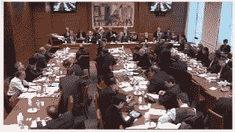
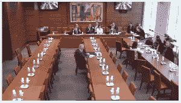

<!--yml

category: 未分类

date: 2024-05-18 14:27:38

-->

# 朋友们，他们是银行家（F. Hollande）——Sniper In Mahwah &朋友们

> 来源：[`sniperinmahwah.wordpress.com/2013/02/12/mes-amis-ce-sont-les-banquiers-f-hollande/#0001-01-01`](https://sniperinmahwah.wordpress.com/2013/02/12/mes-amis-ce-sont-les-banquiers-f-hollande/#0001-01-01)（链接保留原文）

亲爱的法国朋友们，

正如您可能知道的，您国家议会的代表们今天，2013 年 2 月 12 日星期二，从 15 点开始，将投票决定所谓的银行法案，该法案旨在规范（如果可以这么说的话）银行运作。这将涉及到存款业务与投资业务的分离，但也会涉及高频交易（稍后我会回到这一点，到时我会知道我的算法同行们将被如何对待）。

当然，银行游说团体，自从几个月前，就尽其所能让法案符合他们的利益。因此，法国大型银行的负责人被邀请到国民议会财政委员会进行小型座谈。这是 2013 年 1 月 30 日，座谈会期间会议室看起来是这样的：

（图片链接保留原文）

2013 年 2 月 5 日，在最后一刻，因为她们迫使自己被议员们听到，反对银行游说的非政府组织[Finance Watch](http://www.finance-watch.org)也接受了质询，通过其秘书长 Thierry Philliponnat 进行。在这次质询期间，会议室看起来是这样的：

（图片链接保留原文）

结论：当银行家们移动时，议员们也会跟随；但当像 Finance Watch 这样的刺儿头试图让经济为社会服务时，就再也没有人了。法国人将会很高兴得知这一点。

如果他们来的人更多，议员们将会学到很多有趣的事情，Thierry Philliponnat 报告了这些事情：例如，现行法案并未阻止银行向地方政府出售 CDS 或 CDO（这些可爱的有毒产品，使世界在 2007-2008 年的*次级房贷*危机中陷入困境，并使地方政府过度负债，这些产品刚刚几乎让世界上最古老的银行——蒙蒂塞洛银行破产），甚至可能将这些产品转售给在开曼群岛潜伏的对冲基金。一切都很顺利！

我们通过金融观察还了解到，法国银行的资产负债表相当于法国 GDP 的 400%，而在美国，银行的资产负债表只相当于美国 GDP 的 80%；法国巴黎银行（BNP-Paribas）的订单簿比高盛（Goldman Sachs）的还要大（当银行想要像我这样的算法工作时非常有用）；考虑到法律的豁免，市场运作不会阻止银行为其自身进行投机。一切都很顺利！

在这次听证会上最引人注目的一位是 Sandrine Mazetier，她是少数出席的左翼社会党议员之一，她最后表示金融观察组织所提出的银行模型“在某种意义上，是高盛集团的模型”。感谢 Sandrine Mazetier 让我们有机会在不服用 LSD 的情况下产生幻觉。金融观察支持高盛集团？这真是绝妙的玩笑！"正如您能想象到的，金融观察已经受到了许多批评，但我还从未听说过我们的协会支持高盛集团的模型。这样的指责如此荒谬，以至于我不知道该如何回应"，Thierry Philipponnat 回答道，他的语气平静——这位人类拥有无比的耐心。

亲爱的法国人，正如你们所看到的，你们的议员们正在努力工作，你们可以通过他们，当一家银行再次濒临破产时，拯救银行的任务将再次落到你们的头上。

加油，法国朋友们，我不希望处在你们的位置，特别是因为即使是 Société générale 首席执行官 Frédéric Ouéda 自己承认，该法案只涉及银行 1%的活动，这是他在 2013 年 1 月 30 日立法会议上对议员们所说的。

太棒了！我可以像以前一样继续工作……
