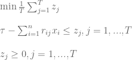
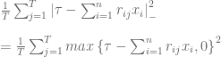
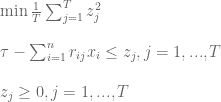

<!--yml

category: 未分类

日期：2024-05-18 14:47:45

-->

# 最小化下行风险 | 系统投资者

> 来源：[`systematicinvestor.wordpress.com/2011/11/01/minimizing-downside-risk/#0001-01-01`](https://systematicinvestor.wordpress.com/2011/11/01/minimizing-downside-risk/#0001-01-01)

在**最大损失和均值绝对偏差**风险度量以及**预期损失（CVaR）和条件回撤风险（CDaR）**文章中，我开始了关于使用替代风险度量来构建[有效前沿](http://en.wikipedia.org/wiki/Efficient_Frontier)的讨论。我想讨论的另一替代风险度量是**下行风险**。

在传统的均值-方差优化中，无论是高于还是低于均值的回报都会贡献到投资组合风险（通常由投资组合回报的标准差来衡量）。在**下行风险**框架中，只有低于均值或低于[目标回报率（MAR）](http://www.investopedia.com/terms/d/downside-deviation.asp)的回报才会贡献到投资组合风险。我将讨论两种下行风险度量：**下侧半方差**和**下侧半绝对偏差**。我将使用[H. Konno, H. Waki 和 A. Yuuki (2002)论文](http://www.kier.kyoto-u.ac.jp/fe-tokyo/workingpapers/AFE-KyotoU_WP01-e.html)中提出的方法来构建最优投资组合。

设 x.i, i= 1,…,n 为投资组合中各工具的权重。假设 j= 1,…,T 的回报情景具有相等概率可用。我将使用历史资产回报作为情景。设 r.ij 为第 i 个资产在情景 j 中的回报。投资组合的**下侧半绝对偏差**（第 6 页）可以写成


它可以被表述为一个线性规划问题



这个线性规划问题可以很容易地被实施

```

min.mad.downside.portfolio <- function
(
	ia,		# input assumptions
	constraints	# constraints
)
{
	n = ia$n
	nt = nrow(ia$hist.returns)

	mar = ia$parameters.mar

	# objective : Mean-Lower-Semi-Absolute Deviation (M-LSAD)
	#  1/T * [ SUM <over j> z.j ]
	f.obj = c( rep(0, n), (1/nt) * rep(1, nt) )

	# adjust constraints, add z.j
	constraints = add.variables(nt, constraints, lb = 0)

	#  MAR - [ SUM <over i> r.ij * x.i ] <= z.j , for each j = 1,...,T 
	a = rbind( matrix(0, n, nt), diag(nt))	
		a[1 : n, ] = t(ia$hist.returns)
	constraints = add.constraints(a, rep(mar, nt), '>=', constraints)					

	# setup linear programming	
	f.con = constraints$A
	f.dir = c(rep('=', constraints$meq), rep('>=', len(constraints$b) - constraints$meq))
	f.rhs = constraints$b

	# find optimal solution
	x = NA
	sol = try(solve.LP.bounds('min', f.obj, t(f.con), f.dir, f.rhs, 
					lb = constraints$lb, ub = constraints$ub), TRUE)

	if(!inherits(sol, 'try-error')) {
		x = sol$solution[1:n]
	}

	return( x )
}

```

投资组合的**下侧半绝对偏差**（第 7 页）可以写成



它可以被表述为一个二次规划问题。



这个二次规划问题可以被实现。

```

min.risk.downside.portfolio <- function
(
	ia,		# input assumptions
	constraints	# constraints
)
{
	n = ia$n
	nt = nrow(ia$hist.returns)

	mar = ia$parameters.mar

	# objective : Mean-Lower Semi-Variance (MV)
	#  1/T * [ SUM <over j> z.j² ]
	f.obj = c( rep(0, n), (1/nt) * rep(1, nt) )

	# adjust constraints, add z.j
	constraints = add.variables(nt, constraints, lb = 0)

	#  MAR - [ SUM <over i> r.ij * x.i ] <= z.j , for each j = 1,...,T 
	a = rbind( matrix(0, n, nt), diag(nt))	
		a[1 : n, ] = t(ia$hist.returns)
	constraints = add.constraints(a, rep(mar, nt), '>=', constraints)					

	# setup quadratic minimization
	Dmat = diag( len(f.obj) )
	diag(Dmat) = f.obj
	if(!is.positive.definite(Dmat)) {
		Dmat <- make.positive.definite(Dmat)
	}	

	# find optimal solution	
	x = NA
	sol = try(solve.QP.bounds(Dmat = Dmat, dvec = rep(0, nrow(Dmat)) , 
		Amat=constraints$A, bvec=constraints$b, constraints$meq,
		lb = constraints$lb, ub = constraints$ub),TRUE) 

	if(!inherits(sol, 'try-error')) {
		x = sol$solution[1:n]
	}

	return( x )
}

```

让我们检查一下在 [资产配置简介](https://systematicinvestor.wordpress.com/2011/10/13/introduction-to-asset-allocation/) 一文中提到的不同风险度量下计算的有效前沿：

```

# load Systematic Investor Toolbox
setInternet2(TRUE)
source(gzcon(url('https://github.com/systematicinvestor/SIT/raw/master/sit.gz', 'rb')))

#--------------------------------------------------------------------------
# Create Efficient Frontier
#--------------------------------------------------------------------------
	ia = aa.test.create.ia()
	n = ia$n		

	# 0 <= x.i <= 0.8
	constraints = new.constraints(n, lb = 0, ub = 0.8)

	# SUM x.i = 1
	constraints = add.constraints(rep(1, n), 1, type = '=', constraints)		

	# Set target return (or Minimum Acceptable Returns (MAR))
	# and consider only returns that are less than the target 
	ia$parameters.mar = 0/100 
		# convert annual to monthly
		ia$parameters.mar = ia$parameters.mar / 12

	# create efficient frontier(s)
	ef.mad = portopt(ia, constraints, 50, 'MAD', min.mad.portfolio)
	ef.mad.downside = portopt(ia, constraints, 50, 'S-MAD', min.mad.downside.portfolio)

	ef.risk = portopt(ia, constraints, 50, 'Risk')
	ef.risk.downside = portopt(ia, constraints, 50, 'S-Risk', min.risk.downside.portfolio)

	# Plot multiple Efficient Frontiers and Transition Maps
	layout( matrix(1:4, nrow = 2) )
	plot.ef(ia, list(ef.mad.downside, ef.mad), portfolio.mad, F)			
	plot.ef(ia, list(ef.mad.downside, ef.mad), portfolio.mad.downside, F)			

	plot.transition.map(ef.mad)
	plot.transition.map(ef.mad.downside)

	# Plot multiple Efficient Frontiers and Transition Maps
	layout( matrix(1:4, nrow = 2) )
	plot.ef(ia, list(ef.risk.downside, ef.risk), portfolio.risk, F)			
	plot.ef(ia, list(ef.risk.downside, ef.risk), portfolio.risk.downside, F)			

	plot.transition.map(ef.risk)
	plot.transition.map(ef.risk.downside)

```


带有前缀 S- 的下行风险有效前沿与它们的完整版本相似，在我们这个例子中也有类似的转移图。

另一种方法来接近我稍后想要探索的 [下届半方差](http://www.vosesoftware.com/ModelRiskHelp/Presenting_results/Statistical_descriptions_of_model_outputs/Measures_of_spread/Semi-variance_and_semi-standard_deviation.htm) 的最小化是 Javier Estrada 在 均半方差优化：一种启发式方法 一文中提出的。

要查看此例子的完整源代码，请查看 github 上的 [aa.downside.test() 函数](https://github.com/systematicinvestor/SIT/blob/master/R/aa.test.r)。
