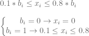
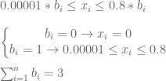

<!--yml

类别：未分类

日期：2024-05-18 14:48:17

-->

# 最小投资和资产数量投资组合基数约束 | Systematic Investor

> 来源：[`systematicinvestor.wordpress.com/2011/10/20/minimum-investment-and-number-of-assets-portfolio-cardinality-constraints/#0001-01-01`](https://systematicinvestor.wordpress.com/2011/10/20/minimum-investment-and-number-of-assets-portfolio-cardinality-constraints/#0001-01-01)

最小投资和资产数量投资组合[基数约束](http://ieeexplore.ieee.org/Xplore/login.jsp?url=http%3A%2F%2Fieeexplore.ieee.org%2Fiel5%2F11108%2F35623%2F01688603.pdf%3Farnumber%3D1688603&authDecision=-203)是不容易纳入[标准均值-方差优化](http://en.wikipedia.org/wiki/Efficient_frontier)框架的实际约束条件。为了帮助我们强加这些现实生活中的约束条件，我将引入额外的二进制变量，并将使用混合二进制线性和二次规划求解器。

让我们从[资产配置简介](https://systematicinvestor.wordpress.com/2011/10/13/introduction-to-asset-allocation/)的帖子继续我们的讨论，并检查有效边界上每个投资组合的权重范围和资产数量。

```

# load Systematic Investor Toolbox
setInternet2(TRUE)
source(gzcon(url('https://github.com/systematicinvestor/SIT/raw/master/sit.gz', 'rb')))

#--------------------------------------------------------------------------
# Create Efficient Frontier
#--------------------------------------------------------------------------
ia = aa.test.create.ia()
n = ia$n		

# 0 <= x.i <= 0.8 
constraints = new.constraints(n, lb = 0, ub = 0.8)

# SUM x.i = 1
constraints = add.constraints(rep(1, n), 1, type = '=', constraints)		

# create efficient frontier(s)
ef.risk = portopt(ia, constraints, 50, 'Risk')
ef.mad = portopt(ia, constraints, 50, 'MAD', min.mad.portfolio)

# Plot range of portfolio weights and number of assets in each portfolio on efficient frontier
layout(1:2)
par(mar = c(4,4,2,1), cex = 0.8)
y = iif(ef.risk$weight > 0.000001, ef.risk$weight, NA) 
plot(as.vector(sort(100 * y)), pch=20, xaxt='n', ylim = c(0, 80),
	xlab='', ylab='Weight', main='Portfolio Weights')
	abline(h=0, col = 'red')
	abline(h=10, col = 'red')

plot(100* ef.risk$risk, rowSums(!is.na(y), na.rm = T), pch=20, type='b', 
	xlab='Risk', ylab='# Assets', main='Number of Assets')

# Plot multiple Efficient Frontiers & Transition Maps
layout( matrix(1:4, nrow = 2) )
plot.ef(ia, list(ef.risk, ef.mad), portfolio.risk, F)	
plot.ef(ia, list(ef.risk, ef.mad), portfolio.mad, F)	

plot.transition.map(ef.risk)
plot.transition.map(ef.mad)

```


投资组合权重范围从 0%到 80%，资产数量从 2 到 4 个。首先，让我们考虑最小投资限制。假设如果我决定分配给某个资产类别，我希望至少分配 10%。这个声明可以作为一个约束条件使用二进制[0/1]变量来纳入：



```

#--------------------------------------------------------------------------
# Minimum Investment Constraint is 10%
# Add binary[0/1] variables
# 0.1 * b.i <= x.i <= 0.8 * b.i
#--------------------------------------------------------------------------

# SUM x.i = 1
constraints = new.constraints(n, rep(1, n), 1, type = '=')		

# New add binary constraint	
# adjust prior constraints: add b.i
constraints = add.variables(n, constraints)

# index of binary variables b.i
constraints$binary.index = (n+1):(2*n)

# 0.1 * b <= x.i <= 0.8 * b
# x.i >= 0.1 * b 
constraints = add.constraints(rbind(diag(n), -0.1 * diag(n)), rep(0, n), type = '>=', constraints)

# x.i <= 0.8 * b
constraints = add.constraints(rbind(diag(n), -0.8 * diag(n)), rep(0, n), type = '<=', constraints)

# create efficient frontier(s)
ef.risk = portopt(ia, constraints, 50, 'Risk')
	ef.risk$weight = ef.risk$weight[, 1:n]
ef.mad = portopt(ia, constraints, 50, 'MAD', min.mad.portfolio)
	ef.mad$weight = ef.mad$weight[, 1:n]

```


预期地，投资组合权重范围从 10%到 80%，没有低于 10%的分配。

为了解决资产数量的约束，我还将使用二进制[0/1]变量。假设我希望所有有效边界上的投资组合都分配给确切的 3 个资产，以下是额外的约束条件（请注意，对于这个例子，我假设任何资产类别的最小分配是 0.001%）：



```

#--------------------------------------------------------------------------
# Limit number of assets to 3
# Add binary[0/1] variables
# 0.00001 * b <= x.i <= 0.8 * b
# SUM b.i = 3
#--------------------------------------------------------------------------

# SUM x.i = 1
constraints = new.constraints(n, rep(1, n), 1, type = '=')		

# New add binary constraint	
# adjust prior constraints: add b.i
constraints = add.variables(n, constraints)

# index of binary variables b.i
constraints$binary.index = (n+1):(2*n)

# 0.00001 * b <= x.i <= 0.8 * b
# x.i >= 0.00001 * b 
constraints = add.constraints(rbind(diag(n), -0.00001 * diag(n)), rep(0, n), type = '>=', constraints)

# x.i <= 0.8 * b
constraints = add.constraints(rbind(diag(n), -0.8 * diag(n)), rep(0, n), type = '<=', constraints)

# SUM b.i = 3
constraints = add.constraints(c(rep(0,n), rep(1,n)), 3, type = '=', constraints)

# create efficient frontier(s)
ef.risk = portopt(ia, constraints, 50, 'Risk')
	ef.risk$weight = ef.risk$weight[, 1:n]
ef.mad = portopt(ia, constraints, 50, 'MAD', min.mad.portfolio)
	ef.mad$weight = ef.mad$weight[, 1:n]

```


如预期所料，所有位于有效前沿的投资组合都恰好分配了 3 种资产。

请告知我还有哪些实际投资组合构建中的约束条件，您希望我进行讨论。

要查看此例的完整源代码，请查看[GitHub 上 aa.cardinality.test()函数](https://github.com/systematicinvestor/SIT/blob/master/R/aa.test.r)。
