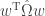
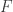
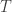
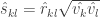

<!--yml

类别：未分类

date: 2024-05-18 13:51:25

-->

# 最小方差投资组合 | Quantivity

> 来源：[`quantivity.wordpress.com/2011/04/17/minimum-variance-portfolios/#0001-01-01`](https://quantivity.wordpress.com/2011/04/17/minimum-variance-portfolios/#0001-01

如[《组合理论已死，现在怎么办？》](https://quantivity.wordpress.com/2011/04/10/portfolio-theory-is-dead-now-what/)所述，*最小方差组合*是在无风险溢价的世界中的最优组合。本文通过在 R 中的实际应用扩展了该主题，并在相应的数学介绍之后进行了讨论。

回想一下，经典的马科维茨均值-方差最优投资组合是：

！\begin{aligned}  & \underset{w}{\text{min}}  & &w^{\mathrm{T}} \hat{\Omega} w - \frac{1}{\gamma}  \hat{\mu}^{\mathrm{T}} w \\  & \text{subject to}  & & \sum_i{w_i} = 1, \\  \end{aligned} 

其中  是投资组合权重的向量， 是样本平均组合回报，而  是组合回报的样本协方差。求和为 1 的约束确保权重百分比总和为 100%，意味着满仓投资。一个常见的额外要求是不能卖空(*例如* 401k、IRAs 和共同基金），这增加了以下非负优化约束：

！对于所有 i : w_i \ge 0

从这一点开始，考虑两个导致*最小方差*组合的假设：

+   风险溢价是零

+   对风险的规避是*无限的*，因此 

有了这些假设，上述优化问题简化为以下协方差最小化问题：

！\begin{aligned}  & \underset{w}{\text{min}}  & &w^\mathrm{T} \hat{\Omega} w \\  & \text{subject to}  & & \sum_i{w_i} = 1, \\  \end{aligned} 

对于由个体股票组成的组合（例如，而不是由行业组成），权重上界 约束适用于最小化*特异性*风险：

！对于所有 i : 0 \le w_i < \epsilon。

[Jagannathan 和 Ma](http://papers.ssrn.com/sol3/papers.cfm?abstract_id=424756)（2002）显示这一约束通过放大收缩效果提高了估计值。作者展示了零下限提供了类似的统计收缩效益。

尽管这是一个基本的约束优化问题，但有趣的是“马科维茨优化谜团”：鲁棒地估计协方差矩阵 。考虑文献中的三种估计器，前两个遵循[Falkenblog](http://www.betaarbitrage.com/member-equityindices-mvp.php)和[估计风险](http://estimationrisk.blogspot.com/)，最后一个是最近的估计器。所有估计器都确保协方差矩阵是[正定的](http://en.wikipedia.org/wiki/Positive-definite_matrix)（以确保优化是[凸的](http://en.wikipedia.org/wiki/Convex_optimization)）。

+   **具有异方差因子残差的渐近分量**

依照 Falkenstein 的方法，使用 Connor 和 Korajczyk（1993 年）以及 Jones（2001 年）来估计 ：


其中 （）是 N 种工具在 T 时期的历史回报，（）是 Jones 因子。

+   **贝叶斯样本收缩估计**

类似于 Nogales，使用 Ledoit 和 Wolf（2004 年）通过[收缩法](http://en.wikipedia.org/wiki/Shrinkage_estimator)和贝叶斯先验以及样本协方差矩阵来估计 ：


其中 是时间序列的长度，是样本协方差矩阵，是收缩常数，估计器 的元素由下式组成：


+   **样本方差和相关性收缩估计**

依照 Schäfer 和 Strimmer（2005 年）以及 Opgen-Rhein 和 Strimmer（2007 年）的方法，通过方差和相关性的[收缩](http://en.wikipedia.org/wiki/Shrinkage_estimator)来估计 ：




（留白）

现在考虑生成这些投资组合所需的 R。希望了解更多关于 R 中投资组合优化的读者可以参考 Yollin（R/Finance 2009）的《R 工具投资组合优化》。

最重要的细节是选择协方差估计器，包括来自`corpcor`包的 Schäfer-Strimmer-Opgen-Rhein 和来自`tawny`包的 Ledoit-Wolf（这两个函数都令人困惑地命名为`cov.shrink`）。本文以及后续文章中将使用 Ledoit-Wolf 估计器。

这些优化可以被表述为二次规划问题，并且可以使用`quadprog`包中的`solve.QP`来解决。通过将上述优化转化为以下函数形式（遵循 Goldfarb 和 Idnani（1982，1983）的方法，并令为零）：


假设`X`是日志收益率的矩阵，然后生成优化输入：

```

<code>covar <- cov.shrink(X)
N <- ncol(X)
zeros <- array(0, dim = c(N,1))

```

评估优化以生成无短卖约束的最小方差投资组合：

```

aMat  <- t(array(1, dim = c(1,N)))
res <- solve.QP(covar, zeros, aMat, bvec=1, meq = 1)

```

或者，具有短卖约束的类似优化（即非负权重）：

```

aMat <- cbind(t(array(1, dim = c(1,N))), diag(N))
b0 <- as.matrix(c(1, rep.int(0,N)))
res <- solve.QP(covar, zeros, aMat, bvec=b0, meq = 1)

```

最后，返回投资组合属性（类似于`portfolio.optim`）：

```

y <- X %*% res$solution
port <- list(pw = round(res$solution,3), px = y, pm = mean(y), ps = sd(y))

```

有一个小的数值分析提醒：在短卖约束下使用`solve.QP`可能会产生带有负号的权重（例如`-3.417223e-17`），这是由于浮点数精度和数值稳定性。当四舍五入到合理的数字位数时，这些权重等于零。

后续文章将应用这些最小方差优化来构建和评估旋转策略的风险。
