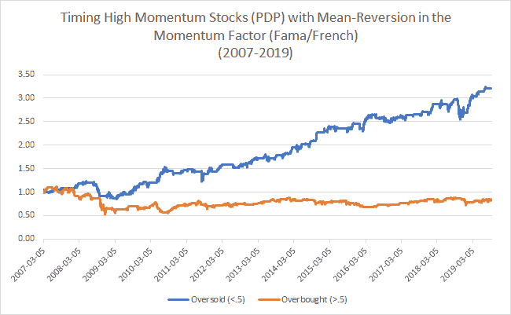

<!--yml

分类：未分类

日期：2024-05-12 17:40:32

-->

# 动量数据：使用动量因子中的均值回归时机 | CSSA

> 来源：[`cssanalytics.wordpress.com/2019/09/12/mo-data-using-mean-reversion-in-the-momentum-factor-to-time-momentum/#0001-01-01`](https://cssanalytics.wordpress.com/2019/09/12/mo-data-using-mean-reversion-in-the-momentum-factor-to-time-momentum/#0001-01-01)

在[上一篇文章](https://cssanalytics.wordpress.com/2019/09/12/when-should-you-buy-momentum-mean-reversion-in-the-momentum-factor/)中，我们使用了 MOM 这一 ETF（交易代码：MOM）的数据，该 ETF 旨在复制道琼斯主题市场中性动量指数，以判断何时买入或卖出高动量股票。Alpha Architect 最近对同一动量指数的回报分布进行了有趣的分析[在这篇文章中](https://alphaarchitect.com/2019/09/12/value-dont-call-it-a-comeback-its-been-here-for-years/)。其中一个挑战是可用的测试数据不足。理想情况下，我们会有更多的数据。为了解决这个问题，我发现[Kenneth French 数据图书馆](https://mba.tuck.dartmouth.edu/pages/faculty/ken.french/data_library.html)有每日动量因子回报数据。为了找到一个可交易的长期动量策略，我使用了[PDP](https://www.invesco.com/portal/site/us/investors/etfs/product-detail?productId=pdp)，这是基于 Dorsey Wright®技术领导指数（DWA 技术领导指数）的 Invesco DWA 动量 ETF。策略是在动量因子超卖（小于 0.5）时买入 PDP，并与动量因子过热（大于 0.5）时买入 PDP 的策略进行比较。更多细节请阅读前一篇帖子。结果如下图表所示：

拥有 2013 年之前的数据很有价值，因为我们能够看到策略在 2008 年信贷危机期间的表现，以及 2009 年初至 2010 年初爆炸性牛市的表现。显然，自 2007 年以来，动量因子中的均值回归在时机判断高动量股票方面表现良好。虽然未展示，但我测试了各种不同的参数，发现结果非常相似。要确定这是否是历史上普遍存在的效应，需要对合成动量策略进行广泛测试，然而我的猜测是，这种方法至少在过去 25 年中一直有效。最终，如果它追溯到 2007 年有效，那么显然值得使用，至少作为您交易高动量股票或其代理 ETF 或共同基金的一部分进行关注。然而，进行一些额外分析以确定这种策略为何有效是有价值的。
