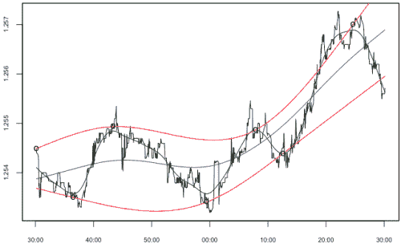
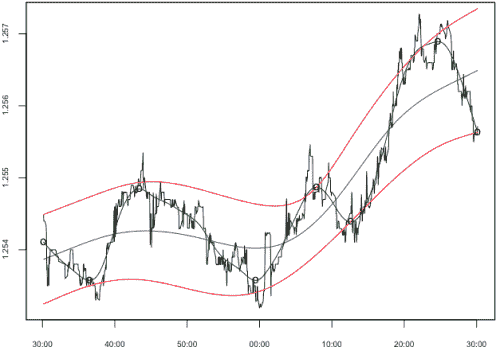

<!--yml

类别：未分类

日期：2024-05-18 15:38:11

-->

# 信号包络的模式 | Tr8dr

> 来源：[`tr8dr.wordpress.com/2009/11/06/mode-of-the-envelope/#0001-01-01`](https://tr8dr.wordpress.com/2009/11/06/mode-of-the-envelope/#0001-01-01)

2009 年 11 月 6 日 · 8:02 am

在 HHT 中，让我印象深刻的一个巧妙之处是，它使用样条函数跨过给定谐波的极小值和极大值。实际上，这为给定谐波（分解级别）的序列定义了包络。事后再看，均值或模式应该与包络样条的平均值相当。很有趣！

在均值回归（即在包络内围绕模式的振荡）的背景下，这是一种非常合适的方式来建模均值。与其尝试直接将均值建模为随机过程，不如建模包络——这更为合适，因为我们可以把包络纳入我们对均值回归的看法。

**版本 1** 我用了一个回归器来估计平均值，并用样条函数连接极小值和极大值来形成包络。这种方法存在一些问题（比如平均值回归器对数据有什么样的偏差）。下面是一些问题：

**版本 2** 我采取了差分方法，用回归的“振荡器”（绿色）来估计拐点，并通过确定极小值和极大值的中点来产生表示模式（蓝色）的样条。到目前为止看起来不错。需要考虑边缘情况、整合和跳跃：

以后再详细讨论这个问题。
