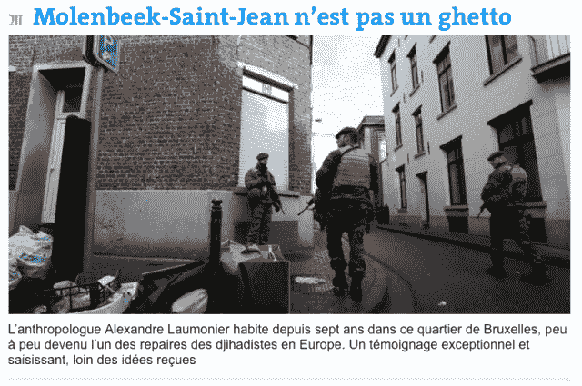

<!--yml

category: 未分类

date: 2024-05-18 14:13:17

-->

# Molenbeek-Saint-Jean 不是一个贫民窟——Sniper In Mahwah &朋友们

> 来源：[`sniperinmahwah.wordpress.com/2015/11/24/molenbeek-saint-jean-nest-pas-un-ghetto/#0001-01-01`](https://sniperinmahwah.wordpress.com/2015/11/24/molenbeek-saint-jean-nest-pas-un-ghetto/#0001-01-01)

[我关于 Molenbeek 的评论文章发表在*[Le Monde](http://www.lemonde.fr/idees/article/2015/11/23/molenbeek-saint-jean-n-est-pas-un-ghetto_4815791_3232.html)。*英文翻译即将推出。]

Molenbeek-Saint-Jean 现在在全球范围内都令人悲伤地闻名。不幸的是，有些人可能不会对得知一些在巴黎制造死亡的恐怖分子曾是我所在的社区的一员感到惊讶。涉及国际恐怖主义事务的 Molenbeek 人的名单现在已经太长了——从参与 2001 年指挥官 Massoud 暗杀的 Abdessatar Dahmane，到今天被认为是巴黎最近袭击事件的主要负责人的 Salah Abdeslam，还有其他十几个。我住在 Molenbeek-Saint-Jean，在这里，这些被认为是“伊斯兰主义恐怖主义活动中心”的街区之一，距离一个被认为是大袭击负责人的公寓只有几十米，我很难不写上这几句话。

首先，背景。与某些媒体所声称的不同，Molenbeek 不是一个“郊区”。“布鲁塞尔”是比利时三个地区之一，由 19 个市镇组成，其中包括“布鲁塞尔市”和 Molenbeek。一条运河确实形成了这两个市镇的物理、社会和象征性边界，但“布鲁塞尔市”中心离我家只有 15 分钟的步行路程，或者三个地铁站的距离。将 Molenbeek 称为“郊区”似乎是贬低地用来指代远离巴黎中心的法兰西岛城市，那里有一个越来越被贫困侵蚀的穆斯林社区，因此产生宗教极端主义。Molenbeek 不是一个郊区，而且与整个布鲁塞尔地区一样，这个市镇是由极其不同的微型街区组成的一个集合。存在多个 Molenbeek，考虑到这种差异性是非常关键的。

今天，这些莫伦贝克区的街道在全世界摄像头的注视下是什么样子呢？简单地说，就是由那些典型的布鲁塞尔砖房组成的大街；这里确实有一些“HLM”类型的公寓楼，但数量不多，且已融入城市景观。暂且不提这个区悠久而激动人心的历史（该区曾于 19 世纪 70 年代接纳了流亡的巴黎公社成员，那时它的别称是“小曼彻斯特”，因为其工业繁荣），莫伦贝克区现在有一些由 80%具有比利时国籍、主要与摩洛哥有历史联系的穆斯林社区构成的微型街区，从这里走出许多（其中一些非常年轻）的男男女女，他们响应圣战主义者在叙利亚的号召而结婚。话虽如此，现有的少量统计数据显示，尽管前往叙利亚的比利时人一半来自布鲁塞尔地区，另一半却来自弗兰德斯，尤其是维尔沃德和安特卫普，而安特卫普是“沙里亚 4 比利时”salafist 传教士被比利时法庭认为是主要的圣战主义者招募者。伊斯兰主义的问题超越了莫伦贝克区的边界。这座城市，至少是其中一些（微型）街区，被媒体称为“贫民窟”。尽管我对这个词的真正含义有些怀疑（或者是在 Max Weber 所说的那种“排他性封闭”的意义上去理解），但如果真的存在贫民窟，那么比我所在的社区更具多样性的富有的布鲁塞尔市乌克勒区，其“贫民窟化”程度远在我所在的社区之上，在那里超过 100 个国籍的人和睦共处，从未有过任何社区间的紧张。

接下来，敏感点：某些街区，包括我所在的街区，拥有大量属于阿拉伯-穆斯林社区的居民。通常被描述为世界上最年轻的圣战分子的，是一个在 Molenbeek 长大的 13 岁小男孩 Younès，他留下了满脸困惑的父母。他是由哥哥 Abdelhamid Abaaoud 训练的，此人被认为是巴黎最近袭击事件的疑似策划者，并在圣丹尼的警方行动中丧生。Younès 就在我家几百米远的地方上学，我常常想，是不是有一天我遇见了他。也许那就是在我街道上走着的，抬头看着他便携式 PlayStation 微笑的年轻男孩，他母亲全身黑，包括手，从脚到头，她自己又在为一个迷失在祈祷中的丈夫后面三米处走着。不诚实地说，这几年，宗教在日常生活中的分量越来越重，哪怕只是小细节。

有一部分在面包店和杂货店工作的妇女和年轻女孩，以前只戴着一个简单的面纱，现在开始佩戴头巾。如今，在街上看到五岁的小女孩披着一件漂亮的彩色头巾已不再稀奇 - 几年前这种情况还非常罕见，甚至可以说是不存在的。尽管在公共场合禁止，但在离我家最近的学校外，还是能看到一些佩戴面纱的妇女。（我曾经要求一位妇女关闭手机里的宗教歌曲，因为我觉得她没有必要向我强加一种不属于我的宗教的祷告 - 她立刻照做了，但从她的眼神中我能看出，她觉得我的要求很荒谬）。在以前的当地邮局，也不时会听到手机里传来宗教歌曲（我曾经在一次要求一位妇女关闭手机里的宗教歌曲，因为我觉得她没有必要向我强加一种不属于我的宗教的祷告 - 她立刻照做了，但从她的眼神中我能看出，她觉得我的要求很荒谬）。在面包店的收银台，也常常可以看到一些宣传某个或另一个穆斯林活动的传单，上面印着一些外国传教士的面孔，通过搜索互联网，我们得知他们在视频中呼吁“烧死犹太人”。还有一些留着长胡子的传教士，三人一组地在街上走动，向年轻人传教。2015 年初，一位战地摄影师和人类学家决定离开莫伦贝克，他解释说：“在这里，一切都变得灰暗，到处都弥漫着悲观情绪。街上的激进主义和阴霾让我感到抑郁。我觉得在大街上，有人试图让我改信伊斯兰教，这太可怕了。”虽然没有人曾经试图让我改信，但我很不幸地认同了这种阴霾和悲观情绪（尽管这种阴霾更多的是布鲁塞尔甚至是比利时的，而不是莫伦贝克的 - 毕竟，布鲁塞尔不是马赛）。摄影师可能还把“阴霾”理解为某些街道的脏乱，一些像露天垃圾场一样的街道，被压坏的人行道，有时持续数周都得不到清理，直到市政部门最终清理干净（有时会引发一些悲惨的场景，比如当一些罗姆人回收邻居们丢弃的可利用垃圾，然后来自东欧国家的人会来把剩下的金属全部拿走 - 有穷人，然后是更穷的人，然后是更穷的人）。

某些小社区的宗教身份认同是显而易见的，这些认同正变得越来越明显。一些目光自然转向了该社区的主要清真寺，布鲁塞尔地区最受欢迎的清真寺之一，有时一些只会说阿拉伯语的传教士被邀请过来，散布令人作呕的言论（我曾经的一个邻居，一个摩洛哥信徒，去过一次，但对那里的激烈针对女性的言论感到震惊）。尽管这座清真寺予以否认，但它培养了不少后来支持萨拉菲主义并前往叙利亚的传教士，其中还有一些当地的年轻人。一位曾担任莫伦贝克市委员会成员的政治家告诉我，这座清真寺多年来一直受到情报机构的监控——但显然没有采取有效的行动，因为最近还有一些常去那里的人决定“参加圣战”。（不过，我们还是赞赏这座清真寺在 11 月 13 日星期五首页上发布的清晰信息，强烈谴责巴黎袭击，但我们更希望周五的大型祈祷也能对非穆斯林开放）。此外，还可以提到一些半官方的清真寺，它们以非盈利协会的身份作为掩护，但实际上在黑暗的车库里组织会议，招募失业的年轻人加入令人不齿的事业。

这一切都是多年来的公开秘密。在未来几周和几个月里，关于比利时伊斯兰教状况的争论将会激烈。对于布鲁塞尔大臣拉希德·马德拉来说，“比利时犯下的原罪是在 1973 年将伊斯兰的钥匙交给了沙特阿拉伯”。一位清真寺负责人在上周三的公民集会上告诉我，他多次要求一些来自安特卫普的“代表”离开他的清真寺，这些人是在莫伦贝克市的市政广场上为巴黎受害者举行的集会上进行招募的，他还向警方报告了他们的存在；另一位宗教负责人告诉我，那些走在街上宣传宗教的留胡子的人有时是从英国来的，他们来招募“新鲜血液”。一切比想象的要复杂，而且问题已经超出了莫伦贝克市的范围。

我不知道一个像 Brahim Abdelsam 这样的年轻 Molenbeekois 脑袋里在想什么，他有一天靠墙坐着，抽着烟，在街角的咖啡馆里小酌，几个月后，在比利时接受了一些“训练”后，就会在巴黎的一家咖啡馆露台上自爆。这一切都远超出简单的宗教信仰，即使是一些极端分子也在利用这一点。Brahim Abdeslam 经营着一家咖啡馆，去年 11 月，因为“毒品交易”被政府勒令关闭。任何居民都知道，这里不止一家咖啡馆或杂货店，两瓶可乐和三包薯片的价格其实是在卖毒品。我街角那个友善的烤肉摊贩不幸被他的一个咖啡馆取代，几个月来，一些留胡子的年轻人坐在露台上抽大麻，而里面电视上循环播放着 Al-Jazzira。尽管这些活动人尽皆知，但政府（可能需要几个月，甚至更长）才能关闭这些地方，这些地方助长了社区形象的恶化，这一点总是令人惊讶。

尽管这里灰暗、肮脏，宗教的重负和毒品交易的咖啡馆存在，Molenbeek 并不是比其他社区更危险的地方。我在这里住了七年，从未遭受过任何攻击。除夕夜这里没有汽车被烧毁；Molenbeek 和布鲁塞尔从未经历过 2005 年克利希- sous-Bois 那样的骚乱；即使在最困难的街区，警察也很少遭到攻击，而在法兰西岛的一些城市，这种情况极其常见。"社区退缩"和"对国家暴力"的情况，法国一些郊区的状况比 Molenbeek 要糟糕得多。

并没有所谓的“莫伦贝克斯坦”，正如某些媒体所说（尽管如此，我们都知道，有些城市地区武器交易和极端言论并存，这种情况也发生在安德莱赫特，法国和其他地方）。在莫伦贝克，所谓的“不安全感”更多地来自于逆向行驶的车辆（该地区的习惯）或过快的车速（布鲁塞尔最频繁发生事故的街道位于莫伦贝克），以及那些几乎掩盖了毒品交易的杂货店，某些街道的脏乱，等等。正是由于这些不同形式的日常扩散性不文明行为（还有其他的）产生了这种著名的“不安全感”。确实有很多市府官员在巡逻，其中一些明确地因为属于阿拉伯-穆斯林社区而被雇佣（有点像法国某些地区实行的“大哥”政策），但是有一天我所看到的情景又作何解释，即三名市府官员走过一条街道，与整个地区都知道的毒品交易者握手，并用阿拉伯语与他们交谈，然后平静地继续他们的路程？

莫伦贝克 99.99%的居民显然不是圣战候选人，甚至不会去“烧犹太人”（尽管如此，由于巴勒斯坦问题以及某些布道，我遗憾的是认为我的大多数邻居都深受粗俗的反犹太主义之苦）。99.99%的居民渴望与他人和平共处。虽然某些地区的状况可能由一系列因素解释（宗教的影响力，感觉不受惩罚，恐怖分子在一个密集地区隐藏的容易性，等等），但造成“所有问题”的主要原因需要另寻他处。而且这些原因已经被大家所知太久。只需看看数据，具体来说就是法国社区委员会（Cocof）的数据，非常详细，不仅涉及整个市镇，而且尤其是每个微型社区的详细数据。

Molenbeek 是比利时第二穷的市镇（不幸的记录属于另一个——规模更小——的布鲁塞尔市镇，圣若瑟 ten Noode，位于欧洲区几步之遥的地方）；该市镇的一些地区是布鲁塞尔最密集的地区之一，大家庭占据了家庭总数的很大一部分，而且自 2000 年以来，居住在该社区的穆斯林人口大幅增长（近年来，出生率大幅上升，是布鲁塞尔地区最高的）；那里的年轻人（15-24 岁）在总人口中的比例尤其高；死亡率高于区域平均水平，报告健康状况不佳的居民比例也是如此；平均收入低于全国平均水平，尤其是在人口密集地区，社会援助的数量大大超过了比例；因此，失业率自然大大高于区域平均水平，每两个年轻人中就有一个失业，这可能是因为他们中遵循普通学校教育体系的比例远低于区域平均水平。Molenbeek 的 51%的居民不需要缴纳税款，那里的居民中位数收入仅为每月 1100 欧元，而*57%的人口生活在贫困线以下*。

Molenbeek 是一个深受贫困困扰的社区，其中超过一半的居民在挣扎求生，尤其是在年轻、受教育程度较低的人群中，他们成为了街头恶棍的容易目标。超出 Molenbeek 之外，不幸的是，记者们对此讨论得很少，但请注意，在欧盟首都布鲁塞尔这个地区，*有三分之一*的居民生活在贫困线以下，这是一个令人印象深刻的数字，尤其是当知道布鲁塞尔产生的财富比比利时另外两个地区还要多时（有趣的是，这个数字是否与国际移民组织最近公布的数字有关，该数字显示 62%的布鲁塞尔地区居民在国外出生或来自迁移到这里的家庭，《使其成为世界上显示这种高比例的第二大城市》）。因此，布鲁塞尔是一个极为对比鲜明的地区：在 Molenbeek，每个居民的平均收入为 776 欧元每月，这只是欧洲委员的住房补贴的四分之一，以及他们的工资的十二分之一。顺便说一下，欧盟官员免征个人所得税，这是任何应税的比利时人都必须支付的所得税。换句话说，一个收入低但支付这项税的 Molenbeek 居民为那些官员享用的布鲁塞尔公共基础设施提供了更多的资金，而这些官员因此受益而不支付这项税，同时拿着更高的工资——但让我们继续。

因此，莫伦贝克正被贫困侵蚀。很少有记者提醒人们，几个月前，这个社区差点破产（这再次给某些政治人物提供了机会，让他们更加指责这个社区）：由于不纳税的人口增长却机械地要求更多的公共资源（社会福利等），加上其贫困化（莫伦贝克居民的平均收入在过去十年下降了 5%），税收收入自然减少；与此同时，据一位公开谈论过这次近乎破产的市议员所说，中产阶级（那些纳税的人）越来越少：「清洁度、教育（质量）、可负担的高质量住房以及宜人的公共空间的缺乏，再加上一种不安全感，是他们离去的主要原因，特别是对于年轻家庭来说」。虽然难以接受，但莫伦贝克仍在不断恶化——这是机械的。因此，一切都有助于某些街区社会和智力的贫困成为令人反感的招募者的肥沃土壤。考虑到其财务和社会的破败状态，这个社区能为一个正在贫困化的人口提供什么未来的前景？如何纠正一个几乎 55,000 人在贫困线以下生活的社会状况？

比利时副首相兼内政部长詹·詹本（Jan Jambon），是弗拉芒民族主义政党新弗拉芒联盟（Nieuw-Vlaamse Alliantie，NVA）的成员。他在巴黎恐怖袭击事件后发表讲话，语气强烈，让人联想到弗拉基米尔·普京曾想“把车臣人赶到他们的厕所”时的场景。他宣称要“清扫”莫伦贝克。考虑到我所在社区的脏乱，提议的大扫除真是求之不得（下次的垃圾收集日是下周三）。但是，现在关心这个问题是不是有点太晚了？为什么在你的政党占多数的弗拉芒社区，会彻底取消对历史悠久的 Foyer 协会的资助，该协会自 1969 年以来在困难街区进行社会工作，提供社会援助、融入社会、培训和跨文化调解等工作？尽管如此，该协会还是通过零敲碎打和受资助的合同完成了必不可少的地毯式工作。比利时首相夏尔·米歇尔（Charles Michel）在巴黎恐怖袭击后表示，“过去存在某种松懈态度，放任不管。我们必须支付过去未完成工作的账单”。首相先生，感谢您公开承认政府在过去几年中对我的社区表现出的“松懈态度”；然而，这绝不是任何借口。我们，无论是莫伦贝克人还是巴黎人，都集体支付了“账单”（用这个词来指代袭击的受害者真是荒谬）。这是因为 successive federal governments have long since stopped funding education, prevention, police, and justice.

弗拉芒电视的一部报道，自巴黎袭击事件以来在网络上重新受到关注，几年前让社会工作者发声，他们当时就已经对政策制定者对贫困外国青年缺乏关注表示担忧，并认为这为某种宗教激进化提供了土壤。当记者问及当时的市长马塞尔·皮卡特需要什么来解决社区的问题时，他的回答很简单：”钱“，但他悲观地补充说，联邦政府分配给布鲁塞尔的预算在不断减少。接受采访的一名穆斯林表示，如果情况恶化（比如失业、孤立等），人们会越来越多地转向上帝。乔汉·莱曼，这家自 2014 年以来没有再收到弗拉芒资金的协会 Foyer 的负责人，表示如果没有任何变化，下一代最终会起来反抗。好吧，现在我们就是这样，尽管革命的面貌和其暴力可能并不是人们所预期的。米歇尔先生，我无法责怪您当时 12 岁时没有采取行动来回应这一状况，那篇报道中做出的这一令人沮丧的判断是在 1987 年\. 那几乎是 30 年前了！

问题已经被识别很长时间了。我非常清楚，考虑到比利时行政层（市镇、地区、社区、联邦政府）的复杂性，某些决定或投资需要时间来实施，但尽管如此，我几乎要和许多居民一样认为，联邦政府已经将莫伦贝克遗弃给了它自己的（越来越悲伤的）命运。我忽略了莫伦贝克最后一位市长不当的言论，他在 20 年的市长生涯中，利用社区客户关系到极点，但今天敢把责任推给现任立法机构，使它负责社区的几乎破产和来自莫伦贝克的大量恐怖分子（穆尔罗先生，2006 年社区的赤字，当您掌权时，比 2014 年还要大）。至于现任市长弗朗索瓦·谢普曼，自 2012 年当选以来，她也是联邦议会的议员 since 2014\. 谢普曼女士，您不认为考虑到目前的状况，莫伦贝克应该有一位能够将 100%的时间投入到社区的首长吗？

在莫伦贝克的工作量巨大，不幸的是，面对这种情况，为数不多的提供教育支持的协会的资金状况令人啼笑皆非。增加警察力量将是受欢迎的（正如布鲁塞尔西部警察局的负责人最近承认，包括莫伦贝克在内的地区，“警察区域的财务标准已经有 12 年没有调整了”）；“去极端化”项目也同样需要。但最重要的是教育：考虑到多年来人口激增，为何没有实施任何大规模的幼儿园和学校建设计划？一个新当代艺术博物馆即将在莫伦贝克和布鲁塞尔之间运河沿岸开放。毫无疑问，这家博物馆将促进“运河区”日益严重的 gentrification（中产阶级化），这不会带来什么好处，而且毫无疑问，针对学校团体的教育活动可能对一些孩子有益。但我们不需要在莫伦贝克建博物馆；我们需要学校，需要提供混合教育的学校，使中产阶级不会逃离这个社区（就连我最喜欢的杂货商，一个实践的土耳其穆斯林，也决定不让他的孩子在家附近的学校上学，原因是缺乏混合教育——这就足以说明问题了）。在这样的社区里，一个博物馆的意义何在——只需听听街上一些年轻人的谈话就知道了——文盲问题影响了多少居民？博物馆不是对社会和教育贫困的正确回应；这是本末倒置。

除了教育问题，还有流动性和城市化项目的问题。一个例子：通往我家最近地铁站的自动扶梯，该地铁站附近有一个变成了垃圾场的空地，多年来一直无人问津，实际上阻止了推着婴儿车的母亲（街区里有很多人这样做）使用公共交通工具。】（这些问题典型的导致了“贫民窟化”。）还有明显的安全问题：很难想象能提升一个某些街道像垃圾场一样的地方的形象；在废墟上什么都不建。

工作量巨大，从任何角度来看都是如此，并且必须从街道排水口的高度开始做起。这项工作不会在几周或几个月内完成，它将需要所有方面的重大资金投入，尤其是联邦政府（无论如何，市镇已经没有余钱了）。声称缺钱是谎言：就在去年，联邦政府宣布将进一步控制失业者的水和天然气消费，“打击欺诈”的同一天，我们震惊地得知，由于比利时和卢森堡之间的税收协议，数亿欧元的大公司欠税实际上不再进入比利时的国库。控制这些可恶的失业者，他们在莫伦贝克被过分代表，显然比收回流向卢森堡（众所周知，由于亚马逊、苹果或宜家，他们的生活水平很糟糕）的比利时税款更重要。

最后三点，作为结论，尽管还有很多话要说。

1/ 尽管这幅莫伦贝克的画像并不讨好，至少对其某些街区而言（但数字和街道就是它们所是的样子），这里的生活并非只有“灰暗”。我们在莫伦贝克有一个类似小巴塔克兰的地方，VK，一个布鲁塞尔人都很熟悉的音乐厅，以及其他各种场所（如莫伦贝克的铸造博物馆或社会和文化团结之家，由市行政管理部门管理）。莫伦贝克并非媒体有时所描述的“彻底的荒漠”，但令人悲哀的是，大多数情况下，这些场所甚至很少被当地居民光顾（或者至少是那些居住在最具社区特色的街区的人）。这同样是教育问题：我们如何希望莫伦贝克的文化设施能被该镇的居民所利用，而该镇一半的人口处于生存状态，还有一成人是文盲呢？像 Bonnevie、La Rue 或 Foyer 这样的协会也在做宝贵的地面工作；没有 Foyer，拉南女士永远不可能参加识字课程，她的女儿法迪拉也许永远不可能成为文化和视听、卫生及机会平等部长。在我写下这些文字的时候，不幸的是，Foyer 还没有完成其 2016 年的预算；明确地说，其员工微薄的工资目前还没有得到保障。这是噩梦般的。

2/ 我去了离家 150 米的 Delaunoy 路，那里在 11 月 16 日星期一发生了一场重大的警政行动。记者和路人全都聚集在街的两头，被警方封锁了。我待了两个小时。那里没什么好看的，但有很多值得听的：记者在采访年轻人，居民们在互相交谈。我和几位邻居聊了聊，他们提到了多年来这个社区一直遭受的污名化，被指责为激进主义、街区脏乱，还有个完美的三语者（阿拉伯语-法语-荷兰语）邻居最终因为从简历上删除了他 Molenbeek 的住址而找到了工作，等等。没有紧张的气氛，只有许多话语。

当天晚上，在 7 点半的新闻节目中，法语公共电视台的第一频道 La Une 报道了这次行动，声称“整个街区都被封锁了”，这是不正确的：只有一条街和一个路口被封锁了，完全可以通过周围地区，我就是这么去的，去和一个*Financial Times*（唯一一个——可惜——联系我的记者，他是我通过社交媒体发消息邀请媒体如果他们想要“内部观点”就联系我后的回应）的布鲁塞尔记者会面。这个街区与电视上描述的禁区完全不相符。更糟糕的是，记者提到了围绕行动现场的“紧张气氛”。这都是纯粹的误导：现场根本没有紧张气氛，每个人都在交流，即使有分歧也没有人提高声音，即使是在讨论中有分歧（我和一个年轻人讨论过，他认识 Salah Abdeslam，称其为一个“自大的小丑”，但语气从未升高）。

莫兰贝克在很大程度上被西方世界钉在了耻辱柱上，无论是有理还是无理，因此我们莫兰贝克人需要的，就是记者们能正确地完成工作，而不是进一步抹黑我们。一位 TF1 的技术人员，他曾在 2005 年报道过克雷希-苏布瓦的激烈骚乱，他向我坦白，他非常惊讶于在采访中莫兰贝克人的善良，与某些“巴黎郊区人”的侵略性相比。通过媒体了解的这座城市，给他留下了灾难性的印象，因此他看起来很高兴地发现这种印象是错误的——这是媒体责任的一个明证。周三晚上，在向受害者致敬的公民集会上，BBC 的一名记者面对镜头宣称“这里只有白人”，这显然是错误的——忽略了数百名记者，以及 2000 名聚集者中有一半属于“穆斯林社区”。在世界面前否认自己在那个夜晚的集会上存在，对穆斯林来说是非常无礼的。

3/ 除了普遍的贫困和宗教的影响，我的街区主要遭受的是一件事：几乎完全缺乏“公共”空间。如果，我骑自行车五分钟就能穿过运河去见朋友，在运河边喝一杯，这条运河将我与思想的真正多样性隔开，那么在我的微型街区，却没有像 Carillon、Le Petit Cambodge、Café Bonne Bière、La Belle Équipe 或 Le Comptoir Voltaire 这样的咖啡馆，这些巴黎人聚会和欢乐的地方，不同起源、不同政治或宗教观点的人们曾围绕着一杯酒相聚，然后在我邻居的子弹下死去。

令人惊讶，但也许并不那么令人惊讶的是，观察到这些年轻人去往根本不存在于莫伦贝克的聚会场所传播死亡。这种“公共”的缺失越来越深刻地影响着莫伦贝克的困难地区。我们当然可以选择茶室、一些具有布鲁塞尔特色的酒吧和由来自东欧的人们经营的酒吧。但去茶室意味着不能有女性陪伴（妻子或姐妹），以避免不适当的目光；去布鲁塞尔酒吧意味着“陷入年长白人的包围”；而置身于只说俄语或罗马尼亚语的咖啡馆不利于交流。在这里，人们在街上相遇，打招呼，在商店里偶尔交谈，但本质上我们并不交谈，也很少一起笑。仅仅是因为能进行这些活动的地方非常稀少。在这些问题街区，你无法找到像“美丽的团队”这样的地方，那家被我的邻居瞄准的巴黎咖啡馆，由一名*犹太人*和一名*穆斯林*经营——不可思议。

在一个政治日益分裂、铁丝网重新出现的欧洲中心，在一个三分之一人口生活在贫困中的欧洲首都，在一个数以万计的人仅能生存的欧洲首都社区，恢复与地方的日常联系，不仅是为当前灾难提供政治回应，更是一个公民项目，有待所有穆斯林、犹太人、无神论者或其他所有人共同建设。在这里，今天球在了我穆斯林邻居的阵营里。也许有一天，即使是在遥远的将来，如果我留在莫伦贝克，我会有机会坐在由犹太人经营的街区咖啡馆里，与小优尼斯分享时光。如果他回到叙利亚，他不会再那么小了。如果他的大脑没有被野蛮侵蚀得一干二净，他肯定有很多关于人类疯狂的事情要告诉我。
