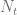
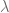
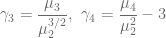

<!--yml

category: 未分类

日期：2024-05-13 00:13:24

-->

# 矩匹配期权定价：案例研究 – HPC-QuantLib

> 来源：[`hpcquantlib.wordpress.com/2019/11/26/moment-matching-option-pricing-a-case-study/#0001-01-01`](https://hpcquantlib.wordpress.com/2019/11/26/moment-matching-option-pricing-a-case-study/#0001-01-01)

随机变量 *Z* 的矩生成函数是

概率分布 *Z* 的第 *n* 个矩则为

对许多金融模型来说，矩生成函数是已知的。因此，基于矩生成函数推导出近似的精确定价公式是很自然的。

克鲁格（Kluge）模型 [1] 使用指数跳跃尺寸分布，在这里可以作为这种方法的测试平台。它的定义如下

其中  是具有跳跃强度  的泊松过程， 是逆跳跃尺寸。为了匹配今天的远期曲线 ，函数  给出如下

对数点过程的矩生成函数

则由 [1] 给出

定价近似公式是基于中心矩

![\displaystyle \mu_n = E\left[\left(Z-E(Z)\right)^n\right] = \sum_{i=0}^n {n\choose i} m_i (-E(Z))^{n-i}](img/cf5eea80663cdf7c10d1e58b075aa5c2.png)

Mathematica 计算前四个中心矩如下

![\begin{array}{rcl} \displaystyle \mu_1&=&0 \\ \displaystyle \mu_2 &=& \frac{\sigma² \left(1-e^{-2 \alpha t}\right)}{2\alpha }+\frac{\lambda \left(1- e^{-2 \beta t}\right)}{\beta \eta ²}\\ \mu_3 &=& \frac{\lambda \left(2-2 e^{-3 \beta t}\right)}{\beta \eta ³} \\ \displaystyle \mu_4 &=& \frac{3 e^{-5 t (\alpha +\beta )} \left(16 \alpha ² \beta \lambda e^{5 \alpha t+3 \beta t} \sinh (2 \beta t)+e^{t (\alpha +\beta )} \left(\beta \eta ² \sigma² \left(e^{2 \alpha t}-1\right) e^{2 \beta t}+2 \alpha \lambda e^{2 \alpha t} \left(e^{2 \beta t}-1\right)\right)²\right)}{4 \alpha ² \beta ² \eta ⁴}.\end{array}](img/9170a7ae9f54bd9502c6d88dcb7ad4b7.png)

高阶矩的 Black-Scholes 类似对数正态模型的近似总结在[2]中。这些扩展以新奇性和峰度为 Fisher 参数的参数化

Cor

而 1998 年 Rubinstein [4]在考虑了正态 Edgeworth 级数展开后推导出了以下的近似

考虑了两种情况来测试 Kluge 模型的不同近似的质量。首先是相对较小的跳跃但跳跃强度变化的情况，其次是少数跳跃但跳跃大小变化的情况。测试参数为

欧洲式 vanilla 期权的参考结果是使用相应的有限差分定价引擎和理查森外推法生成的。第一个测试案例是通过增加  从零到 40 来变化跳跃次数。科拉多/苏第四阶近似仅在跳跃强度非常小的情况下获胜，而对于较大的跳跃强度，科拉多/苏高达第三阶的近似与鲁宾斯坦公式竞争激烈。第二个测试案例中，跳跃次数少但跳跃大小增加，情况类似。对于小跳跃，第四阶近似占主导地位，但大部分时间鲁宾斯坦近似给出最佳结果。

这些结果的源代码可以从[PR #728](https://github.com/lballabio/QuantLib/pull/728)获取。

[1] Kluge, T. : [定价摆动期权及其他电力衍生品](https://www.semanticscholar.org/paper/Pricing-Swing-Options-and-other-Electricity-Kluge/9e8be93531ffa8aeb1a9e36181e0537cac99e400)

[2] Jurczenko, E, Maillet, B and Negrea, B: [多时刻近似期权定价](https://papers.ssrn.com/sol3/papers.cfm?abstract_id=300922)

[模型：一般比较（第一部分）](https://papers.ssrn.com/sol3/papers.cfm?abstract_id=300922)

[3]  Corrado C. and T. Su: [隐含波动率偏度和股票回报](https://www.researchgate.net/publication/24080621_Implied_volatility_skews_and_stock_return_skewness_and_kurtosis_implied_by_stock_option_prices)

[股票期权价格所隐含的偏度和峰度](https://www.researchgate.net/publication/24080621_Implied_volatility_skews_and_stock_return_skewness_and_kurtosis_implied_by_stock_option_prices) , 欧洲杂志 of

金融 3, 73-85., 1997

[4] Rubinstein M: [爱德华·吉福特二项式树](https://pdfs.semanticscholar.org/f5d2/d0b90dea9a5e2dc298f0ba0aefc2b98387e4.pdf), 《衍生品杂志》

5 (3), 20-27., 1998
