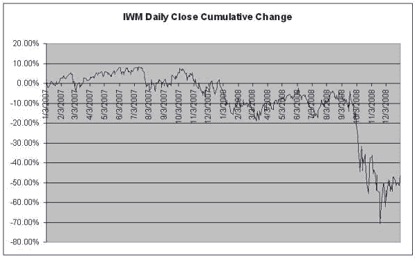
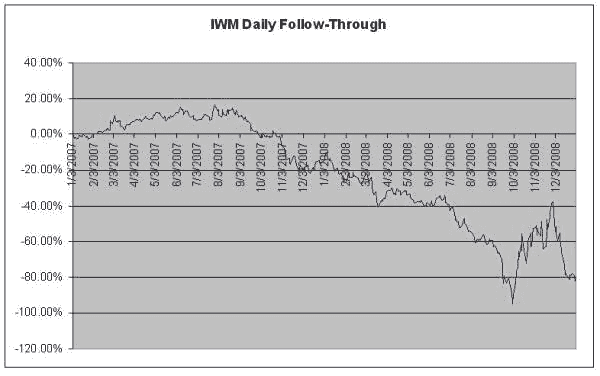
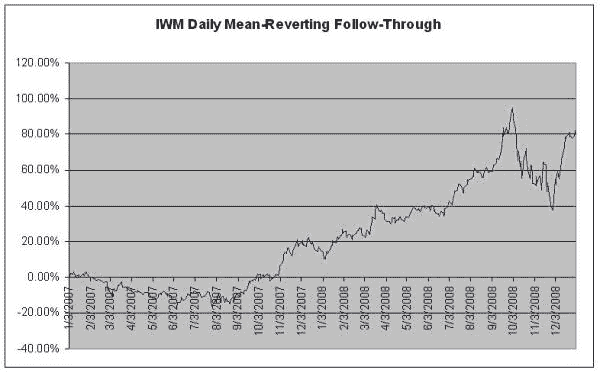
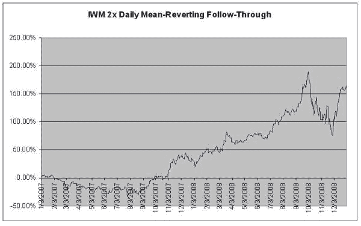

<!--yml

类别：未分类

日期：2024-05-18 13:50:28

-->

# 动量 | 量化

> 来源：[`quantivity.wordpress.com/2009/07/19/momentum/#0001-01-01`](https://quantivity.wordpress.com/2009/07/19/momentum/#0001-01-01)

成功的算法往往具有优雅性：概念上简单，建立在清晰的直觉之上。为此，总结一些构成量化交易大部分的基本现象是值得的。

基本交易经验告诉我们，价格系统性地受到两种相反力量的其中之一驱动。第一种力量是动量：

> “**动量**是观察到的资产价格上涨倾向进一步上升的实证现象。”([维基百科](http://en.wikipedia.org/wiki/Momentum_(finance)))

动量在许多算法和技术形式中表现出来。例如，“跟进”是起源于技术分析的经典测量方法。作为说明，考虑 2007-2008 年期间任意交易量大的 ETF（[IWM](http://finance.yahoo.com/q?s=IWM)）的收盘价：

与*日收盘价跟进*相比，它可以被经典地（*即*非均值回归）计算：

`IF(yesterday change > 0) THEN go long; OTHERWISE go short.`

或者，等效的平均回归日跟进：

`IF(yesterday change > 0) THEN go short; OTHERWISE go long.`

请注意前两个图表的对称性：两种跟进方式在水平轴上是对称的；等价地说，它们是彼此的算术倒数（一个的利润是另一个的损失）。

从这个例子中，一个简单的交易策略是显而易见的：在收盘时做空（多），在随后的收盘时平仓，在前一收盘到收盘期间为正值（负值）。IWM（多）和[RWM](http://finance.yahoo.com/q?s=RWM)（合成空)可以结合起来避免[做空](http://en.wikipedia.org/wiki/Short_(finance))。使用[RRY](http://finance.yahoo.com/q?s=RRY)（多）和[RRZ](http://finance.yahoo.com/q?s=RRZ)（空）进行杠杆操作，以下为结果：

对动量分析的十分钟揭示了产生 75%无摩擦年化回报的策略。

动量在技术分析中尤其受到彻底的研究，已经确定了数十个动量指标：从 RSI 到[DV](http://marketsci.wordpress.com/2009/07/15/varadi%E2%80%99s-rsi2-alternative-the-dv2/)。Achelis 的《技术分析从 A 到 Z》是这一文献中的标准参考书。

并非偶然，这一策略表现出许多成功（非天真）策略共有的几个特点：

+   无预测/预报：策略不打算“预测未来”或以任何明确、有意义的方式进行经济预测。

+   动态策略：策略严重依赖反馈（即收盘价接近收盘价的日常回报迹象），并尽可能少地使用[数据窥探](http://en.wikipedia.org/wiki/Data-snooping_bias)参数。

+   非一致性：回报在整个期间内不是一致的（无论是正向还是负向）；相反，从 2007 年 10 月到 2008 年 12 月，均值回归很强；而 2007 年 1 月到 9 月的情况正好相反。

+   正向预期：策略在 52.38%的日子里产生正向回报，提供正向期望值。

+   正向回报：策略产生 0.16%的平均每日回报（未杠杆），提供正向的平均回报。

许多算法利用动量，以一种或另一种形式，无论是明确地还是隐含地。
