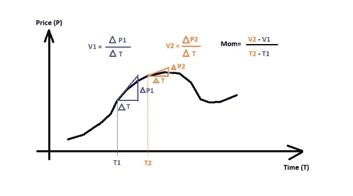
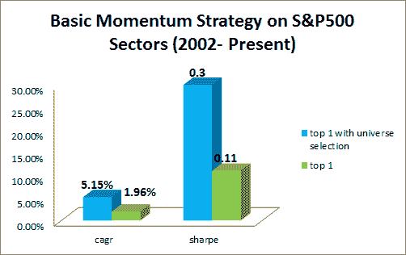

<!--yml

类别：未分类

日期：2024-05-12 17:54:05

-->

# 动量策略与宇宙选择 | CSSA

> 来源：[`cssanalytics.wordpress.com/2014/06/04/momentum-strategies-and-universe-selection/#0001-01-01`](https://cssanalytics.wordpress.com/2014/06/04/momentum-strategies-and-universe-selection/#0001-01-01)

众所周知，动量效应在个股和广泛的资产类别中都是稳健的。然而，在策略层面实施时最大的问题之一是选择一个交易宇宙。例如，一个人可能会为个股动量策略选择一个广泛的指数，如标普 500，但这真的是最大化回报的最佳选择吗？或者如果我们想建立一个带有动量属性的资产配置策略，我们应该包括/排除哪些资产，为什么？通常，这些问题在学术论文中很少被讨论，在博客圈也几乎不见提及。结果是，宇宙的选择可能会由于数据挖掘而人为地提高结果（在呈现最终回测之前找到最佳宇宙），或者这个选择可能过于随意，因此从策略开发的角度来看不是最优的。

有充分的理由相信，某些资产宇宙可能比其他宇宙更优越。在后续的文章中，我将尝试从数学上分解什么使一个宇宙特别适合动量策略。但现在，让我们讨论一些可能推动动量策略表现明显的因素：1）宇宙异质性/同质性：合理的推理是，由六个不同的大型 ETF 组成的投资宇宙不会导致理想的结果，因为宇宙过于相似（同质）。相比之下，选择不同的板块或风格，甚至是资产类别应该能在宇宙中的其他资产表现不佳时找到表现良好的资产。2）宇宙中的资产数量：资产越少，在其他条件相同的情况下机会越少。3）协整/均值回归：选择由协整资产组成的宇宙，比如可口可乐和百事可乐，或者埃克森美孚和能源板块 ETF，可能会导致负的动量表现，因为从共同均值偏离最终会回归而不是持续。这并不是驱动动量表现的所有因素的完整描述，而是一份对大多数投资专业人士来说可能会有逻辑意义的列表。

由于有充分的理由相信，有些宇宙就是比其他的更好，因此确定一些宇宙选择的启发式方法以改善动量策略的性能是有意义的。确定用于交易/回测的宇宙的一种逻辑方法是尝试在前进的基础上选择最佳的宇宙，而不是事后的。换句话说，我们在每个时间步骤使用一个选定的动量策略进行回测——例如，通过 60 天回报选择顶级资产——并使用一个更长的窗口，比如 756 天或更多，来测试从选定的宇宙中使用 CAGR 等性能指标的每个可能的宇宙子集。然后我们选择表现最佳的 n/%的宇宙，并将这些宇宙应用于动量策略，以确定每个再平衡时需要交易资产。

一个简单的例子是使用标普 500（sector spyders）中的九个不同行业。也许有些行业比使用全部九个行业更适合动量策略呢？为了测试这个假设，我们可以选择所有宇宙子集，这些子集包含 2 个或更多的资产（在这种情况下为 2 到 9 个资产），这将产生 502 个不同的动量投资组合。这突显了这种方法的一个关键困难——随着宇宙大小的增加，计算负担呈指数级增长。假设我们使用一个 60 天的动量策略，通过选择 CAGR 最高的行业来进行再平衡，回顾 756 个交易日或 3 年，我们测试所有 502 个不同的宇宙并使用动量策略选择 CAGR 排名前 10%的宇宙。现在，在每次再平衡时，我们选择每个宇宙中 CAGR 排名前 10%的资产。这种策略的目的——我们称之为带有宇宙选择的动量策略——是希望增强相对于使用宇宙中所有资产的回报和风险调整后的回报。这种前进策略的结果如下：

看来宇宙选择显著增强了基本动量策略的性能。使用滚动宇宙选择，回报和风险调整后的回报都有所提高。显然有些行业更适合于切换策略，而不是一次性使用所有行业。关于资产类别呢？同样的效果适用吗？我们选择了一个之前用于测试[自适应资产配置](https://cssanalytics.wordpress.com/2012/07/17/adaptive-asset-allocation-combining-momentum-with-minimum-variance/)的 10 资产宇宙：标普 500/SPY，房地产/IYR，黄金/GLD，长期国债/TLT，商品/DBC，10 年国债/IEF，新兴市场/EEM，欧洲/IEV，国际房地产/RWX，日本/EWJ。这种前进策略的结果如下：

再次说明，运用全宇宙选股的方法，其回报率和经风险调整的回报率要高得多。在此情况下，差异是高度显著的。很明显，资产类别中存在一些子集，这些子集优于使用整个宇宙。

然而，这种全宇宙选股的方法并非没有缺陷，稍后文章中将详细说明原因。然而，只要回测回顾窗口（上述例子中的 756）远大于动量回顾窗口（上述例子中的 60），它仍然相当实用。此外，回测回顾窗口理想上应覆盖一个市场周期——使用较短的回顾窗口可能会导致在牛市期间仅选择表现最佳的投资品种——这将导致有偏的宇宙。此外，选择一个合理数量或百分比的顶级宇宙（例如我们上述例子中的前 5 名、前 10 名甚至前 10%）会有所帮助，以减轻数据挖掘过多不同组合的影响，从而避免仅仅因为运气好而取得良好表现的宇宙。这也提高了样本外表现的可靠性。
