<!--yml

分类：未分类

日期：2024-05-13 00:17:48

-->

# Heston 随机局部波动率模型的蒙特卡罗校准 - HPC-QuantLib

> 来源：[`hpcquantlib.wordpress.com/2016/01/10/monte-carlo-calibration-of-the-heston-stochastic-local-volatiltiy-model/#0001-01-01`](https://hpcquantlib.wordpress.com/2016/01/10/monte-carlo-calibration-of-the-heston-stochastic-local-volatiltiy-model/#0001-01-01)

通过有限差分方法解决 Fokker-Planck 方程并非校准 Heston 随机局部波动率模型的唯一方法

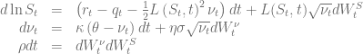

校准本地波动率曲面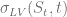和一组 Heston 参数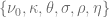的杠杆函数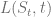的基本方程为

![L(S_t, t)=\frac{\sigma_{LV}(S_t, t)}{\sqrt{\mathop{\mathbb{E}}[\nu_t|S=S_t]}}= \sigma_{LV}(S_t, t)\sqrt{\frac{\int_{\mathop{\mathbb{R}}^+} p(S_t,\nu, t) d\nu}{\int_{\mathop{\mathbb{R}}^+}\nu p(S_t,\nu,t)d\nu}} ](img/119356653cb0c4aa9dbec471528da261.png)

关键问题在于计算期望值![\mathop{\mathbb{E}}[\nu_t|S=S_t]](img/4c2203b6d9d260d8f1b17063c07e1020.png)。这可以通过 Fokker-Planck 方程或蒙特卡罗模拟来完成，如[3]中概述的以及其中的参考文献所示。如果费勒约束被违反，通过有限差分方法得到 Fokker-Planck 方程的解决方案绝非易事。在这种情况下，蒙特卡罗方法承诺能减少数值问题。获得高效蒙特卡罗校准的起点是用于随机局部波动率（SLV）模型的快速而准确的模拟方案。SLV 的方差部分可以使用非中心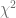分布来精确采样。

支持累积非中心分布的逆函数的 boost 库，但计算本身相当缓慢。[1]中概述的 Heston QE 方案配备了一个快速而准确的采样方案，用于平方根过程。在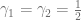的情况下，它的形式为

![\begin{array}{rcl} m &=& \theta+(\nu_t - \theta)e^{-\kappa \Delta t} \\[6pt] \nonumber \psi &=& \frac{\nu_t \frac{\eta²\sigma² e^{-\kappa\Delta t}}{\kappa}\left(1-e^{-\kappa\Delta t} \right) + \frac{\theta\eta²\sigma²}{2\kappa}\left(1-e^{-\kappa\Delta t}\right)²}{m²}\\[6pt] \nonumber \beta &=& \frac{2}{\psi} - 1 + \sqrt{\frac{2}{\psi}\left(\frac{2}{\psi}-1 \right)} \\[6pt] \nonumber p &=& \frac{\psi-1}{\psi+1} \\[6pt] \nonumber Z_\nu &\sim& \mathcal{N}(0,1) , u \sim \mathcal{U}(0,1) \\[6pt] \nonumber \nu_{t+\Delta t} &=& \begin{cases} \frac{m}{1+\beta}\left(\sqrt{\beta}+Z_\nu\right)² & \text{if } \psi < 1.5 \\[6pt] \begin{cases} 0, & \text{if } u \leq p \\[6pt] \ln{\left(\frac{1-p}{1-u}\right)}\frac{m}{1-p} & \text{otherwise} \end{cases} & \text{if } \psi \geq 1.5 \end{cases} \end{array}](img/32c44e6fd57bbc2333a06f04a6003245.png)

文献[2]中的作者建议了对 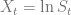 的抽样方案。下面的方案更接近原始 QE 方案，并且没有严格的证明，它已经显示出了对于这些例子 slightly smaller discretisation errors。

![\begin{array}{rcl} X_{t+\Delta t} &=& X_t + \left(r_t - q_t - \frac{1}{4}\left(\nu_t+\nu_{t+\Delta t}\right)L(S_t, t)² \right)\Delta t \\[6pt] \nonumber &&+ \frac{\rho}{\sigma}L(S_t, t) \left(\nu_{t+\Delta t} -\nu_t - \kappa\theta\Delta t + \frac{1}{2}\

为了从蒙特卡洛路径得到杠杆函数，文献[2]中作者使用了每个时间步的箱式技术。QuantLib 支持两种生成随机抽样的方法，一种基于独立同分布的正态变量，另一种基于 Sobol 准蒙特卡洛模拟与布朗桥。

测试案例定义：Feller 约束被违反。

有效地，杠杆函数  将移除 Heston 模型引入的偏斜和期限结构，并将波动性转移到 30%。为了衡量校准质量，计算了价格高于 0.02 的 OTM 看涨和看跌期权，以及从一个月到两年的到期期限的波动率基点差异。SLV 价格是通过使用有限差分法解决费曼-卡克后向方程计算得出的。

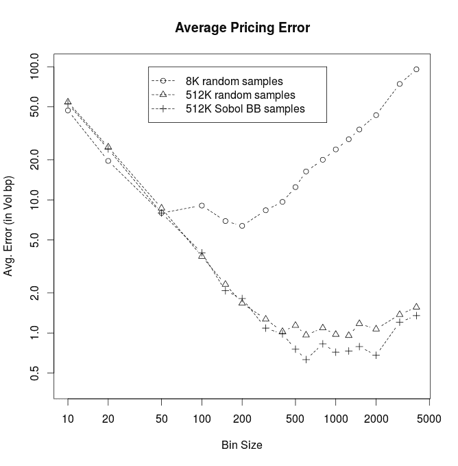

上述图表显示了不同蒙特卡洛校准路径数和不同箱体大小下的平均定价误差。正如预期的那样，最优箱体大小取决于蒙特卡洛模拟的数量。特别是深度 OTM 期权，从大量的箱体中受益。使用 Sobol 准蒙特卡洛模拟和布朗运动桥并没有带来显著优势。

当总是选择最优箱体大小时，平均定价误差随着蒙特卡洛校准路径数的平方根减小，如图所示。使用布朗运动桥的准蒙特卡洛路径生成带来一点优势。

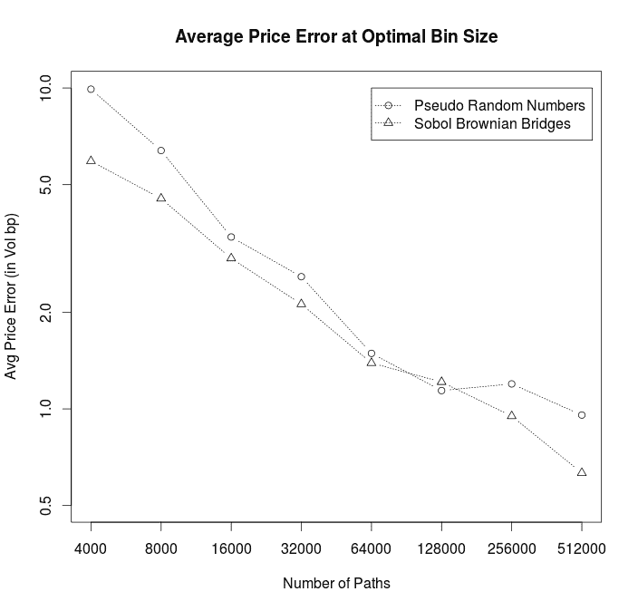

如图所示，杠杆函数本身确实暴露了一些蒙特卡洛噪声，相应的基于有限差分法的杠杆函数曲线平滑，但整体校准误差与此相当。

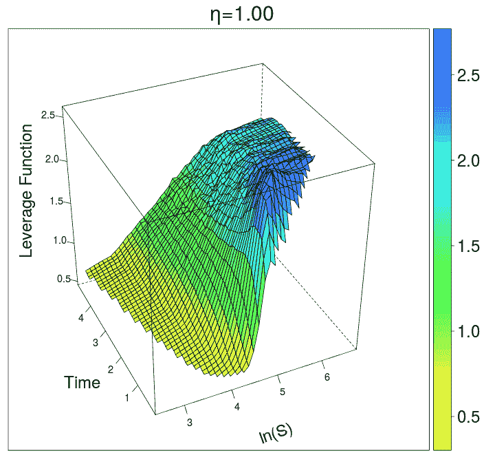

不同混合因子 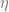 的校准是直接的。例如，下图显示了不同对称下限和上限障碍距离的双重触摸期权价格，用相应的布莱克-舒尔斯价格表示。这种图表类型源自[4]中的图 8.8。

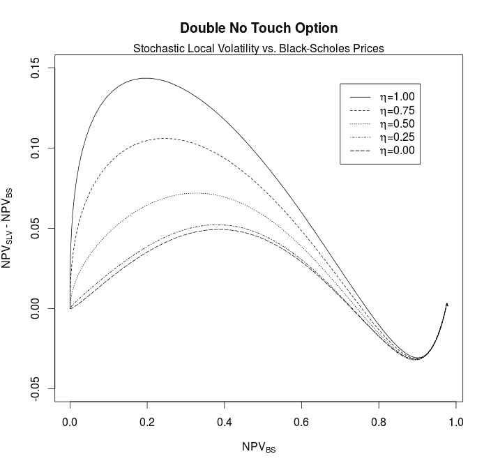

源代码可在[github](https://github.com/lballabio/QuantLib/)上找到，作为 HestonSLVModelTest 测试套件的一部分。

[1] Leif Andersen, [Heston 随机波动模型的有效模拟](http://papers.ssrn.com/sol3/papers.cfm?abstract_id=946405)

[2] Anthonie Van der Stoep, Lech Grzelak, Cornelis Oosterlee,

[Heston 随机局部波动模型：高效的蒙特卡洛模拟](http://papers.ssrn.com/sol3/papers.cfm?abstract_id=2278122)

[3] Johannes Goettker-Schnetmann, Klaus Spanderen, [使用 Fokker-Planck 方程校准 Heston 随机局部波动模型](http://hpc-quantlib.de/src/slv.pdf)

[4] Iain J. Clark, 外汇期权定价：实践者指南
