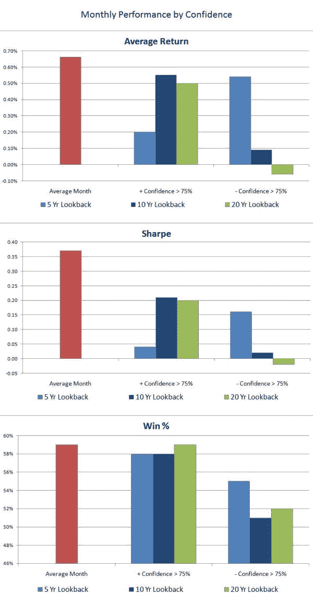
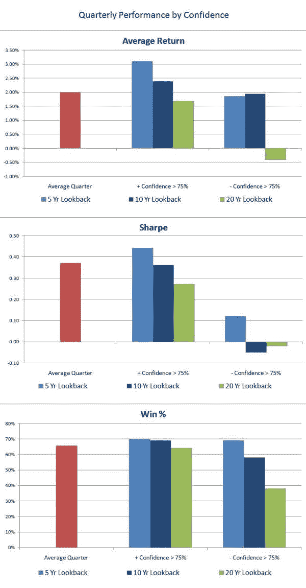
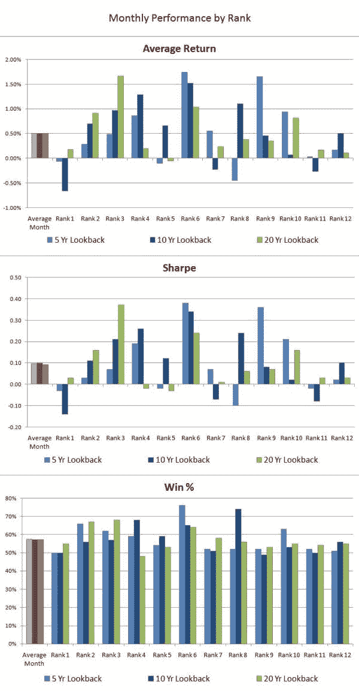
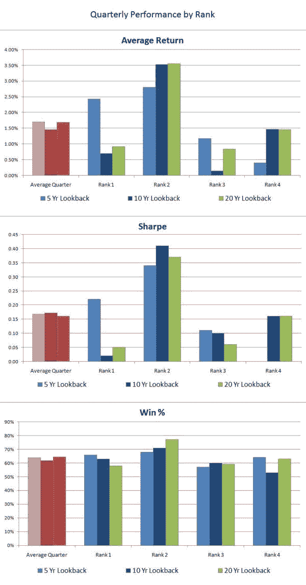

<!--yml

类别：未分类

日期：2024-05-12 18:46:24

-->

# 使用时间机器测试探讨月度和季度季节性（第一部分） | CSSA

> 来源：[`cssanalytics.wordpress.com/2009/10/06/monthly-and-quarterly-seasonality-using-the-time-machine-test-part-1/#0001-01-01`](https://cssanalytics.wordpress.com/2009/10/06/monthly-and-quarterly-seasonality-using-the-time-machine-test-part-1/#0001-01-01)

***注意：想要在即将推出的 DV 指标包中享受早鸟折扣，请通过电子邮件联系我们* *dvindicators@gmail.com* *——已经向我们咨询过 DVTrsi 的人自动有资格。***

继我们探讨基于季节性的策略之后，我们决定调查在现实的时间机器测试中，月度和季度策略的表现如何。对于新手来说，时间机器测试意味着我们将使用一个按照特定规则编程的学习算法，从数据集的开始部分开始，并进行出样本交易。这是最客观的实验，因为历史回测充满了后见之明偏差——或者用俏皮的话来说，就是“周一早上四分卫”的偏差。那些通过时间机器测试的策略在现实生活中发挥作用的可能性要比静态回测或“系统”大得多。

那么我们先来看第一次测试：让我们寻找使用 t 统计量，在 95%的统计置信水平下大于或小于 0 的月份或季度。本质上，我们想要找到历史上极其一致的正面或负面月份。哦，没有多少人愿意接受这个挑战，使用更长的回望期（超过 5 年的历史数据）**我们几乎没有找到任何符合条件的月份或季度**。这是我们第一次发现月度和季度的季节性非常**嘈杂**——我个人认为，如果一个策略通不过这个测试，我可能会直接将其抛弃。有很多好的效应值得交易，专注于那些无法自信地区分于零的策略是没有意义的。那么我们暂时将置信度定为 75%——这对于金融市场来说已经足够了。下面是一个测试，该测试选择 t 分数大于 0 且置信度在 75%或以上的月份，即它们应该高于 0，并且希望比平均月份更好。此外，我们还包括了选择 t 分数小于 0 且置信度在 75%或以上的月份，意味着它们应该是负面的，或者希望比平均月份更糟。在这里，我们看到我们评估时需要 10 年或 20 年的回望期来提高效果（这是有意义的，因为样本量较小），而且这个策略只能成功识别表现不佳的月份。实际上，选择高 t 分数的月份实际上表现不如平均水平。相比之下，季度的表现要好得多，奇怪的是，为了识别最好的季度，更倾向于使用较短的回望期——关于这个现象，我们将在下一篇文章中详细介绍。然而，为了识别最差的季度，20 年的回望期是最成功的，这可能与寻找最差月份的效果巧合。结果对回望期非常敏感，这大大削弱了可以得出的任何结果或结论。

我们还使用了一种包含 DVR 的排名方法——这是夏普比率乘以权益曲线的线性度。试图识别最佳和最差排名的月份或季度中的噪声在图表中非常明显。并没有明确的关系。到目前为止，教训似乎是月度和季度的季节性是一个非常微弱的影响——虽然评论家们经常提出回测结果，显示出像一月效应或者在夏季和早秋期间卖出这样非常出色的结果，但没有多少证据支持这是容易赚钱的。请记住，我们的时间机器没有后视镜的优势，所以在这个意义上它就像一个真正的交易员。我们的时间机器确实选择了最佳/最差和最一致的日历效应，并且很可能历史数据似乎包含了一个月或季度超越/落后表现的明显持续性。**在实际中，使用这种方法并没有产生良好的持续性结果，当这种信息用于交易时。**在下一篇文章中，我们将看看一些其他方法，尝试分离季节性效应………并得到一些非常令人惊讶和有趣的结果。尽管如此，教训仍然是警惕长期季节性研究——这里唯一可交易的好处似乎是在确定何时略微增加给定季度的敞口，以及何时减少敞口。使用顶部和底部进行多空策略并没有能够打败买入并持有。

（[月度绩效按配置](https://cssanalytics.files.wordpress.com/2009/10/monthlyperfbyconf.jpg)）

（[季度绩效按配置](https://cssanalytics.files.wordpress.com/2009/10/quarterlyperfbyconf.jpg)）

（[月度绩效按排名 2](https://cssanalytics.files.wordpress.com/2009/10/monthlyperfbyrank2.jpg)）

（[季度绩效按排名 2](https://cssanalytics.files.wordpress.com/2009/10/quarterlyperfbyrank2.jpg)）
