<!--yml

分类：未分类

日期：2024-05-18 13:44:02

-->

# 多资产市场制度 | Quantivity

> 来源：[`quantivity.wordpress.com/2012/11/09/multi-asset-market-regimes/#0001-01-01`](https://quantivity.wordpress.com/2012/11/09/multi-asset-market-regimes/#0001-01-01)

一个敏锐的读者建议重现 Kritzman 等人最近一篇关于制度分析的文章的结果，[制度转变：对动态策略的影响](http://www.cfapubs.org/doi/abs/10.2469/faj.v68.n3.3)，刊登于 FAJ（2012 年 5 月/6 月）。这是一个有趣的练习，可以通过一系列帖子进行，这样做可以阐明一些重要的经济原理和一些优雅的数学。

本文从识别*源自多资产经济活动的宏观经济市场制度*开始。

分析市场制度的一个重大挑战是*识别*，因为它们不能直接观察到。作为一个无监督的统计学习问题，没有可验证的“正确答案”。除了识别制度外，我们还想知道在任何给定时间点处于给定制度的概率。最后，我们的经济活动通过时间序列来衡量。

幸运的是，存在一种具有这些属性的标准 ML 技术：*隐马尔可夫模型*（HMM）。对于不熟悉 HMM 的读者，这里是与我们问题相关的理论的简要总结。有关更多详细信息，请参阅 Zucchini 和 MacDonald（2009）的[《时间序列的隐马尔可夫模型》](http://books.google.com/books?id=LDDzvCsdVs8C)。

* * *

HMMs 的有用之处在于它们估计了未观察到的状态和每个时间点上处于每个状态的概率。后者称为“局部解码”，并表示为条件状态概率：

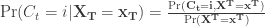

换句话说，给定观察到的数据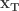，在时间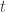处于状态的概率。

其中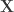是观察到的时间序列数据，是一个未观察到的参数过程，其在时间的条件概率至多依赖于以前的时间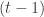，也称为马尔可夫性质：

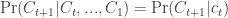

因此，是一个不可观察的马尔可夫链；因此，在时间的条件概率可以很好地简化为（参见 Zucchini 的方程 5.6，派生自 4.9）：

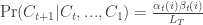

其中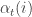和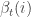是在时间沿着马尔可夫链的前向和后向概率（通过使用[期望最大化](http://en.wikipedia.org/wiki/Expectation%E2%80%93maximization_algorithm)迭代最大似然估计得出），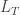是时间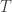的似然性。

对于那些喜欢代码的人来说，其中`val`是观察到的时间序列和`numOfStates`是未观察到的体制数量:

```

hmmFit <- HMMFit(val, nStates=numOfStates)
fb <- forwardBackward(hmmFit, val)
eu <- exp(fb$Alpha + fb$Beta - fb$LL)

```

具有机器学习背景的读者会认识到 HMM 是一种基本的时间图模型（参见[Koller 和 Friedman（2009）](http://books.google.com/books?id=7dzpHCHzNQ4C)的第 6.2 节）。

* * *

有了这一点 HMM 理论，我们现在可以用经济术语来阐述我们的体制分析问题，并使用 R 来解决它。

考虑四个经济活动的指标：美国股市，实际国内生产总值（GDP），通货膨胀和 G10 货币。假设每个经济活动的指标在任何时间点都可以被划分为*两个*状态之一：稳定且相应的小幅下行波动或收缩且相应的高波动。这广泛符合传统智慧，即宏观经济要么表现得“相当正常”，要么是异常的（要么是恐慌要么是过度自信）。

值得注意的是，这种双状态模型明显简化了现实，特别是忽略了“增长”与“停滞”（在 1970 年代和 2010 年代可能具有重要意义）之间的潜在区别。直觉上不清楚*先验*一个双状态模型或三状态模型哪个更优越。后续的文章将讨论这个模型选择的问题，因为它没有一个简单的答案。

用图形方式说明这个模型的条件概率，其中值为 0 表示 100%的可能性处于“正常”体制，值为 1 表示 100%的可能性处于“异常”体制：


这些体制与我们的经济记忆相匹配。在整个 1990 年代和 2000 年代初的中期，股市都处于正常状态，在恐慌期间剩余的时间都是如此。在 1990 年代中期、2000 年代初期的互联网泡沫恢复期间和 2000 年代末期的房地产泡沫恢复期间，GDP 增长异常强劲；“正常”时期内的增长。在 1970 年代末和 2000 年代末的房地产泡沫期间，通货膨胀率很高。在 1980 年代和 1990 年代，货币一直波动不定，然后在 2000 年代末的房地产泡沫期间再次出现波动。

这些体制也说明，从历史角度看，房贷泡沫是多么的异常，因为这是过去 30 年中唯一一次所有四个宏观经济活动指标同时处于异常体制的情况。

****

用于复制上述结果的代码，以及在后续帖子中将会讨论的更多内容。

注意：美国股市体制是使用 SPX 的日回报率来估计的，而不是像原文文章中那样使用标普 500 行业指数的等权重篮子。这样做导致了几乎相同的股市体制条件概率，因此选择了 SPX，以示奥卡姆的剃刀原则。

```

library("RHmm")
library("TTR")

displayKritzmanRegimes <- function()
{
  # Display regimes from Kritzman et al. (2012), printing regime
  # statistics and plotting local decoding.

  equityRegime <- getEquityTurbulenceRegime()
  inflationRegime <- getInflationRegime()
  growthRegime <- getGrowthRegime()
  currencyTurbulenceRegime <- getCurrencyTurbulenceRegime()

  print(equityRegime)
  print(inflationRegime)
  print(growthRegime)
  print(currencyTurbulenceRegime)

  plotMarkovRegimes(equityRegime, "Equity (SPX)", plotDensity=F)
  plotMarkovRegimes(inflationRegime, "Inflation (CPIAUCNS)", plotDensity=F)
  plotMarkovRegimes(growthRegime, "Real GDP (GDPC1)", plotDensity=F)
  plotMarkovRegimes(currencyTurbulenceRegime, "G10 Currency Turbulence", 
                    plotDensity=F)

  plotLocalDecodings(list(equityRegimeTurbulence, growthRegime, inflationRegime, 
                          currencyTurbulenceRegime),
                     list("US Equity (SPX)", "Real GDP (GDPC1)", 
                          "Inflation (CPIAUCNS)","G10 Currency Turbulence"),
                     regimeNums=c(2,2,2,2))
}

getEquityTurbulenceRegime <- function(startDate=as.Date("1977-12-01"), 
                                      endDate=Sys.Date(), numOfStates=2)
{
  # Estimate two-state markov (SPX-based) equity regime. In lieu of S&P 500
  # sector indices, use SPX instead.
  #
  # Args:
  #     startDate: date which to begin panel for regime estimation
  #     endDate: end which to end panel for regime estimation
  #     numOfStates: number of hidden states in regime
  # 
  # Returns: hmmFit from HMMFit(), suitable for display with plotMarkovRegime()

  spx <- dROC(getOhlcv(instrumentSymbol="^GSPC", startDate=startDate, 
                              endDate=endDate, quote=c("close")))
  spxTurb <- rollingTurbulence(spx, avgWidth=(250 * 10), 
                                    covarWidth=(250 * 10))
  meanTurb <- apply.monthly(spxTurb, mean)
  estimateMarkovRegimes(meanTurb, numOfStates=numOfStates)
}

getInflationRegime <- function(startDate=as.Date("1946-01-01"), endDate=Sys.Date(),
                               numOfStates=2)
{
  # Estimate two-state markov (CPI-based) inflation regime.
  #
  # Args:
  #     startDate: date which to begin panel for regime estimation
  #     endDate: end which to end panel for regime estimation
  #     numOfStates: number of hidden states in regime
  # 
  # Returns: hmmFit from HMMFit(), suitable for display with plotMarkovRegime()

  val <- 100 *dROC(getFREDData(symbol="CPIAUCNS", startDate=startDate, 
                               endDate=endDate))
  estimateMarkovRegimes(val, numOfStates=numOfStates)
}

getGrowthRegime <- function(startDate=as.Date("1946-01-01"), 
                            endDate=as.Date("2012-12-31"), numOfStates=2)
{
  # Estimate two-state markov (GDP-based) growth regime.
  #
  # Note: Growth regime appears to be bi-modal, and thus need to estimate
  # several times to get convergence on the regime reported by Kritzman.
  #
  # Args:
  #     startDate: date which to begin panel for regime estimation
  #     endDate: end which to end panel for regime estimation
  #     numOfStates: number of hidden states in regime
  # 
  # Returns: hmmFit from HMMFit(), suitable for display with plotMarkovRegime()

  val <- 100 * dROC(getFREDData(symbol="GDPC1", startDate=startDate, 
                                endDate=endDate))
  estimateMarkovRegimes(val, numOfStates=numOfStates)
}

getCurrencyTurbulenceRegime <- function(startDate=as.Date("1971-01-01"), 
                                        endDate=Sys.Date(), 
                                        numOfStates=2)
{
  # Estimate two-state markov (G10-based) currency turbulence regime.
  #
  # Args:
  #     startDate: date which to begin panel for regime estimation
  #     endDate: end which to end panel for regime estimation
  #     numOfStates: number of hidden states in regime
  # 
  # Returns: hmmFit from HMMFit(), suitable for display with plotMarkovRegime()

  g10rates <- getG10Currencies()
  avgg10rates <- xts(100 * rowMeans(dROC(g10rates), na.rm=T), 
                     order.by=last(index(g10rates), -1))
  turbG10rates <- rollingTurbulence(avgg10rates, avgWidth=(250 * 3), 
                                    covarWidth=(250 * 3))
  meanTurbG10rates <- apply.monthly(turbG10rates, mean)

  estimateMarkovRegimes(meanTurbG10rates, numOfStates=numOfStates)
}

estimateMarkovRegimes <- function(val, numOfStates=2)
{
  # Estimate n-state hidden markov model (HMM) for val.
  #
  # Args:
  #     val: series
  #     numOfStates: number of hidden states in HMM
  #
  # Returns: hmmFit from HMMFit(), suitable for display with plotMarkovRegime()

  hmmFit <- HMMFit(val, nStates=numOfStates)
  return (list(val=val, hmmFit=hmmFit))
}

plotLocalDecodings <- function(regimes, symbols, plotDateRange="1900::2012", 
                             regimeNums)
{
  # Plot local decodings for a list of HMM regimes, optionally over a set
  # date range.
  #
  # Args:
  #     regimes: list of regimes, as returned by estimateMarkovRegimes()
  #     symbols: list of human-readable symbols for regimes
  #     plotDateRange: option date over which to plot regime local decodings
  #     regimeNums: index of HMM regime, into regimes, to plot

  oldpar <- par(mfrow=c(1,1))
  on.exit(par(oldpar))

  layout(c(1,2,3,4))

  # generate merge of local decodings
  localList <- lapply(c(1:length(regimes)), function(i) {

    regime <- regimes[[i]]
    fb <- forwardBackward(regime$hmmFit, regime$val)
    eu <- exp(fb$Alpha + fb$Beta - fb$LL)
    local <- xts(eu[,regimeNums[i]], index(regime$val))[plotDateRange]

    plota(local, type='l', plotX=T, col=drawColors[i], main=symbols[i])
  })
}

plotMarkovRegimes <- function(regime, symbol, plotDateRange="1900::2012",
                              plotDensity=T, plotTimeSeries=T)
{
  # Plot markov regimes from HMM: kernel densities and per-regime local decodings.
  #
  # Args:
  #     hmmFit: fit for HMM, as generated by estimateMarkovRegimes()
  #     symbol: human-readable description of series with markov regimes
  #     plotDateRange: contiguous range of time which to plot

  val <- regime$val
  hmmFit <- regime$hmmFit

  # calculate local decoding
  fb <- forwardBackward(hmmFit, val)
  eu <- exp(fb$Alpha + fb$Beta - fb$LL)
  hmmMeans <- hmmFit$HMM$distribution$mean
  hmmSD <- sqrt(hmmFit$HMM$distribution$var)

  # plot kernel density with regime means
  oldpar <- par(mfrow=c(1,1))
  on.exit(par(oldpar))

  if (plotDensity)
  {
    plot(density(val), main=paste("Density with Regime Means:", symbol))
    abline(v=mean(val), lty=2)

    sapply(c(1:length(hmmMeans)), function(i) {
      abline(v=hmmMeans[i], lty=2, col=drawColors[(i+1)])
      curve(dnorm(x, hmmMeans[i], hmmSD[i]), add=T, lty=3,
            col=drawColors[(i+1)])
    })
  }

  # Plot time series of percent change and local decoding for each regime
  if (plotTimeSeries)
  {
    merged <- merge(val, eu)
    layout(c(1:(1+ncol(eu))))

    plota(merged[,1][plotDateRange], type='l', paste("Regime:", symbol), plotX=F)
    sapply(c(1:length(hmmMeans)), function(i) {
      abline(h=hmmMeans[i], lty=2, col=drawColors[(i+1)])
    })
    plota.legend("Percent Change:", drawColors[1], last(merged[,1]))

    sapply(c(1:ncol(eu)), function(i) {

      plota(xts(merged[,(i+1)], index(val))[plotDateRange], type='l', 
            plotX=(i==(ncol(eu))),
            col=drawColors[(i+1)])
      plota.legend(paste0("Event Regime ", i, ":"), drawColors[(i+1)], 
                   last(merged[,(i+1)]))
    })
  }
}

dROC <- function(x, n=1)
{
  # Return discrete rate-of-change (ROC) for a series, without padding
  ROC(x, n, type="discrete", na.pad=F)
}

```
