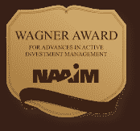

<!--yml

分类：未分类

日期：2024-05-12 18:05:29

-->

# 2013 年 NAAIM Wagner 奖：征稿通知 | CSSA

> 来源：[`cssanalytics.wordpress.com/2012/08/29/naaim-wagner-award-2013-call-for-entries/#0001-01-01`](https://cssanalytics.wordpress.com/2012/08/29/naaim-wagner-award-2013-call-for-entries/#0001-01-01)

全国积极投资经理协会（NAAIM）宣布了 2013 年

奖金$10,000 将授予最佳论文，该论文对投资者如何可能在市场低迷期间更好地管理投资组合进行了批判性分析，同时还能抓住市场表现卓越的时期。论文必须对积极投资者具有实际意义。

该比赛向所有投资从业者、学术界的教师和博士候选人开放。Wagner 奖的目的是提供学术支持，证明积极管理的可行性，并证实积极投资的合理性。

进一步的细节和提交规则请查看[此处](http://www.prnewswire.com/news-releases/call-for-papers-for-2013-wagner-award-167196805.html?utm_expid=43414375-18&utm_referrer=http%3A%2F%2Fwww.google.ca%2Furl%3Fsa%3Dt%26rct%3Dj%26q%3D%26esrc%3Ds%26source%3Dweb%26cd%3D4%26sqi%3D2%26ved%3D0CDcQFjAD%26url%3Dhttp%253A%252F%252Fwww.prnewswire.com%252Fnews-releases%252Fcall-for-papers-for-2013-wagner-award-167196805.html%26ei%3DnwU8UN-fH8Kh6wH4x4DoBg%26usg%3DAFQjCNEOJDPbqI466sS3Z-ZpKIf_hEXmsQ%26sig2%3DLE5DLtodB_IBBrmQtKqUXg)

（点击图片查看详情）[链接](http://www.prnewswire.com/news-releases/call-for-papers-for-2013-wagner-award-167196805.html?utm_expid=43414375-18&utm_referrer=http%3A%2F%2Fwww.google.ca%2Furl%3Fsa%3Dt%26rct%3Dj%26q%3D%26esrc%3Ds%26source%3Dweb%26cd%3D4%26sqi%3D2%26ved%3D0CDcQFjAD%26url%3Dhttp%253A%252F%252Fwww.prnewswire.com%252Fnews-releases%252Fcall-for-papers-for-2013-wagner-award-167196805.html%26ei%3DnwU8UN-fH8Kh6wH4x4DoBg%26usg%3DAFQjCNEOJDPbqI466sS3Z-ZpKIf_hEXmsQ%26sig2%3DLE5DLtodB_IBBrmQtKqUXg)
