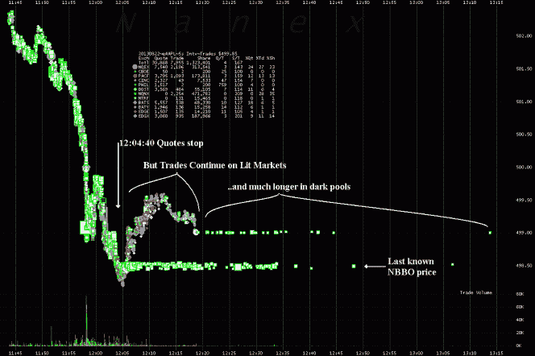

<!--yml

分类：未分类

日期：2024-05-18 14:25:58

-->

# Nasdark #2 – 空间与时间 – Sniper In Mahwah &朋友们

> 来源：[`sniperinmahwah.wordpress.com/2013/08/26/nasdark-2-de-lespace-et-du-temps/#0001-01-01`](https://sniperinmahwah.wordpress.com/2013/08/26/nasdark-2-de-lespace-et-du-temps/#0001-01-01)

2013 年 8 月 22 日星期四持续了三小时的纳斯达克历史上大故障，至今仍然在这里那里引起不少讨论。即使是 Thomas Peterffy 这位我曾在[*6*](http://www.zones-sensibles.org/index.php?mod=auteurs&a=06)中讲述的高频交易老手，也在这篇[巴伦周刊](http://blogs.barrons.com/stockstowatchtoday/2013/08/23/nasdaqs-shutdown-what-next/)的文章中表达了他的看法：“*我们应该认识到计算机系统本质上是复杂的并且可能出现故障*”，Peterffy 说，这与他在 2010 年 10 月 11 日在巴黎世界交易所大会上的著名讲话相呼应，他当时在金融市场的精英面前宣称市场现在是一个“真正的妓院”。仔细观察，纳斯达克的这次故障为回顾近期电子平台的历史和监管者引发的问题提供了一个梦寐以求的机会。卡尔·马克思可能写过一些聪明的东西，但当他声称资本主义是一种“通过时间消灭空间”的时候，我们必须认识到他大错特错了。

**从纳斯达克到电子平台**

纳斯达克于 1971 年 2 月 8 日开放电缆，成为美国第一个自动化市场，意思是经纪人先接收客户的订单，然后将其输入一个所有经纪人通过计算机访问的电子订单簿。这个电子订单簿当时取代了物理交易场所（*pits*, 或者交易厅），那里的人类交易员通过声音和手势相互交易，经纪人围绕这个空间坐镇。随后在 1980 年代和 1990 年代机器力量崛起，几乎所有美国市场都转向了电子形式，即 ECN（电子通信网络）。市场于是变成了电子平台，算法取代了人类交易员执行订单的工作。这个系统的核心是*匹配引擎*，即市场服务器，它将卖方算法与买方算法（电子版的以前交易员人类相遇的物理空间）相匹配。

**岛国与共享主机**

要理解托管服务，我们必须回溯到 ECN 的早期，特别是到岛国。在 20 世纪 70 年代和 80 年代，纽约证券交易所和纳斯达克被认为是“双头垄断”的市场，其中人类中介商被一些人视为眼中钉（有时公正地，被指责相互操纵价格，损害投资者利益）。面对这一双头垄断最愤怒的人之一是直言不讳的 Sheldon Maschler，他通过他的公司 Datek，直接且电子化地攻击纳斯达克。那正是“SOES 恶棍”时代的到来。我在[6](http://www.zones-sensibles.org/index.php?mod=auteurs&a=06)中详细说明了计算机天才 Josh Levine 如何在 Datek 的地下室里设计了后来成为市场电子平台矩阵的 Island。岛国很快被认为是首批平台中最稳健的一个，吸引了全国最优秀的电子经纪人，包括传奇的对冲基金 Renaissance（从技术上讲，岛国主要是 Josh Levine 上线的极其有效的*匹配引擎*，代码[在此](http://josh.com/notes/island-ecn-10th-birthday/ISLAND.PRG.TXT)庆祝岛国的十周年）。

在这些岛国的客户经纪人中，包括了 Tradebot，这是首批高频交易公司之一。它的创始人，Dave Cummings，随后创建了自己的电子平台，即后来的 Bats Global Markets，现在是美国第三或第四大成交量市场，与纽约证券交易所和纳斯达克直接竞争（就在此时，[报道](http://dealbook.nytimes.com/2013/08/26/bats-and-direct-edge-to-merge-taking-on-older-rivals/)指出 Bats 将与 Direct Edge 合并，它的最大竞争对手，这将会震撼美国市场）。但当时，当 Tradebot 开发其最初的高频算法时，Cummings 打电话给 Levine 提出了一个难题：与位于华尔街的多数岛国客户不同（岛国本身位于百老汇 50 号），Tradebot 位于堪萨斯城，距离那里有 1927 公里。Tradebot 需要穿越到岛国的一个订单因此对公司不利，来自 Tradebot 的订单必然比在百老汇几条街之外的订单来得慢。岛国随后向 Tradebot 提出，可以让 Tradebot 在其办公室内安装计算机（以及算法），作为交换，支付租金，靠近*匹配引擎*——其他岛国客户后来也这么做了。

因此，“托管”诞生了，这个操作就是尽可能将交易算法和*匹配引擎*靠近，使这些算法相互匹配（距离越短，订单传递越快）。如果最初的第一批托管客户在 Datek 的加热地下室安装，以尽可能接近 Island，那么在短短 10 年内，情况已经发生了很大变化：金融市场的*匹配引擎*安装在巨大的冷却*数据中心*中，华尔街的所有市场都搬到了新泽西州（纽约证券交易所位于 Mahwah，纳斯达克位于 Carteret 等——见下方的地图）。在这些*数据中心*内部，有一个专门为市场*匹配引擎*预留的房间，而另一个大厅则包括所有市场运营商的算法所在的办公室，当然这些算法都离市场同样的距离。这个故事是讽刺的：即使过渡到完全电子化，市场还是重新创造了人类交易员在交易大厅时代需要的那种空间接近性……因此，纽约证券交易所向这些托管客户承诺，在 37 微秒内执行一个订单，即 0.000037 秒，这是人类声音从喉咙发出到达嘴巴所需时间的一四分之一。

**Reg NMS, SIP 和 NBBO**

金融市场因此变成了一个由*数据中心*组成的群岛，最强大的市场运营商在这些*数据中心*中安装了他们的交易算法（如果 Island 收取的租金是几百美元，那么现在市场可以收取高达数万美元的租金）。

这是美国市场的地图，展示了*数据中心*的位置以及一条信息（一个报价或仅仅是数据）从纳斯达克出发前往其他市场（或相反方向）的延迟时间。这张地图也可以通过[谷歌地图](https://mapsengine.google.com/map/edit?mid=zrNZZNGK5JGs.kpbJtsC1ztHI)查看。纳斯达克位于 Carteret，Bats 位于 Weehawken，纽约证券交易所位于 Mahwah，Secaucus 这个迷人的城市迎来了芝加哥期权交易所（CBOE），国际证券交易所（ISE），波士顿期权交易所和 Directe Edge（在那里有两个平台，EDGE-A 和 EDGA-X）。现在我们可以清楚地看到，市场的名称与它们新的物理位置无关，芝加哥在 Secaucus。

在 2007 年，美国市场监管机构，证券交易委员会（SEC），通过了一系列名为 Reg NMS 的规则来监管这个由机器组成的新兴群岛。其中一项规则要求券商或市场必须将订单“路由”到提供最佳价格的平台，这是一个显而易见的安排：投资者肯定希望与提供比其他人更好价格的交易对手进行交易。因此，所有券商和市场都必须了解这个碎片化数据中心的*data centers*中各地的价格。SEC 随后创建了 NBBO，即全国最佳买入卖出价，该文件包含了所有市场所有报价的信息，随后提供给券商和市场，以便他们可以将订单路由到价格最佳的地方。

关于 SEC 将处理 NBBO 的任务委托给一个市场（实际上是纳斯达克）的事实，我们暂且不表，只谈技术层面。为了更新 NBBO，纳斯达克使用了证券信息处理器或 SIP，它收集不同平台的价格信息，然后将其整合到 NBBO 中，之后 NBBO 发送给所有参与者。然而众所周知，电子券商可以与平台直接购买报价信息（这被称为拥有一个*直接数据流*）。那么券商有什么理由通过市场购买通过 NBBO 分发的数据呢？因为这样会更快，*当然…*

NBBO 更新缓慢的问题早已为人所知，这正是故事的又一讽刺之处，再次将我们带回 Island。在其初期，Island 曾是纳斯达克的强劲竞争对手，因为乔什·莱文的平台效率更高、更稳健、速度更快，这使得电子经纪商将订单导向 Island，而非纳斯达克。命运的第一个讽刺：Island 后来被 Instinet（另一个平台）收购，然后 Instinet 又被纳斯达克收购。Island 最终落入了其历史竞争对手的手中。乔什·莱文随后决定着手改进 SIP，使其更高效，尤其是更快。他提议用 1 美元重建 SIP，并将其命名为 Big J Sip。我将用 1 美元创建一个简单、快速且可靠的 SIP。我会用一年的时间来证明它的工作性，然后我会将其以非盈利目的的*trust*形式交付。我可以在六个月内交付该系统，并保证第一年的技术运营成本将低于 10 万美元，之后的年份会更低。我会这么做，因为我认为一个高效的 SIP 将对整个市场和经济产生积极影响。我将使用与 Island 相同的类似技术。

遗憾的是（对于 2013 年的纳斯达克来说），乔什·莱文与谢尔森·马施勒以及前 SOES 歹徒的联系使纳斯达克变得警惕，纳斯达克拒绝了这一提议，并聘请了一家公司来重建 SIP……耗资 1000 万美元！乔什·莱文随后决定离开 Island/Instinet，并开始研发一个自动生成法律文件的系统，灵感来源于哲学家路德维希·维特根斯坦的《逻辑哲学论》……

纳斯达克故障

纳斯达克肯定会对乔什·莱文（Josh Levine）的提议作出回应。现在我们对此事有了更深入的了解（尽管纳斯达克并未详细说明），关于 8 月 22 日电子市场故障的问题。华尔街日报的这篇文章证实了之前一些匿名人士所提到的内容：问题源于纳斯达克和纽约证券交易所 Arca 之间的连接问题，两家交易所从上午 10 点 55 分开始无法相互连接（顺便提一下，Arca 是 Archipelago 的缩写，这是纽约证券交易所于 2005 年收购的一个电子平台，由杰里·普特南创立，普特南将他的平台命名为“Archipel”以回应乔什·莱文的“岛屿”）。由于无法与纽约证券交易所连接，纳斯达克无法更新 NBBO（尚不清楚为什么与 SIP 相关的问题会导致纳斯达克干脆关闭了对经纪商的门）。

时间套利、高频交易和暗池

Reg NMS 在一点上非常明确：即使一个经纪人直接从平台/市场购买报价信息（*直接反馈*），它必须根据 NBBO 显示的价格来处理证券（这是有逻辑的，因为 NBBO 平等地通知所有参与者）。然而，获取 NBBO 数据比处理*直接反馈*要花更多时间……这都是因为共享主机（一切都在这里）。

假设一个市场运营商（比如，随机选取的高盛）在 Mahwah 安装了其算法，那里是纽约证券交易所的所在地。高盛作为共享主机，购买了纽约证券交易所的数据，由于共享主机以及与市场的接近，这些数据在几十万分之一秒内就传达到了高盛的算法中。那么，为什么还要等待 390 万分之一秒，让来自 Carteret（距离 60 公里）的 NBBO 信息传来呢？即使被禁止，对于位于市场附近的高频共享主机算法来说，使用*直接反馈*数据而不是等待 NBBO 是非常诱人的。这或许可以解释 Nanex 的这张图表：

（图片链接保留原文）

由于 SIP 故障，NBBO 也停止运作，报价在 12h04mn40s 停止。然而，在接下来的 15 分钟里，仍有交易发生。没有报价怎么会有交易呢？答案可能在于高频交易算法通过共享主机服务来获取数据。唯一的解释是这些算法使用了*直接反馈*数据（直接从市场获取，距离算法所在地几米远）来完成交易，完全不需要 NBBO——因为 NBBO 在当时已经不存在了。如果确实如此，那么 12h04h40s 之后的所有交易**都是完全非法的**，因为 Reg NMS 禁止使用*直接反馈*进行交易。

特别是对于*暗池*来说，正如 Nanex 图表所显示的，在 NBBO 消失后，它们还继续运作并完成了超过一个小时的交易。然而，*暗池*为了进行交易，也必须以 NBBO 作为参考价，这个图表清楚地显示了 NBBO 消失所造成的问题：在 12h04mn40s 到 13h14 之间，*暗池*以过时的价格（甚至有两个不同的价格）完成了交易。在一个所有交易都在毫秒甚至微秒级别进行的世界里，发现*暗池*能够以一个小时之前的价格完成交易，这是相当令人不安的。

这篇文章已经相当长了:)，我快速提一下，Tradebot 在 2004-2005 年期间，正是利用了市场光明面（例如纽约证券交易所）和*暗池*之间的价格差异进行时间套利。正是利用了*暗池*更新全国最佳买卖价（NBBO）的速度慢于市场光明面的特点，人们能够在其中快速赚取几美分。）高频交易算法和*暗池*并不是纳斯达克故障的根源，但它们确实从中受益匪浅（即便最大的两个*暗池*，高盛的 Sigma-X 和瑞士信贷的 Crossfinder，在一段时间后也停止了运作）。

**结论**

上周纳斯达克的故障是金融市场现状的完美症状。金融市场群岛的地域分布和主机托管使得交易员（算法交易员）在时间上永远不可能处于平等地位，原因很简单，因为光速是不可超越的，地球是圆的。除非将所有市场参与者放在同一个地点，否则 NBBO 必须无延迟地运作。另外，了解 SEC 对在 12h04mn40s 之后发生的所有交易的意见将会很有趣，因为它们是基于非法使用的数据进行的。

让我们来结束关于乔什·莱文（Josh Levine）的言论，这是上周五由[彭博社](http://www.bloomberg.com/news/2013-08-23/island-inventor-levine-says-backups-not-enough-in-stocks.html)报道的（除非出错，这是自莱文 2004 年离开 Island 以来第一次提到金融市场）。根据莱文的说法，要实现一个有效的最佳买卖报价（NBBO）的解决方案就是将其去中心化，并构建一个分布式系统（在这种情况下，数据不需要在发送到 Carteret 之前再返回不同的平台）。莱文没有说的是（很难知道他是否想到了这一点），这样的系统将迫使高频交易员在每个 NBBO 分发点进行托管，这将对他们的账户产生重大影响。这是一个有趣的线索……
