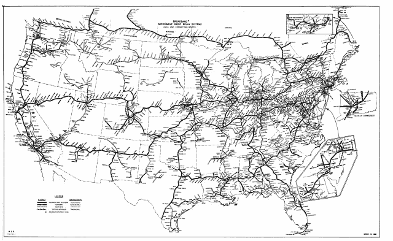

<!--yml

类别：未分类

日期：2024-05-18 14:08:50

-->

# Network Effects | Part I – Sniper In Mahwah & friends

> 来源：[`sniperinmahwah.wordpress.com/2017/06/07/network-effects-part-i/#0001-01-01`](https://sniperinmahwah.wordpress.com/2017/06/07/network-effects-part-i/#0001-01-01)

##### INTRODUCTION

由于在我们的生活中每一~微秒~纳秒都很重要，在当前的情况下，我不得不把每一微秒都投入到其他工作中，而不是在这里写关于高频交易和/或微波世界的内容。这就是我决定给不同的高频交易行业（或非行业）的人士提供在这里写作机会的原因。我原以为这个博客的座右铭可能会是“*资本市场之声*”，但另一个[组织](https://twitter.com/TabbFORUM)已经用了这个标题——太遗憾了。无论如何，我很高兴有几个人同意接替我。这里是一系列新文章《网络效应》的第一部分，由我的第一位嘉宾撰写，我很高兴在这里欢迎他。我只是稍微编辑了文本（几张照片，几个链接等），并在[括号]中添加了评论，作者为 SIM。祝大家阅读愉快。

##### NETWORK EFFECTS | PART I

上个月初，一名记者打电话给我，问了一个奇怪的问题。

“我了解到 Jump 最近在 Aurora 的对面购买了一个 31 英亩的场地。他们付了很多钱。据说达到了 1400 万美元。有任何想法知道他们可能在做什么吗？”

伊利诺伊州优质的农田每年可产出大约 200 蒲式耳玉米。按每蒲式耳 4 美元计算，Jump Trading LLC——这家不透明的高频交易巨头，拥有一个空白银色的[网站](http://www.jumptrading.com)和一个没有推文的[推特账号](https://twitter.com/jumptrading)，他们那块地可能每年能带来大约 2.5 万美元的农业收入。

“数据中心哪一侧？”我问道。

“在北面。”

Carteret, Mahwah, Secaucus, 350 Cermak and CoreSite 都位于东边或稍微偏东南。北面并不在地球的几何线上。

“可能是短波装置？”我犹豫了一下，但基本上还是茫然无知，“也许他们在一次性密码本上加密 E-mini 的跳动，并将其全球广播。东京、伦敦、法兰克福、新加坡、圣保罗。嘿，你在线吗？”

他停顿了一下。

“打开谷歌图片搜索‘Rampisham Short Wave Radio Station’”，我说，“你在寻找的是那样的东西；一个长着天线而不是玉米的田地。如果你开车去 Aurora 拍照，这将让你了解他们正在做什么。”

第二天，照片突然出现在我的屏幕上。

来源：Brian Louis/Bloomberg

跳远新购买的田野是一片荒凉未耕种的荒地，早期春天的野草丛生。在远处，可以看到卡车，在 I-88 上轰鸣而过。费米实验室就在地平线上，在那里，曾经在废弃的 2 公里宽的 Tevatron 中，产生了在宇宙存在的第一微秒时刻存在的温度。

在田野的极端东南角，有一台科勒便携式发电机，一根短小结实的杆子上装有一个毫米波无线电台，还有两根小天线朝东北方向指向。

***

十多年前，我确实了解过 Getco，并对这个名字的胆大妄为感到惊讶。我的一个朋友，一位物理学家，在一张 20 世纪 90 年代的办公桌工作，那张办公桌开创了[统计套利](http://www.hedgefund-index.com/d_statarb.asp)和高频交易的早期版本。在那个现在遥远的时代，毫秒级的速度、开放的电话线路和人类的反应时间都是相关的。我知道服务器正在迁移到数据中心以获取与交易所的接近。我听说过一些令人兴奋的传言，说一些位于芝加哥的公司集合正在产生巨大的 P&L（利润和损失）。“每天 100 万美元”，“有效无限的[夏普比率](http://www.investopedia.com/terms/s/sharperatio.asp)” [我在一份法庭文件中读到，休斯顿的一家大型“HFT”（高频交易）公司在 2001 年早期阶段，其夏普比率达到了 20 到 40，“*这是非常高的*” —— SIM]。 2007 年底，一个可能知道内情的人，在喝了几杯玛格丽特之后，透露了一些听起来像是通往城堡的钥匙的话，“ETFs，伙计，我们在解包 ETFs 并对冲其基础资产。”几周后，一个成功的交易员，完全清醒，神秘地评论道，“数量级*，你需要用每毫秒多少美元来思考*。”另一个人说，“读读勒费弗的[书](https://en.wikipedia.org/wiki/Reminiscences_of_a_Stock_Operator)。那里面的一切仍然有效。”这是通过一个不完美、完全不完整的窗户，窥视一个神秘令人兴奋的世界，那个世界完全遥不可及。

能否通过线索和误信息的蔓延来揭示高频交易（HFT）实际是如何运作的？一些简单原则似乎不断地在谣言中出现。（1）如果延迟是一个问题，那么你预测有效的时长必须缩短。也就是说，如果你能预测出股票下周的价格走向，那么你关心的是订单执行和市场影响，而不是微秒级的延迟或者纳秒级的时间戳。 （2）在生产过程中根本没有时间去解决复杂的方程式。在数据中心牢笼里，必须依靠启发式算法和查找表。 （3）[中心极限定理](https://en.wikipedia.org/wiki/Central_limit_theorem)和[大数定律](https://en.wikipedia.org/wiki/Law_of_large_numbers)将有助于一个人。扩散随时间的[平方根](http://www.macroption.com/why-is-volatility-proportional-to-square-root-of-time/)而变化，所以 VIX 达到 20 时，每年化价格变动的 ticks 在 E-mini 上每几秒出现一次。因此，[队列定位](https://www.kcg.com/uploads/documents/KCG_NeedForSpeed1-Report.pdf)至关重要，市场造市，或其高科技等价物*必须* 是 HFT 的核心组成部分。

***

2010 年 9 月，《福布斯》杂志上那篇臭名昭著的关于 Spread Networks 的文章我直到 11 月初才看到，所以很显然，别人早在很久以前就形成了我阅读后立即产生的所有想法：对于如此直且昂贵的光纤，为什么从芝加哥到纽约的往返旅行时间如此痛苦地缓慢？距离大约 1200 公里，所以单向信号传播时间至少应该为四毫秒，而不是七毫秒。然后我想起二年级物理课上的知识，玻璃中的折射率大约为*n*=1.5……困惑。

直接通过空气发送信号不是更快更便宜吗？

一个关于无线电频率通信的谷歌 crash 课程——一个我简直一无所知的主题——表明，无论是通过一系列微波无线电站传送信号，还是几乎零成本地使用流星爆发通信，都不会有阻止性的障碍。在确信我已经做了足够的尽职调查以免出丑之后，我把这两个计划通过电子邮件抛给了略微认识的一位退休通信工程师。大约一周后，他回信了。

> 我认为使用无线电链路的构想似乎是个好主意，并且行得通，但我相信通过流星散射来做可能存在一些问题。在我看来，一个标准的微波中继链可能是最好的选择，而且有可能使用双跳对流层散射链。
> 
> 请记住，无线电有两个独立的问题：技术可行性和获取频谱的使用权。对于这样的事情，我猜成本不会压倒一切。另一个问题是所使用的协议是否需要远端端的响应，或者是否可以通过某种巧妙的方式消除这一点，从而使延迟基本上是“开环”的。
> 
> 首先，谈谈流星散射。标准的流星散射链路有一个不同寻常的特点，即来自电离层的反射不像电离平面那样具有相同的地理覆盖范围，因此两个地点之间的有用流星轨迹数量远小于流星的总率。典型的链路非常窄带，部分原因是它们通常功率较低。因此，一个更高功率的链路可能解决突发率问题，但即便如此，我相信也不足以提供足够的对齐路径以实现实时服务。
> 
> 一种更可靠的方法是使用曾经在老 AT&T 长途电话网络中使用的接力站点，频率为 4 GHz 和 6 GHz。
> 
> （[点击这里](https://www.reddit.com/r/technology/comments/fxuk2/this_is_a_map_of_the_1960s_era_att_long_lines/)查看 1960 年代 AT&T 长途电话网络的地图）
> 
> 许多这些设备之前已经出售过一段时间，我猜它们已经被租赁塔和建筑空间的机构收购。在这种情况下，你可以期待有合理的带宽，而延迟当然由空气中的光速加上管道和电路的少量确定。为这项服务提供现代设备是可行的，天线和馈线也同样如此。由于光纤具有更大的带宽、灵活性以及较低的成本，因此这种特定技术并没有市场。但我认为从芝加哥到纽约的单向延迟可能在 700 英里的距离上是 4 毫秒左右。见[`long-lines.net/places-routes/1st_transcon_mw/LL0949/02.html`](http://long-lines.net/places-routes/1st_transcon_mw/LL0949/02.html)
> 
> 有一些未授权的 5 GHz 频段可以提供这项服务，或者它可能在 4 GHz 和 6 GHz 的授权频段中。可能会有一些衰减中断，但可以通过工程来解决这些问题。
> 
> 另一种可能性是一个双跳[对流层散射](http://www.militaryaerospace.com/content/dam/mae/online-articles/2013/07/Troposcatter%2026%20July%202013.jpg)链路。这需要大型天线和高功率，但这些都是为卫星地球站开发的。有 20 MB 的军事系统，但每次跳转的最大范围是 400 英里，所以你需要一个中间点。考虑到对对流层的依赖，可能会有一些中断，但可用性可能足够有用。

这回复似乎挺鼓舞人心的。我继续深入挖掘。由于是中继传输，并且几乎是最优的几何方案，对流层散射方案看起来将会是最快的选择。然而，对流层散射服务提供商网站的调查，显示出的基础设施无一例外地包括装甲悍马车、令人不安的大天线、集装箱大小的发电机以及伪装网。在芝加哥市中心协调这些设备的停放似乎希望渺茫。

然而，通信塔上的微波天线无处不在。它们已经成为景观的一部分，以至于人们几乎注意不到它们[这就是我对高频微波世界的兴趣所在 - SIM]。我发出了更多的咨询，提出了各种想法。回顾我的笔记，我有一封来自一位工程师朋友的打印出来的邮件，日期是 2010 年 12 月 8 日，这封信极具预见性：

> 非常有趣。这让我想到了其他完成这件事的方法。这里有一个更加切合实际的想法。你可以使用未授权的频谱，比如用于 Wi-Fi 的频谱，并建立一个网状网络，以及你需要的跳数。
> 
> 我在网上搜寻了一番。有一家公司出售的频谱许可豁免基站设备，其有效范围可达 30 公里。主要用途是企业或市政/乡村的 Wi-Fi 网络。但是，有了这样的覆盖范围，理论上你可以在纽约到芝加哥之间搭建大约 40 个中继跳。我不确定每个跳点会增加多少延迟，但我猜测不会超过 20 微秒。在我的上一份工作中，我负责整个网络栈（TCP/IP）的硬件处理，内部延迟很好地控制在 5 微秒以下。采用每个跳点 20 微秒的保守估计，将额外增加 800 微秒（1.6 毫秒的往返时间）到 8 毫秒的光速传输时间。即便如此，总时间仍低于 10 毫秒，与文章中的 13 毫秒相比，这无疑具有竞争力。另外，带宽应该也相当可观，大约在兆字节量级。虽然比不上光纤，但对于一些有限的符号的贸易信息通信来说，肯定是足够的。另一个优势是它具有一定程度的可扩展性。你可以建立多个点对点的跳点链接。由于这种设备是视距传输，你很容易就能拥有非常相似路径上的并行网络。这不仅能增加带宽，还能为网络增加冗余和可靠性。如果可用产品具有合理的性能，这种解决方案的成本将会非常低。我找到了另一家公司，美国塔公司，它出租天线塔空间用于蜂窝和无线电（可以把它看作是天线托管，类似于数据中心托管）。看起来所有这些组件都已经齐备，可以出去组装一个解决方案。我敢肯定大玩家们已经这么做了，但同样，这是那些你总有一天会在报纸上读到，然后想“天哪，我们谈论过那个！”的事情之一。毕竟，我们谈论过到芝加哥的隧道，结果有人真的建了它。一旦有人这么做，就会有一大群人跟着做，因为这是低成本且直接的。从纽约到芝加哥的直射 Wi-Fi 频谱将会非常拥挤，以至于宾夕法尼亚州和俄亥俄州的乡村地区的人永远无法使用他们的 Wi-Fi。我敢肯定到那时政府必须介入。所以，即使有人在使用微波，我想 Wi-Fi 想法的可能性也较小。没有什么比在光天化日之下隐藏一个超级低延迟网络更隐蔽的了！

2010 年我最后一篇笔记本上的记录是一段没有注解的片段，它像是通过两次跳的散射链接转发来的，来自一个据称在该行业工作的人。

> 实际上……芝加哥有一家公司使用微波在通往纽约市区的途中覆盖一个城镇/区域。（显然有一些电信公司控制这个地区的交换机，他们不得不绕道，所以决定翻越）据说他们的时间是 13.9，而 Spread Network 直连线路是 15（普通线路是 16.5）

上一次的条目中有些内容似乎令人困惑且令人畏惧，接下来的十周里，我的兴趣转向了其他事物。

###### 正如我们法语中所说：“à suivre…”
