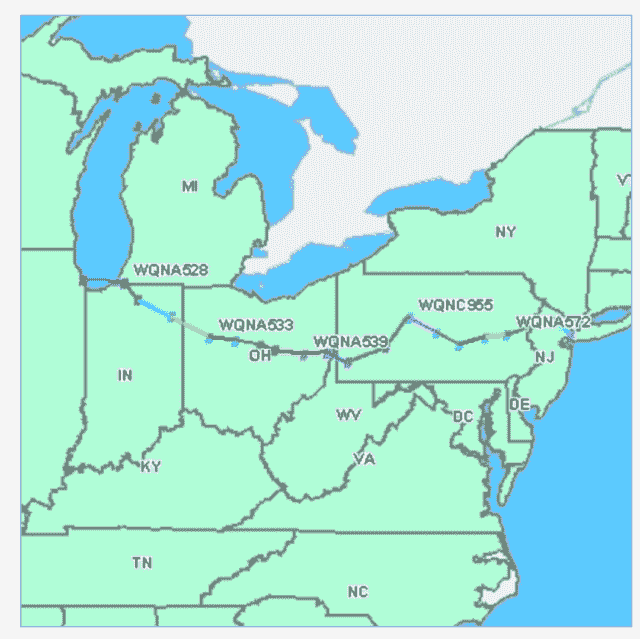
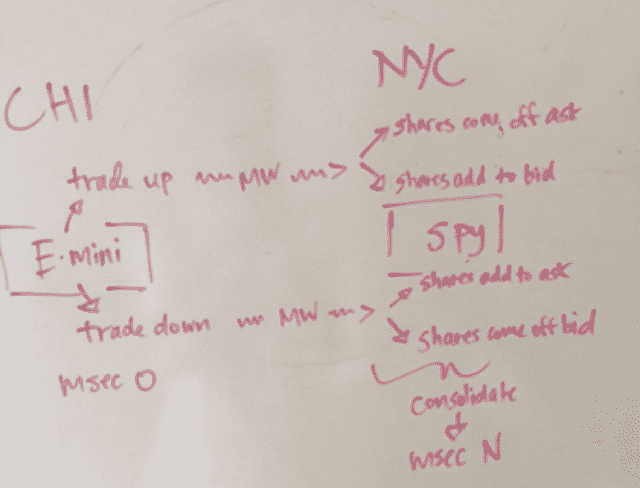
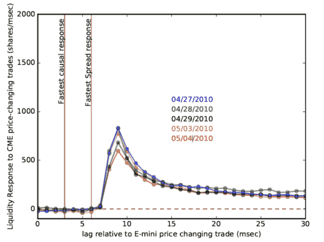

```yml

分类：未分类

日期：2024-05-18 14:08:41

-->

# 网络效应 | 第二部分 - 曼哈顿狙击手及朋友们

> 来源：[`sniperinmahwah.wordpress.com/2017/06/26/network-effects-part-ii/#0001-01-01`](https://sniperinmahwah.wordpress.com/2017/06/26/network-effects-part-ii/#0001-01-01)

保密协议已经到期。从芝加哥到新泽西的微波竞赛已经合并为几个胜者。许多早期参与者现在可能都在关注某种与高频交易（HFT）相关的[畅销书](https://en.wikipedia.org/wiki/Flash_Boys)的巨大成功（以及明显的不足），并且在想，是的，“我也能做到。”

毕竟，这是一个精彩的故事，而且还没有真正被讲述过。看起来有两种基本方法。你可以写一本电影级的惊悚小说，内容充满阴谋。在认知无线电上非法广播。流动的骗子在永远不会存在的网络上推销期货。或者你可以尝试写一本具有长期重要性的书，将细节纳入现代美国更大的背景和矛盾之中。

*

科技行业的一位同事最近回忆起他第一次遇到*真正的*闪电男孩的经历。

他说，“2010 年夏天，电话开始陆续打来，”他说，“这突如其来的，然后迅速升级。很快，整个秋天，然后进入 2011 年。他们会来到现场，很明显他们不是传统意义上的电信人员。他们要年轻得多，首先。穿着凉鞋、短裤、T 恤。他们直接拒绝说明他们实际上在做什么。

“他们谈论增益边际、调制、传播物理*等等*，但以一种奇怪的理论方式。就好像他们刚刚熬夜精通了一本教科书。他们中的每一个人都想知道关于再生延时的信息。在此之前，我从未考虑过内部延时。通常在数字信号处理方面，你关心的是错误校正，并且尽可能做得最好。额外的微秒从来都不重要， period.

他们并不是住在超级八酒店。他们会乘坐豪华轿车出去，让豪华轿车全天等待。有一次，我对他们中的一个人说，“嘿，让我带你回机场。”结果他并不是乘坐商业航班。我把他送到了通用航空。我看到停机坪上有一架 G4 在等待。

*

2011 年初，我参加了一个名为研究“Jamboree”的活动，在那里所有人——也就是说，大楼里的一大群物理学家——会快速地站起来并给出一个一分钟的演讲，同时展示预加载的 PowerPoint 幻灯片。由于我已经参加了几次这样的活动，我知道我之前的*modus operandi*，即认真尝试解释太多研究，然后被不体面地打断，*Gong Show*式的做法是完全无效的。

当我的一分钟到来时，我走上讲台。我的幻灯片是一张数字迷宫的截图；一个 asof 连接的[kdb](https://en.wikipedia.org/wiki/Kdb%2B)+股票报价表——我在学习简洁的[Q](https://en.wikipedia.org/wiki/Q_(programming_language_from_Kx_Systems))语言时使用的示例数据。

一分钟计时开始了。我看着观众，保持面部表情完全空白。五，六，七秒尴尬地过去了。

“一分钟并不多，”我最后说，打破了沉默，“但在高频交易这个高度机密、高度盈利的世界里，这是一段永恒。”

我指向幻灯片上的数字。“这是一份股票买卖报价的时间序列。令人惊讶的是，这些尖峰的数据结构中有一个*纳秒*字段。交易日内 的 23,400 秒现在可以被分成十亿个个体增量。当你考虑到地球有 45 亿年的历史时，这是相当惊人的。”

“十年前，谈论交易记录上的纳秒戳将是荒谬的。在互联网繁荣时期，你有 Xilinx 的股票日交易员，有时他们甚至能保持稳定的盈利。人类最快的反应时间是大约一百五十亿纳秒。”

“光速是一英尺每纳秒。爱因斯坦的特殊相对论现在是*经济*问题。延迟再减少几个数量级，广义相对论的时间膨胀开始变得重要。在未来，为了获得有竞争力的利率，你需要住在引力势井深处，你的银行需要在平坦的时空里。”

我的时间到了。所有人都看着我，好像我刚从外太空来的一样。

“嗯，呃，好吧……”主持人说，“那是不一样的。我们下一个演讲者将告诉我们有关在[红移](https://en.wikipedia.org/wiki/Redshift) Z=2 时气体 onto 星系的过程。”

*

第二天，我在走廊里遇到了一个同事，我叫他 Tim，“你认真的吗？”他问。

“或多或少是这样的，”我说，“广义相对论——引力时间膨胀——现在肯定在市场上没有发挥作用，但特殊相对论在回测策略和历史数据方面是有意义的，因为时间类和空间类事件之间的区别绝对是重要的。”

我告诉他关于使用微波中继来击败 Spread 网络的计划。“显然，他们花费了大约 3 亿美元来挖掘光纤。无线通信可能比这便宜两个数量级……”

“我加入了。”他说。

*

即使只花费 Spread 光纤的 1%，一个横跨大陆三分之一的秘密无线中继也是一个艰巨的项目。2011 年初紧迫的问题是谁先到了那里。

“如果这件事已经做了，也许它就在眼皮子底下。比如说他们使用许可频谱。联邦通信委员会[FCC]可能有一个可搜索的数据库吗？”

他们确实如此。

从芝加哥到纽约的地理弧线从未远离[41N](https://en.wikipedia.org/wiki/41st_parallel_north)，FCC 也使查询符合特定条件的实体变得容易，这些实体在相关地理范围内：

> AB 服务公司
> 
> airBand 通信
> 
> AT&T 公司
> 
> 细胞合作公司
> 
> 清晰频谱控股二、三公司
> 
> 综合无线通信公司
> 
> ECHOSTAR 公司
> 
> FELHC 公司
> 
> 纤维塔网络服务公司
> 
> 纤维塔频谱控股公司
> 
> 基础广播公司
> 
> 西班牙语信息和电信网络公司
> 
> IDT 频谱公司
> 
> MCI 通信服务公司
> 
> 大都市区网络公司
> 
> MPX 公司
> 
> 新兴通讯无线 PCS 公司
> 
> 诺福克南方铁路公司
> 
> 诺斯罗普·格鲁曼系统公司
> 
> 开放范围通信
> 
> 电信传输管理公司
> 
> 德克萨斯东部通信公司
> 
> 思想传输公司
> 
> 塔斯流公司
> 
> 特雷克斯企业公司
> 
> 西伍德一号广播网络公司

有了交叉列表，很容易逐一查看这些公司并标出它们的天线位置。从芝加哥到纽约的视线中继线应该是很明显的，即使是一瞥。列表上的第一家是“AB 服务”，但 FCC 网站突然变得令人发指的缓慢。我们等了将近一分钟。最后屏幕上出现了一张地图，引发了一种敬畏和失望的混合感。



一个简单的速算表明，即使考虑到商用无线电的延迟，AB 网络公司（在 FCC 数据库中有许可）也能轻易地打败 Spread 的纤维。谷歌将有限责任公司与安东·卡佩拉（Anton Kapela）和亚历克斯·皮洛索夫（Alex Pilosov）联系起来，这两人显然拥有各种市场技术技能。2008 年，《Wired》杂志[报道](https://www.wired.com/2008/08/revealed-the-in/)他们在[DefCon](https://www.defcon.org)黑客会议上的一次演讲：

“……BGP 窃听长期以来一直是一个理论上的弱点，但没有人知道已经公开演示了，直到安东·‘托尼’·卡佩拉，5Nines 数据中心和网络总监，以及亚历克斯·皮洛索夫，皮洛软件公司的首席执行官，在最近的 DefCon 黑客会议上展示了他们的技术。这对人成功地拦截了送往会议网络的流量，并将其重新定向到他们在纽约控制的一个系统，然后再将其路由回拉斯维加斯的 DefCon……

通过查看许可证持有者的名单，可以看出“综合无线”、“基础广播”以及名称令人毛骨悚然的“思想传输”也注册了一个网络，使用不同的有限责任公司来帮助掩盖他们的意图。综合-基础-思想已经建立了一条更直接的路径，如果运作顺利，将比 AB 的还要快。

*

很清楚，一场军备竞赛正在发展，最终胜出者将是一个非常直接的网络，拥有非常快速的无线电。为了了解事情进展到哪一步，我们需要查看滴答数据来判断信息传播的速度。是否有人已经上线并在 Spread 前面进行抢跑？

福布斯文章指出，光纤建设是由涉及“芝加哥期货合约与其 underlying equities 在纽约之间的微小差异”的交易推动的。查阅学术文献，一篇由 Joel Hasbrouck 撰写的标题为“美国股指市场日内价格形成”的论文因其被引用数百次而脱颖而出。摘要内容如下：

“目前，美国股指市场包括场内交易的股指期货合约、交易所交易的基金（ETFs）、电子交易的、小面值期货合约（E-minis），以及分解标普 500 指数为组成行业组合的板块 ETFs。本文实证调查了这一环境中的价格发现。对于标普 500 和纳斯达克 100 指数，大部分的价格发现发生在 E-mini 市场。对于标普 400 中盘股指数，价格发现由普通期货合约和 ETF 共同分享。标普 500ETF 对板块 ETFs 的价格发现贡献显著，但反向影响较小。”

所以，我们似乎处于熟悉的领域！我们实际上面临着一个粒子物理实验，这很快就在白板上 diagrammed 了：



芝加哥的 E-mini 交易在传播超过一千公里、达到光速的相当一部分后，才撞上位于新泽西郊区的数据中心“探测器”。我们可以通过将 SPY 订单簿响应与 E-mini 价格变动交易相关联来测量延迟。在获取数据、区分[FIX](https://en.wikipedia.org/wiki/Financial_Information_eXchange)和[ITCH](http://www.nasdaqtrader.com/content/technicalsupport/specifications/dataproducts/NQTVITCHSpecification_5.0.pdf)，并构建订单簿后——所有的麻烦——我们就能看到交易发生的速度有多快。

为了得到基准线，我们首先筛选了 2010 年 4 月底前后直至闪崩期间的数据。那是一段 HFT 风光无限的久远日子。巨大的交易量，巨大的波动性，没有任何迹象显示有人以能打败 Spread 的速度进行交易，而 Spread 的建设队伍正在努力钻穿结晶化的阿巴拉契亚古老基底岩层以铺设他们的光纤隧道。



那天晚上走路回家，一首随机播放进我耳机里的《Vampire Weekend》歌曲似乎恰如其分：

*早晨的条纹领男人

勇敢走向前跳舞

四亿美元

孩子们没机会*

*
