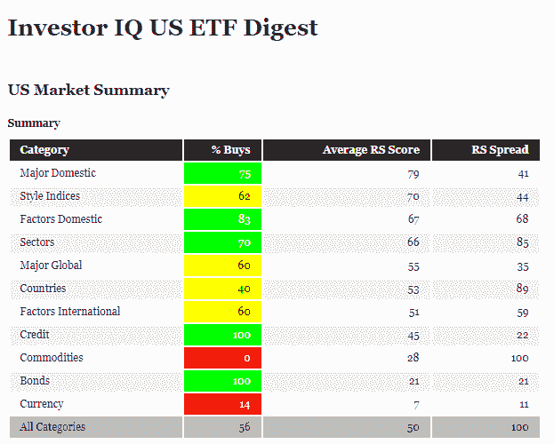

<!--yml

类别：未分类

date: 2024-05-12 17:41:59

-->

# New Feature on Investor IQ: Asset Class Breadth and Relative Strength Summary Statistics | CSSA

> 来源：[`cssanalytics.wordpress.com/2019/05/28/new-feature-on-investor-iq-asset-class-breadth-and-relative-strength-summary-statistics/#0001-01-01`](https://cssanalytics.wordpress.com/2019/05/28/new-feature-on-investor-iq-asset-class-breadth-and-relative-strength-summary-statistics/#0001-01-01)

昨天在[Investor IQ](https://cssanalytics.wordpress.com/2019/05/13/welcome-to-investor-iq/)上引入的新功能之一是对各种资产类别宽度和相对强度的总结。这有助于为投资者提供另一层信息，以确定应关注哪些资产类别以及应避免哪些。我们使用趋势和动量信号矩阵以及资产类别内的动量平均 RS 或相对强度来编制买入信号的%。最好的组合显然是高买入信号%和高 RS。然而，高 RS 和低买入信号%表明需要谨慎，因为并非所有领域都在像健康市场中所典型地参与。RS 差距是该类别中最强和最弱表现者的差异，表明了同一资产类别内长短组合的机会程度。当前输出的视觉图像可以 below 看到：

资产类别按平均 RS 排序列出。我们可以看到，国内股票和风格、部门和因子成分具有最强的相对强度。在国内股票类别中，传统股票因子具有最高的买入%。在国际市场上，情况看起来很有挑战性——很可能是贸易战的结果。各国的买入%只有 40%，这表明全球市场目前普遍处于困境。这也与货币类别的宽度和相对强度减弱相符，该类别的买入%仅为 14%，平均 RS 也只有最弱的 7%。在宽度方面表现最强的资产类别是债券和信贷，这是一个值得关注的趋势。在宽度方面表现最差的类别是商品，买入%为 0%，相对强度也只有 28%。商品的 RS 差距是资产类别中最高的，这表明了一个很好的机会，可以长期投资于强市场如石油（USO），同时做空弱市场如天然气（UNG）。

这种总结是保持市场领先地位和发现可以超配/低配某些资产类别的好方法。
