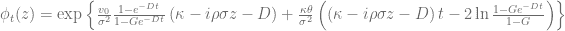
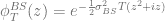

<!--yml

分类：未分类

date: 2024-05-13 00:12:49

-->

# 新的半解析 Heston 定价算法 - HPC-QuantLib

> 来源：[`hpcquantlib.wordpress.com/2017/05/07/newer-semi-analytic-heston-pricing-algorithms/#0001-01-01`](https://hpcquantlib.wordpress.com/2017/05/07/newer-semi-analytic-heston-pricing-algorithms/#0001-01-01)

QuantLib 中 Heston 模型的定价引擎已经有些过时。同时，新的更好的算法已经在文献中得到发展和讨论。欢迎参阅 [1][2] 进行全面审查。是时候翻新现有的引擎了。

Heston 模型由以下股票对数的随机微分方程定义

Gatheral 形式中的归一化特征函数为

Andersen 和 Piterbarg [3] 引入了一个 Black-Scholes 控制变量，以提高 Lewis 公式（2001 年）对香草看涨期权价格的数值稳定性

其中香草期权的 Black-Scholes 价格  具有波动率  和特征函数

为了实现最优控制变量，提出了不同的香草期权波动率方案：

+   

+   

+    其中  是  的第二累积量 [1]。

下图显示了不同控制变量波动率和 Heston 模型参数的结果被积函数。

并且对于执行价为和到期日为的普通认购期权。

最佳选择取决于 Heston 和期权参数，但似乎

对于各种参数而言，这是一个很好的选择。有控制变量和没有控制变量时，对函数被积函数进行直接比较，展示了控制变量的有效性。

Andersen-Piterbarg 的核心技巧是将 Lewis 的无限积分截断至有限的，使得剩余部分小于基于下列不等式的给定阈值

请参阅原始论文或[2]，了解如何从这里得到一个算法用于，特别是短期期权。

正如 Andersen 和 Piterbarg 所指出的，如果使用控制变量，简单的梯形法则在执行得到的积分时效果出奇的好。Alan Lewis 的[测试案例](https://forum.wilmott.com/viewtopic.php?f=34&t=90957&hilit=heston#p620396)，具有高精度 Heston 参考价格，应该作为测试的基础，特别是执行价为 100 的认购期权。Gauss-Laguerre 方法对这个特定测试案例非常感谢，但这里的重点是，梯形法则的收敛速度比高阶 Simpson 法则或甚至更复杂的自适应 Gauss-Lobatto 方法要快得多。

下图将最近新增的 COS 引擎与使用梯形法则的 Andersen-Piterbarg 方法进行了比较。对于相似数量的点，Andersen-Piterbarg 方法更为精确。

实现是 pull request [#251](https://github.com/lballabio/QuantLib/pull/251) 的一部分。

[1] M. Schmelzle，《利用 Fourier 变换的期权定价公式：理论与应用》。

[2] F. Le Floc’h，《傅里叶积分和随机波动率校准》。

[3] L. Andersen, and V. Piterbarg, 2010, 《利率建模，第一卷：基础和普通模型》，大西洋金融出版社，伦敦。
