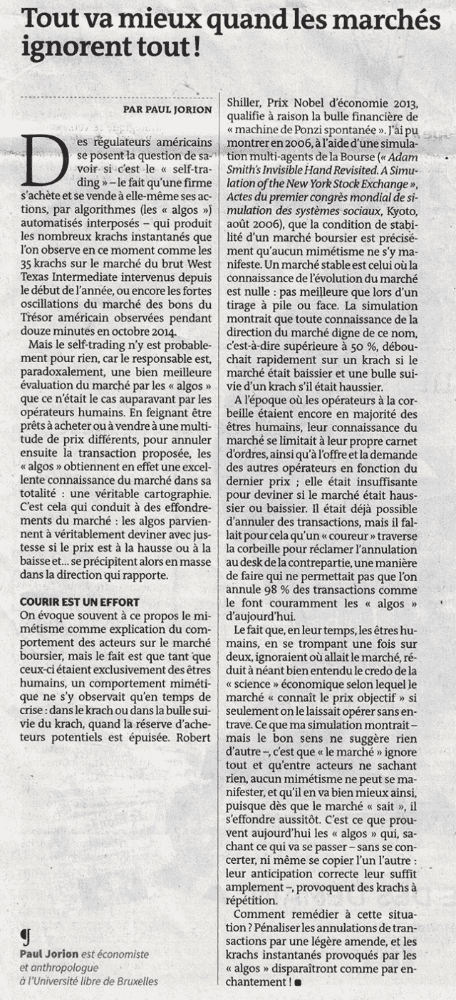

```yaml

分类：未分类

日期：2024-05-18 14:13:32

→

# On Bullshit – Sniper In Mahwah & friends

> 来源：[`sniperinmahwah.wordpress.com/2015/11/11/on-bullshit/#0001-01-01`](https://sniperinmahwah.wordpress.com/2015/11/11/on-bullshit/#0001-01-01)

十年前，我是第一个对普林斯顿大学出版社在 2005 年出版的一本书感兴趣的法国出版商。尽管我主要出版学术书籍（这意味着：为数百名读者而非数千名读者出版），但我认为这本书在法国会非常成功。这本书名叫《论废话》（*On Bullshit*），作者是美国哲学家哈里·弗兰克福特(*Harry Frankfurt*)。我试图购买该书的法语版权，但遗憾的是，由于它在美国非常成功（“该书在《纽约时报》畅销书榜上出现了二十七周”），我无法支付要求的预付款（数千美元）。后来，一家大型法国出版社以《论说废话的艺术》（*De l’art de dire des conneries*）为标题出版了这本书，法国民众购买了数万册——可惜的是，这次我错过了赚大钱的机会。我非常喜欢弗兰克福特的这项既严肃又讽刺的研究，它探讨了“废话”的艺术（在法语中翻译为*baratin*或*conneries*）；弗兰克福特区分了*废话*和*谎言*，并得出结论称“废话比谎言更不利于真理”。

上周我乘火车从巴黎返回布鲁塞尔。这次我买了份主要法国报纸，《世界报》（*Le Monde*——实际上，《世界报》并非主要报纸，但它被认为是主要的严肃报纸）。我看到了一篇法国知名经济学家保罗·乔里翁(*Paul Jorion*)的文章，题目是《如果市场无知，一切都会变得更好！》以下是注释：



程序员 Alberto Brandolini 曾经说过：“反驳胡说八道所需的能量比产生它的能量大一个数量级”，所以我不会花很多时间来评论一些奇怪的理论。例如，Jorion 写道，如果参与者/算法知道很多信息，这种情况会导致崩溃，或小型崩溃（由于模仿）；相反，如果参与者是盲目的，什么都不知道，那么一切都很完美（这很奇怪，因为如果参与者什么都不知道，就没有价格，也没有市场了；这让我想起了 Todd Kaplan 发明的名为 Sniper 的算法，参与 90 年代在圣达菲举行的一场竞赛的故事；这个故事是由 Rust、Palmer 和 Miller 在《Behavior of Trading Automata in a Computerized Double Auction Market》一书中讲述的，这就是我选择“Sniper”作为我的书中的叙述者的原因）。在最后一段中，Jorion 建议对由算法生成的“交易取消”略微征税，所以“*神奇地*所有的微型崩溃都会消失！” Yeah，就这么做——说起来容易做起来难。

这里的主要问题是关于“交易取消”的。这对于那些自称了解市场的人来说非常奇怪（Jorion 曾在华尔街的金融市场工作过几年），他会混淆“订单”和“交易”。订单是一种报价，意图以一定价格进行交易；交易是双方达成一定价格的协议。Jorion 表示“98%的交易被算法取消了”，而这里就是*胡说八道*。只有交易所理论上可以取消交易（在 2010 年闪崩后，许多交易被取消了；2012 年 Knight Capital 公司智能订单路由器出现严重问题并崩溃时，大部分交易*没有被*取消，但 2013 年高盛的交易软件出现故障时，所有交易所取消了大部分交易，*限制了可能高达 5 亿美元的高盛损失*——我一直认为上帝一定给交易所打了电话，说“嘿，银行为我工作，所以你别无选择：取消交易！”）。显然，算法不会取消交易；他们只取消订单（Matt Levine 最近在这方面做了一篇有趣的文章，《为什么高频交易者取消这么多订单？》()）。看到一个伟大的法国人类学家克劳德·列维-斯特劳斯的学生写出绝对的胡说八道，真是令人羞愧。

我在此要表达的是，《世界报》在法国被视为最严肃的报纸（“le quotidien de référence”），但发表这种*baratin*并不好——对读者和市场参与者来说都不好，因为大多数受过教育的人是通过阅读报纸来获取知识的，如果报纸发表的是垃圾文章，那么人们对市场的判断就会被歪曲。作为一名图书出版商和教师，我认为良好的教育至关重要，同时也对那些被授权撰写此类*connerie*（胡说八道）的人的严肃性缺乏感到震惊。这真是糟糕透顶——很抱歉用了这个双关语，因为我非常尊敬那些古老的智者们。

###### PS

1/ 最近也有一些报纸关于在法国进行中的 Virtu 案例发表了胡说八道（法国监管机构 AMF 对 Virtu 进行了起诉——更具体地说，是 2011 年与 Virtu 合并的 Madison Tyler，指控其在 2009 年和 2010 年进行欺诈活动），我很快会发布一篇关于这方面的简短故事。

2/ 有关高频交易者如何进行“限价订单放置”的新学术论文已于昨天发布，标题为“[Limit Order Placement by High-Frequency Traders](http://papers.ssrn.com/sol3/papers.cfm?abstract_id=2688418)”。尽管有些批评者会抱怨（因为科学家们使用了现在广为人知且备受批评的 2011 年纳斯达克数据集），但这篇文章远比《世界报》所发表的*baratin*（无聊文章）有趣。
