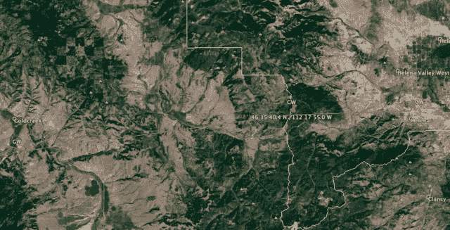
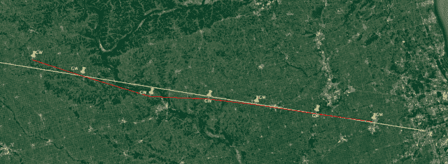

<!--yml

类别：未分类

日期：2024-05-18 14:10:20

-->

# 从前有个西部故事 - 马瓦狙击手和朋友们

> 来源：[`sniperinmahwah.wordpress.com/2016/09/23/once-upon-a-time-in-the-west/#0001-01-01`](https://sniperinmahwah.wordpress.com/2016/09/23/once-upon-a-time-in-the-west/#0001-01-01)

现在我确实没有时间在这个博客上写更多的文章（我有更有趣的研究要做），但是关于“向西走”我有一些话要说。三周前，彭博发布了这个[故事](http://www.bloomberg.com/news/articles/2016-08-29/traders-said-to-discuss-data-superhighway-from-chicago-to-japan)，*交易员讨论从芝加哥到日本的数据超级高速公路*，详细介绍了一个名为“向西走”的项目，该项目将在芝加哥地区到美国西海岸之间安装一系列微波塔，可能在西雅图附近结束。“竞争对手高频交易公司正在讨论共同建立一条从芝加哥到日本的通讯链路，以加速跨太平洋的交易”。这很有趣，而且可能是多个“HFT”公司（提到了 Virtu、Citadel 和 Jump）首次联合建立了一个非常长的微波网络的时候（2800 公里）。时间很有趣，因为在英国，两家 HFT 公司 Vigilant 和 New Line Networks（又名 Jump + KCG）正在争夺在里茨伯勒建造一个 300 米高的塔，以节省法兰克福（德国证券交易所 FR4 数据中心）和斯劳（LD4 数据中心）之间的 4-5 微秒。在英国，这两家公司竞争建塔，但在美国，各种公司加入合作。

超越至关重要的新泽西-芝加哥微波[路线](https://www.google.be/url?sa=t&rct=j&q=&esrc=s&source=web&cd=3&ved=0ahUKEwiI9dq8u6XPAhWFCBoKHcxJB8YQFgg2MAI&url=https%3A%2F%2Feconomics.sas.upenn.edu%2Fsystem%2Ffiles%2Fevent_papers%2FLAG_final.pdf&usg=AFQjCNFzUi5zvY31CNRMB-M3oVbgGuTO3g&sig2=v5ByajQFyktD02ddTuYsaQ) ，我不太清楚美利坚合众国的情况（这离我家太远了），但我想去了解一下“向西走”。由于我对这些非常长途的路线不太熟悉，所以我需要从某个地方开始，于是我寻求了帮助，并得到了一家我不能透露名字的公司在 2012 年制作的可行性研究，该研究正在考虑在更广泛的背景下（世界各交易所之间的大圆距离）从芝加哥到西雅图的跨洲路线（多么巧合 ;)）。

研究指出，芝加哥和西雅图之间的微波链路可以将亚洲市场中心和北美主要贸易中心之间的当前最佳往返延迟时间缩短 28 毫秒。著名的海伯尼亚电缆在 2012 年尚未运行，但论文中提到，一个 10 毫秒的西雅图至芝加哥的微波链路将使东京至伦敦的通信与计划中的东京至伦敦海底电缆的通信±相等。以下是一些延迟时间（记住，这是在 2012 年）：

我在寻找可能存在的一些“Go West”路径，但是（研究内附的）全球地图上显示的芝加哥和西雅图之间可能的微波路由并不是很清晰：

幸运的是，有一张爱达荷州和蒙大拿州边境的详细地图：

所以我查了一下美国联邦通信委员会（FCC）[网站](http://fcc.gov)，并开始在这个美国角落寻找许可——只是想看看这个“Go West”路径是否正在进行中。我找到了一些由一家名为“RSN 无线”的公司持有的许可：

并且在路由的另一侧，在奥罗拉附近（CME 数据中心所在地）：

然后我把所有的 RSN 无线许可……

…在一张地图上（点击放大）：

嗯，这看起来像是通往奥罗拉和西雅图的一部分“Go West”路径。最后一条路径通往哈伯普因电缆登陆站（那里是连接美国至日本的 PC-1 电缆的终端站）：

这条路是部分的，但值得注意的是 RSN 无线首次向联邦通信委员会（FCC）申请的许可/路径是在爱达荷州和蒙大拿州边境，围绕老虎峰和帕特斯的圆顶。有趣的是，因为 2012 年的可行性研究指出这一地区是一个关键检查点。正如您在下图中看到的，这条路由远离了芝加哥和西雅图之间的直线：

 McKay Brothers 的股份，后者是微波提供商领导者之一。我们可以假设 McKay 正在为 IMC（和其他人）的“Go West”工作吗？我不知道，也没有问。但还有一个问题 remains: where is Gran Turismo?

周末愉快。
