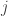

<!--yml

类别：未分类

日期：2024-05-18 13:49:53

-->

# 最优股权货币化 | Quantivity

> 来源：[`quantivity.wordpress.com/2011/07/30/optimal-equity-monetization/#0001-01-01`](https://quantivity.wordpress.com/2011/07/30/optimal-equity-monetization/#0001-01-01)

最近有读者就*股权货币化*提出了一个有趣的问题，这与[10b5-1](http://en.wikipedia.org/wiki/SEC_Rule_10b5-1)规则紧密相关（与之前的[员工股票期权对冲](https://quantivity.wordpress.com/2010/11/28/employee-stock-option-eso-hedging)文章相关）：

> 那么，如何正确地模拟一个大量集中股权头寸的货币化，包括税收考虑呢？

这个话题很有趣，需要解开神秘面纱，因为许多金融顾问在严格意义上很难解释答案，通常使用过于简化的假设(*例如*标的资产价格的线性变化)，并且几乎从不提供分析模型或代码模型。为此，本文构建了这样一个分析模型，并逐步介绍了一些（但*不是*全部）相应的考虑因素。

从概念上讲，清算模型相当简单：

利润 = (实现的收益) – (行权价格) – (税收责任)

换句话说，利润是股权清算实现的收益总额，减去任何行权价格（适用于期权，不适用于 RSUs），减去相应的税收责任。当然，集中头寸必须逐步清算以最小化*市场影响*。因此，该模型扩展为一个期清算计划（希望不会被对手方过于提前清算）：

其中是时期的收益，是时期的行权成本，是时期的税收责任。这些都可以随后定义为：

其中  是第  期卖出的股份数量， 是第  期卖出的每股平均价格， 是第  期卖出的每股平均行权成本， 是根据对应于期间  的税收年度期间收益计算税务责任的非平凡函数。代回，模型变为：

![\pi = \sum\limits_i \left[ (q_i \times p_i) - (q_i \times c_i) - \hat t (q_i, p_i) \right] ](img/7497d17786a1b09f5aaa86d2cc50783d.png)

简化为：

![\pi = \sum\limits_i \left[ (q_i \times (p_i - c_i)) - \hat t (q_i, p_i) \right] ](img/1fab9959894ea7e0abeb7119ec18d24b.png)

首先，在此模型中， 和  都被视为已知的；前者是因为它事先已知（对于 RSU 为零，对于 ISO / NQO 为固定行权价格），后者是因为它是公式化的，并且在基本模型中很少影响清算时间表。

这留下了三个自由变量：、 和 。因此，该模型归结为一个单一的自主变量 q（其基数意味着  的值），其值基于由全能的市场确定的非自主变量（）。当然， 受一个或多个限制。

第一个边界是可供变现的总股份数量 ：

对于受限股份的归属期（ 个期间），每个期间要变现的股份数量下界为零，上界为之前期间受限股份的归属 （其中 ）：

换句话说，在第个时期中要货币化的最大股票数量等于在第个时期中已经行权的股票数量，直到包括个时期，减去在前期中已经卖出的股票数量。

绕了一圈之后，股权货币化的目标是最大化清算股票的利润：

这导致了一个*最优的股权货币化模型*：

![\begin{aligned}  \underset{q_i}{\text{max}}  &\sum\limits_i [(q_i \times (p_i - c_i)) - \hat t (q_i, p_i)] \\  \text{subject to}  & \sum_i{q_i} = \hat q, \\  & \forall i : 0 \leq q_i \leq \left( \sum\limits_{j=1}^i v_j - \sum\limits_{j=1}^{i-1} q_j \right)  \end{aligned} ](img/ff3cd85d82af3e18c07acbf58d3aec49.png)

其解决方案归结为对所有的预测，其中包含了乐趣。根据读者兴趣，后续文章可能会考虑这个模型的解决方案，包括诸如对冲和场外[奇异期权](http://en.wikipedia.org/wiki/Exotic_option)等额外复杂性。
