<!--yml

category: 未分类

date: 2024-05-18 13:49:33

-->

# 最佳股权货币化：第二部分 | Quantivity

> 来源：[`quantivity.wordpress.com/2011/07/31/optimal-equity-monetization-part-2/#0001-01-01`](https://quantivity.wordpress.com/2011/07/31/optimal-equity-monetization-part-2/#0001-01-01)

上一篇文章[最佳股权货币化](https://quantivity.wordpress.com/2011/07/30/optimal-equity-monetization)介绍了一个用于优化股权货币化的数学模型。在这篇后续文章中，我们考虑了该模型的几种解决方案，在对的动态作出幼稚的假设后。

首先假设（不切实际地）值得一提的是，对于的值的分布是已知的且确定的。在这种情况下，考虑动态具有简单解析解的两种情况：单调递增的一阶差分和平稳的情况。对于非零归属权，考虑领口叠加。这些解决方案值得注意，因为它们不受的相对值的影响。

**Monotonic First Differences**

考虑当所有 p 的一阶差分要么单调递增要么单调递减的情况；换句话说：

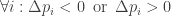

其中：

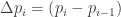

换句话说，标的资产的价格每个周期要么持续上升，要么持续下降*每个*周期。

对于单调递减的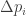，解决方案是在归属时立即出售股票：

如果没有归属权，那么解决方案简化为在第一个周期出售所有股票：

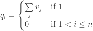

对于单调递增的，解决方案是尽可能持有，并在最后一个周期出售：

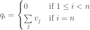

遗憾的是，这种情况很少出现在现实中。然而，从这两种情况中，我们可以考虑更加现实的一般化情况。

**Collared**

再次考虑当  单调递减且 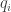 为非零行权时。正如零行权案例所示，最优解是在第一时期出售所有股票。然而，非零行权导致  的不等式约束（更多详情请参见[最优股权变现](https://quantivity.wordpress.com/2011/07/30/optimal-equity-monetization)），因此无法在第一时期出售所有股票。一个明显的问题是如何在存在行权的情况下放松这个约束。

显然不可能出售未行权的股票，使用期权来复制等效现金流是一个自然的选择。具体来说，一个或多个[对冲](http://en.wikipedia.org/wiki/Collar_%28finance%29)。理论上的最优解决方案与现金流匹配：将每个行权期间与一个等值到期对冲配对。例如，需要  个对冲来匹配  个月的行权：第一个对冲的到期等于第一时期，第二个对冲的到期等于第二时期，*等等*。

一个更简单的替代期权策略是在第一个时期开设一个大小等于 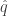 的单个对冲，然后每个时期通过关闭对冲的一部分来减少敞口。每个时期 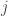 的敞口减少相当于 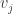 股（明显地乘以期权的乘数）。尽管这种更简单的做法可能具有较低的交易成本，但由于期权头寸在到期前关闭，它具有 [vega](http://en.wikipedia.org/wiki/Greeks_%28finance%29#Vega_.CE.BD) 风险。然而，考虑到相对较低的 theta 衰减暴露，进入该位置的成本*可能*也可能较低。

在两种策略中，通常更偏好**欧洲**期权而不是**美式**期权，原因有两个：消除指派风险（在空头看涨期权中）和降低成本。

使用这种带对冲的方法，最优股权变现模型简化为：

![\begin{aligned}  \underset{q_i}{\text{max}}  & \sum\limits_i [(q_i \times \gamma) - \hat t (q_i, p_1)] \\  \text{subject to}  & \sum_i{q_i} = \hat q  \end{aligned} ](img/e23100e4d8dad9546e44abf9ec216404.png)

其中 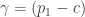，代表在整个期间内对冲下行风险的现金流中性化，而 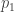 是在对冲开启期间的标的资产价格。

解决方案等同于随着股票行权出售股票，相应地在对冲（无论是到期还是部分关闭）中进行抵消。

相应的利润，减去套保成本（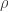），为：

![\pi = \left( \sum\limits_i \left[ (q_i \times \gamma) - \hat t (q_i, p_1) \right] \right) - \rho ](img/d1e02169c70ca568c4797706e52c851d.png)

换句话说，这个模型体现了一个经典的衍生品权衡：保证的利润现金流，以固定的一次性、前置成本（*即*）为代价。

**平坦**

整个期间基础资产交易平坦的价格是考虑的第三个简单场景；换句话说：

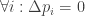

这相当于：

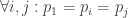

这个等式表达式很有用，因为它类似于上述套保方法，其中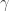抵消了基础资产价格敞口（*即*套保和基础资产现金流相抵消）。特别是，当基础资产价格提前已知在整个期间内交易平坦时，现金流等同于套保（无需任何期权）。因此，优化模型和解决方案与套保模型相同：

通过消除套保成本，利润简化为以下形式：

![\pi = \sum\limits_i \left[ (q_i \times \gamma) - \hat t (q_i, p_1) \right] ](img/c9c11f433f3163946533e803ecc08509.png)

因此，与带套保的利润相比，平坦利润在所有情况下都更高，除非是用信用溢价（*即*溢价是正的，因此需要支付费用以开设套保）。
