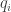
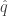
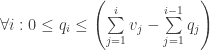

<!--yml

分类：未分类

日期：2024-05-18 13:49:08

-->

# 最优股票货币化：第三部分 | Quantivity

> 来源：[`quantivity.wordpress.com/2011/08/03/optimal-equity-monetization-part-3/#0001-01-01`](https://quantivity.wordpress.com/2011/08/03/optimal-equity-monetization-part-3/#0001-01-01)

前一篇帖子 [最优股票货币化](https://quantivity.wordpress.com/2011/07/30/optimal-equity-monetization) 介绍了一个优化股票货币化的数学模型。在后续帖子 [最优股票货币化：第二部分](https://quantivity.wordpress.com/2011/07/31/optimal-equity-monetization-part-2) 中，考虑了假设  是确定性的解决方案。在这篇文章中，通过假设  是一个随机过程，来考虑现实生活。

尽管这个主题乍一看似乎很普通，但它出人意料地美丽，它展示了涵盖金融、机器学习和纯数学的量化技术：拟合经验回报、[蒙特卡洛](http://en.wikipedia.org/wiki/Monte_Carlo_method)、[全局优化](http://en.wikipedia.org/wiki/Global_optimization)、[整数组合](http://en.wikipedia.org/wiki/Composition_(number_theory))、[最大似然估计](http://en.wikipedia.org/wiki/Maximum_likelihood)、遗传随机化，以及[投资组合理论](http://en.wikipedia.org/wiki/Portfolio_theory)。

在一个具有随机未来股票价格的模型中，首先要问的重要问题是 *智能（或愚蠢）选择数量  对货币化利润有什么影响*。完美预见预测所有未来回报与没有预见相比如何？

通过在这个背景下构建货币化，可以从投资组合优化中借用技术：数量  沿袭地（在货币化期间）考虑，类似于横截面投资组合权重。此外，这种观点暗示了对  的一个明显先验：每个时期卖出等量的数量。通过概念上的类比，这对于货币化是“等权重投资组合”的解决方案。

因此，这篇文章考虑了 *最优预见与等数量货币化利润的比较*。这很重要，因为它提供了是否值得花时间预测未来回报的洞察。这种考虑对于股票货币化尤为重要，因为它对于高波动性及/或新发行的股票最有趣，而这些股票的预测公认是不好的。

为了量和回答这个比较，通过蒙特卡洛计算未来回报的货币化利润。分析首先通过查看最优和等权重卖出策略的渐进密度和矩，然后查看相应的的小样本分析。在结果之后，讨论了分析和计算方法。最后，提供了 R 代码。

**渐进结果**

言归正传：最优和等量的利润差异*出奇的小*。大约 5%。

以下图表展示了在代表性场景中（使用知名股票、圆整数和 48 个周期），通过 2000 次迭代蒙特卡洛评估的最优和等量货币化利润密度：


在这个图表中，黑色是最优的，红色是等量的。利润分布相似；等量有更多的负偏斜，有更大的左尾；最优有更多的正偏斜，有更大的右尾。这是符合直觉的。这里是意外的部分：虚线垂直线是各自密度的中位数（由于偏斜，中位数比平均值更受欢迎）。最优和等量的中位数利润差异小于 5%。

换句话说，*对未来回报的完美预见产生的货币化利润不超过比每个周期卖出等量股份高 5%*，当在大量未来情景中考虑*渐进*时，因此，试图预测未来的努力带来的好处相当有限。

**小样本结果**

渐进结果是有用的，但它们忽略了一个至关重要的事实（经常被忽视）：货币化是一项*一次性的活动*，因此只看分布可能会掩盖*小样本风险*。为此，通过蒙特卡洛方法探索了小样本动态，迭代次数较少。

下面的四个图表展示了每个 10 次迭代的代表性小样本货币化模拟，值得视觉注意的是分布形状的不稳定性和定性差异。


特别感兴趣，也值得关注的是[双模分布](http://en.wikipedia.org/wiki/Bimodal_distribution)的明确证据。一个可能的解释是收益的跳跃，由一个非常高波动率的股票拟合的分布具有大尾巴：一个大跳跃，无论是正还是负，都会把价格（作为几何累积）从第一期的价值上推得很远。因此，收敛到两个模态：正跳跃和负跳跃。

尽管存在这种普遍的双模态，*渐进中位数差异结果在小样本中同样成立*：最优和相等的中位数之间的最大差异小于 7%。这个中位数差异的稳健性令人愉快地惊讶，并且暗示这个结果在实践中可能很重要。

圆满地，这项分析表明，即使对 4 年未来收益有完美的预见，也只能带来微不足道的更大利润。因此，暗示尝试*预测*实际生活中未知的未来收益的比较盈利性甚至更小。除了实际利益外，这个结果还揭示了会计文献中关于异常 10b5-1 收益的报道结果（参见例如[Jagolinzer](http://leeds-faculty.colorado.edu/alja4277/research.html)的研究）。

* * *

对于那些有兴趣的人，接下来将讨论方法论、数学和 R 实现。

**过去和未来收益分布**

首先假设是一个随机过程。[几何布朗运动](http://en.wikipedia.org/wiki/Geometric_Brownian_motion)在波动率高时没有意义，相反，假设收益遵循单变量[广义双曲分布](http://en.wikipedia.org/wiki/Generalised_hyperbolic_distribution)，它推广了熟悉的厚尾分布([学生*t*分布](http://en.wikipedia.org/wiki/Student%27s_t-distribution)，[拉普拉斯分布](http://en.wikipedia.org/wiki/Laplace_distribution)，和[方差-伽玛分布](http://en.wikipedia.org/wiki/Variance-gamma_distribution))。分布参数应直接从可观察数据中拟合，因为对于合适的值没有*先验*直觉。因此，在 R 中：

```

fit.NIGuv(returns, opt.pars=c(alpha.bar=FALSE),
          alpha.bar=1, control=list(abstol=1e-8), silent=TRUE)

```

假设一个未知的收益随机未来，比较最优与相等的一种方法是考虑大量的潜在未来，通过蒙特卡洛采样；在 R 中：

```

replicate(periods, rghyp(n,fit))

```

对于这些潜在的未来情况，必须计算出最优数量和相等数量下的货币化利润并进行比较。计算相等数量的利润是容易的(*即*纵向价格乘以数量，在数量约束条件下)。

**最优利润优化**

对于最优数量，计算利润需要更多的努力：所有数量都必须选择以优化总利润，因此需要优化。由于这个问题凸性不能保证，计算利润的一种方法是全局优化目标，数量界限为约束条件：

```

lower <- rep(0, periods)
upper <- rep(qHat, periods)
cont <- DEoptim.control(trace=FALSE, itermax=500, initialpop=randomPartitions,
                        NP=as.numeric(nrow(randomPartitions)))
DEoptim(profit, lower, upper, control=cont, prices, qHat, vest, cost)

```

一个优化的折痕是数量必须满足以下不等式约束([最优股票货币化](https://quantivity.wordpress.com/2011/07/30/optimal-equity-monetization)解释)：




将来自[Ardia *et al*.](http://papers.ssrn.com/sol3/papers.cfm?abstract_id=1584905)的投资组合优化方法应用于股票货币化，首先生成一个满足约束条件的初始随机人口，这为遗传优化提供了种子。由于上述第一个约束，每个种群成员是总数量的整数组成。然而，组成基数是：


给定个周期和的分数划分，这将产生一个巨大的矩阵。因此，由于内存限制，无法使用`partitions::compositions()`。相反，组成的两划分[遗传](http://en.wikipedia.org/wiki/Genetic_algorithm) [变异](http://en.wikipedia.org/wiki/Mutation_%28genetic_algorithm%29)是通过`randomPartitions()`生成的随机人口矩阵来构建的。

* * *

对于那些熟悉 R 的读者，以下计算股票货币化：

```

### Optimal monetization for concentrated equity.

library("tseries")
library("DEoptim")
library("HyperbolicDist")
library("ghyp")
library("partitions")

fitDistribution <- function(returns)
{
  # Fit generalized hyperbolic distribution to univariate series of returns.
  #
  # Args:
  #   returns: series of returns
  #
  # Returns: fit model corresponding

  fit.NIGuv(returns, opt.pars=c(alpha.bar=FALSE),
            alpha.bar=1, control=list(abstol=1e-8), silent=TRUE)
}

sampleDistribution <- function(fit, periods, n=1)
{
  # Sample values from a generialized hyperbolic distribution, previously fit by fitDistribution().
  #
  # Args:
  #   fit: fit previously returned by fitDistribution
  #   periods: number of samples to generate
  #
  # Returns: vector (n=1) or matrix (n > 1) of samples from fit

  replicate(periods, rghyp(n,fit))
}

# optimization function for calculating profit
profit <- function(quantity, prices, qHat, vest, cost)
{
  # Optimization function to calculate profit for a series of quantity and prices, subject 
  # to quantity constraints. This functions negative values, suitable for minimization.
  #
  # Args:
  #   quantity: vector of quantities, aligned with quantity
  #   prices: vector of prices, aligned with quantity
  #   qHat: maximum quantity, which should satisfy invariant sum(quantity) = qHat
  #   vest: vector of number of shares vested per period, aligned with quantity
  #   cost: average cost per share, aligned with quantity
  #
  # Returns: vector of profit per period

  # enforce qHat equality constraint
  if (round(sum(quantity) - qHat) > 0)
  {
    # illegal value, optimizer treat as worse value
    return (Inf)
  }

  p <- quantity %*% (prices - cost)
  return (-p)
}

randomPartitions <- function(qHat, periods, count, warmup=500, skip=100)
{  
  # Generate random partition matrix for quantities with length periods. Using a simple 
  # genetic algo, as integral partitions (via partitions::compositions) generates a 
  # matrix which is way too big for reasonable-sized periods (size is choose(n+k-1,k)).
  # This function also enforces constraints.
  #
  # Args:
  #   qHat: total quantity, which to all rows should sum
  #   periods: number of partitions (equal to number of periods to spread quantity over)
  #   count: number of quantity rows to generate
  #   warmup: number of generic iterations to warmup randomization
  #   skip: number of genetic iterations to skip between samples
  #
  # Returns: random partition

  # start with equal-fraction integer partition
  partition <- round(qHat / periods)
  equal <- rep.int(partition, periods)
  elen <- length(equal)

  # mutation randomizer: choose two entries, increment one and decrement the other
  randomizer <- function(dup)
  {
    sample <- sample.int(elen, 2)
    up <- sample[1]
    down <- sample[2]
    olddup <- dup

    diff <- sample.int(partition,1)
    dup[up] <- dup[up] + diff
    dup[down] <- dup[down] - diff

    # TODO: add vesting constraint

    # try again if constraints are violated
    if (length(which(dup<0)) > 0)
    {
      dup <- (Recall(olddup))
    }

    dup
  }

  # warmup randomization
  for (i in c(1:warmup))
  {
    equal <- randomizer(equal)
  }

  # generate random partitions, skipping skip between samples
  randomPartitions <- matrix(data=NA, nrow=count, ncol=periods)
  skipper <- skip
  i <- 1
  while (i <= count)
  {
    equal <- randomizer(equal)

    if (skipper == 0)
    {
      randomPartitions[i,] <- equal
      skipper <- skip
      i <- i + 1
    }
    else
    {
      skipper <- skipper - 1
    }
  }

  rownames(randomPartitions) <- c(1:nrow(randomPartitions))

  return (randomPartitions)
}

optimizeQuantity <- function(randomPartitions, prices, qHat, periods, vest, cost)
{
  # Generate quantities which maximize profit for monetization given prices, via global 
  # optimization using DEoptim().
  #
  # Args:
  #   randomPartitions: random partition of quantities, previously generated by randomPartitions()
  #   prices: vector of prices, aligned with quantity
  #   qHat: maximum quantity, which should satisfy invariant sum(quantity) = qHat
  #   periods: number of periods to optimize quantities
  #   vest: vector of number of shares vested per period, aligned with quantity
  #   cost: average cost per share, aligned with quantity
  #
  # Returns: vector of quantities optimized to maximize monetization

    lower <- rep(0, periods)
    upper <- rep(qHat, periods)
    cont <- DEoptim.control(trace=FALSE, itermax=500, initialpop=randomPartitions,
                            NP=as.numeric(nrow(randomPartitions)))
    DEoptim(profit, lower, upper, control=cont, prices, qHat, vest, cost)
}

# Monte-Carlo sampling for optimal partition equity monetization (perfect foresight)
optimalEquityMonetization <- function(prices, periods, qHat, vest, cost, mcCount, doPlot=FALSE)
{
  # Calculate profit of optimal equity monetization using monte carlo sampling assuming perfect 
  # foresight from random quantity partitions.
  #
  # Args:
  #   prices: daily prices from equity
  #   periods: number of periods to calculate optimal
  #   qHat: maximum quantity, which should satisfy invariant sum(quantity) = qHat
  #   vest: vector of number of shares vested per period, aligned with quantity
  #   cost: average cost per share, aligned with quantity
  #   mcCount: number of monte carlo iterations
  #   doPlot: flag indicating to plot the monte carlo return series
  #
  # Returns: vector of profits from monte carlo, length equal to mcCount

  message("Fitting and sampling returns distribution\n")
  samples <- sampleDistribution(fitDistribution(returns), periods, mcCount)

  optimalEquityMonetizationWithSamples(prices, periods, qHat, vest, cost, samples, doPlot)
}

optimalEquityMonetizationWithSamples <- function(prices, periods, qHat, vest, cost, samples, doPlot=FALSE)
{
  # Calculate profit of optimal equity monetization using monte carlo sampling assuming perfect 
  # foresight from random quantity partitions.
  #
  # Args:
  #   prices: daily prices from equity
  #   periods: number of periods to calculate optimal
  #   qHat: maximum quantity, which should satisfy invariant sum(quantity) = qHat
  #   vest: vector of number of shares vested per period, aligned with quantity
  #   cost: average cost per share, aligned with quantity
  #   samples: future return samples, over which monte carlo is evaluated
  #   doPlot: flag indicating to plot the monte carlo return series
  #
  # Returns: vector of profits from monte carlo, length equal to mcCount

  returns <- ROC(prices,type="discrete",na.pad=FALSE)
  priceNow <- last(prices)

  message("Building random partitions\n")
  randomPartitions <- randomPartitions(qHat, periods,1000)

  message("Optimizing optimal\n")
  mcCount <- nrow(samples)
  profits <- sapply(c(1:mcCount), function(i) {

    returns <- samples[i,]

    if (doPlot) { plot(cumprod(1+returns),type='l') }

    prices <- as.matrix(coredata(priceNow) * cumprod(1+returns))

    # find quantities which maximize profit
    optim <- optimizeQuantity(randomPartitions, prices, qHat, periods, vest, cost)
    best <- -optim$optim$bestval

    best
  })

  return (as.matrix(profits))
}

equalEquityMonetization <- function(prices, periods, qHat, vest, cost, mcCount, doPlot=FALSE)
{
  # Calculate profit of optimal equity monetization using from monte carlo sampling 
  # assuming equal-size quantity partitions.
  #
  # Args:
  #   prices: daily prices from equity
  #   periods: number of periods to calculate optimal
  #   qHat: maximum quantity, which should satisfy invariant sum(quantity) = qHat
  #   vest: vector of number of shares vested per period, aligned with quantity
  #   cost: average cost per share, aligned with quantity
  #   mcCount: number of monte carlo iterations
  #   doPlot: flag indicating to plot the monte carlo return series
  #
  # Returns: vector of profits from equal monetization, length equal to mcCount

  message("Fitting and sampling returns distribution\n")
  samples <- sampleDistribution(fitDistribution(returns), periods, mcCount)

  equalEquityMonetizationWithSamples(prices, periods, qHat, vest, cost, samples, doPlot)
}

equalEquityMonetizationWithSamples <- function(prices, periods, qHat, vest, cost, samples, doPlot=FALSE)
{
  # Calculate profit of optimal equity monetization using from monte carlo sampling 
  # assuming equal-size quantity partitions.
  #
  # Args:
  #   prices: daily prices from equity
  #   periods: number of periods to calculate optimal
  #   qHat: maximum quantity, which should satisfy invariant sum(quantity) = qHat
  #   vest: vector of number of shares vested per period, aligned with quantity
  #   cost: average cost per share, aligned with quantity
  #   doPlot: flag indicating to plot the monte carlo return series
  #
  # Returns: vector of profits from equal monetization, length equal to mcCount

  returns <- ROC(prices,type="discrete",na.pad=FALSE)
  priceNow <- last(prices)

  message("Optimizing equal\n")
  mcCount <- nrow(samples)
  profits <- sapply(c(1:mcCount), function(i) {

    returns <- samples[i,]

    if (doPlot) { plot(cumprod(1+returns),type='l') }

    prices <- as.matrix(coredata(priceNow) * cumprod(1+returns))

    # calculate profit for equal quantities
    quantity <- rep.int(qHat / periods, periods)
    best <- -profit(quantity, prices, qHat, vest, cost)

    best
  })

  return (as.matrix(profits))
}

analyzeMonetizationFromSymbol <- function(symbol, quoteType, qHat, periods, perShareCost, mcCount=500)
{
  # Plot optimal vs equal equity monetization profits.
  #
  # Args:
  #   symbol: equity symbol which to monetize
  #   quoteType: quote type for equity, such as "AdjClose"
  #   qHat: total quantity of shares to monetize
  #   periods: number of distinct periods over which to monetize
  #   perShareCost: cost to exercise share; zero for RSUs; strike price for ISO/NQs
  #   mcCount: number of monte carlo iterations

  prices <- get.hist.quote(instrument=symbol,quote=quoteType)
  analyzeMonetization(prices, qHat, periods, perShareCost, mcCount)
}

analyzeMonetization <- function(prices, qHat, periods, perShareCost, mcCount=500)
{
  # Generate monte carlo densities of optimal and equal equity monetization profits.
  #
  # Args:
  #   prices: vector of prices to monetize
  #   qHat: total quantity of shares to monetize
  #   periods: number of distinct periods over which to monetize
  #   perShareCost: cost to exercise share; zero for RSUs; strike price for ISO/NQs
  #   mcCount: number of monte carlo iterations
  #
  # Returns: percentage difference in profit between optimal and equal 

  message("Fitting and sampling returns distribution\n")
  samples <- sampleDistribution(fitDistribution(returns), periods, mcCount)

  optimal <- optimalEquityMonetizationWithSamples(prices, 
                                       periods, qHat,rep(qHat/periods,periods), 
                                       rep(perShareCost,periods), samples)

  equal <- equalEquityMonetizationWithSamples(prices, 
                                   periods, qHat, rep(qHat/periods,periods), 
                                   rep(perShareCost,periods), samples)

  plot(density(optimal), main="Optimal Monetization Density (with Median)", xlab="Profit",
       ylim=c(min(density(optimal)$y,density(equal)$y),
              max(density(optimal)$y,density(equal)$y)))
  lines(density(equal), col='red')
  abline(v=median(optimal),lty=2)
  abline(v=median(equal),col='red',lty=2)
  legend("topleft",legend=c("Optimal","Equal"), fill=c('black', 'red'), cex=0.5)

  # calculate difference in first moments of optimal and equal
  medOptimal <- median(optimal)
  medianDiff <- ((medOptimal - median(equal)) / medOptimal)

  meanOptimal <- mean(optimal)
  meanDiff <- ((meanOptimal - mean(equal)) / meanOptimal)

  return (list(medianDiff=medianDiff, meanDiff=meanDiff, optimal=optimal, equal=equal))
}

```
