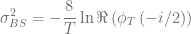
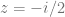
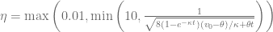
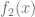
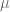
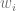
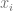
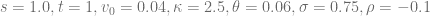
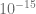
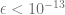

<!--yml

category: 未分类

date: 2024-05-13 00:11:53

-->

# Optimized Heston Model Integration: Exponentially-Fitted Gauss-Laguerre Quadrature Rule. – HPC-QuantLib

> 来源：[`hpcquantlib.wordpress.com/2020/05/17/optimized-heston-model-integration-exponentially-fitted-gauss-laguerre-quadrature-rule/#0001-01-01`](https://hpcquantlib.wordpress.com/2020/05/17/optimized-heston-model-integration-exponentially-fitted-gauss-laguerre-quadrature-rule/#0001-01-01)

Aim: Develop an exponentially-fitted Gauss-Laguerre quadrature rule to price European options under the Heston model, which outperforms given Gauss-Lobatto, Gauss-Laguerre and other pricing method implementations in QuantLib.

Status quo: Efficient pricing routines for the Heston model

are based on the integration over the normalized characteristic function in the Gatheral formulation

in combination with a Black-Scholes control variate to improve the numerical stability of Lewis’s formula [1][2][3]. The normalized characteristic function of the Black-Scholes model is given by

and the price of a vanilla call option can then be calculated based on

where  is the corresponding Black-Scholes price. Different choices for the volatility of the control variate are discussed in the literature. For the following examples the volatility will be defined by either

or

.

第一个与的整体方差相匹配，而后者与积分起点处的特征函数值相匹配。通常后者选择会得到更好的结果。观察上面的积分函数，可以直接发现算法在深度实值/深度虚值期权中的一个弱点。在这种情况下，由于术语

。

第二，当使用 Gauss-Laguerre 规则时，权重函数与特征函数的重叠对于非常短期的到期时间或小的有效波动性来说是最优的，正如 Black-Scholes 特征函数所示。

第三，对于非常小的，积分的函数容易受到减法抵消误差的影响。

最后一个问题通过使用归一化特征的二阶泰勒展开很容易克服，对于小的。相应的 mathematica 脚本可以在[这里](https://github.com/klausspanderen/HestonExponentialFitting/blob/master/mathematica/heston_expansion.nb)看到。

通过将积分变量重新缩放，可以改进第二个问题，通过将积分用来重写。

。

第一个问题，高度振荡的积分函数，可以通过指数拟合的 Gauss-Laguerre 规则[4]来解决。两个平滑函数和的数值积分。

。

近似由 Gauss-Laguerre 规则的形式表示。

是

。

以及高斯-拉盖尔数值积分规则的权重和节点成为频率的函数。在[4]中概述的算法运行时太慢，在原始形式下只能用于。为了使用它进行 Heston 模型，我们预计算了一组定义的频率的权重和节点。对于给定的频率，最接近的预计算值被用来评估积分。当然，使用的权重和节点而不是

要有更大的预计算权重和节点 N，有两种关键技术：

+   从开始算法，以获得标准高斯-拉盖尔权重/节点，然后缓缓增加。使用前 20 步的旧权重和节点，基于拉格朗日插值多项式生成牛顿求解器的下一个起始向量。

+   通过使用[boost 多精度](https://www.boost.org/doc/libs/1_73_0/libs/multiprecision/doc/html/index.html)包而不是双精度来增加“数值头部空间”。这仅与预计算有关。最终权重和节点以正常双精度值存储。

生成指数拟合高斯-拉盖尔数值积分规则的权重和节点的源代码[在此处](https://github.com/klausspanderen/HestonExponentialFitting/blob/master/exponential_fitting/ef_laguerre.cpp)可用。

使用[boost 多精度版本](https://github.com/klausspanderen/HestonExponentialFitting/tree/master/ql/pricingengines/vanilla)的 Gauss-Laguerre 定价算法生成了与其他 Heston 定价方法比较的参考结果，该算法阶数为*N=2000*。与*N=1500*和*N=2500*的结果比较确保了结果的正确性。指数拟合高斯-拉盖尔数值积分规则总是使用*N=48*个节点，对应于仅对特征函数进行 48 次估值。第一个示例模型是

指数拟合方法在考虑特征函数估值的总数时尤其优于其他方法。正如预期的那样，该方法对于深度 OTM/ITM 期权表现得非常出色，并确保绝对定价误差保持在以下，适用于非常广泛的期权行权价范围。下一轮，模型不变，但。

指数拟合的定价误差再次保持在以下，适用于-15 到 15 的所有资金度之间，远低于其他方法。下一次测试，模型不变，但非常短的到期时间。COS 方法与 250 次特征函数调用和指数拟合*N=48*相近，并且优于所有其他方法。

以下文档中展示了各种不同 Heston 参数在文献中的应用情况。[文档](https://hpcquantlib.files.wordpress.com/2020/05/heston_catalog-3.pdf)。仅用 64 个节点的指数拟合高斯-拉格朗日数值积分规则解决了问题，对于-20 到 20 的资金度和一天到 10 年的到期时间，误差以内，并且优于其他方法，尤其是在考虑所需特征函数调用次数时。此方法也可以扩展到更多的节点。

算法在 QuantLib 中的实现是[PR#812](https://github.com/lballabio/QuantLib/pull/812)的一部分。

[1] Lewis, A. [A simple option formula for general jump-diffusion and other exponential Lévy processes](https://papers.ssrn.com/sol3/papers.cfm?abstract_id=282110)

[2] F. Le Floc’h, [Fourier Integration and Stochastic Volatility Calibration.](https://papers.ssrn.com/sol3/papers.cfm?abstract_id=2362968)

[3] L. Andersen, and V. Piterbarg, 2010,  利率建模，第一卷：基础和 vanilla 模型，  大西洋金融出版社伦敦。

[4] D. Conte, L. Ixaru, B. Paternoster, G. Santomauro, [Exponentially-fitted Gauss–Laguerre quadrature rule for integrals over an unbounded interval.](https://www.sciencedirect.com/science/article/pii/S0377042713003385)
