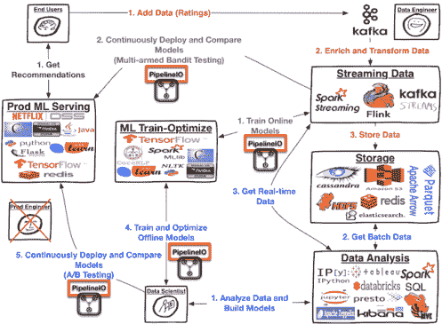

<!--yml

分类：未分类

日期：2024-05-18 05:29:56

-->

# Pancake Stack: End-to-End, Real-time ML and AI Pipeline | Tales from a Trading Desk

> 来源：[`mdavey.wordpress.com/2016/09/12/pancake-stack-end-to-end-real-time-ml-and-ai-pipeline/#0001-01-01`](https://mdavey.wordpress.com/2016/09/12/pancake-stack-end-to-end-real-time-ml-and-ai-pipeline/#0001-01-01)

## Pancake Stack: End-to-End, Real-time ML and AI Pipeline

InfoQ 有一篇关于[Apache Spark](http://spark.apache.org/)机器[学习](http://advancedspark.com/)管道的“最后一公里”的有趣[阅读](https://www.infoq.com/articles/fregly-pancake-stack)，“Chris Fregly 关于 PANCAKE STACK 研讨会和数据管道的观点”。

很有趣的是，即使是 Netflix 和其他公司也在这个领域中挣扎：

> PipelineIO 的想法可以追溯到几年前我在 Netflix 的时候，当时我们被迫建立一个自定义的 ML 预测/服务层。当时没有——在我看来现在也没有——一个生产级的、容错性强的、低延迟的开源系统，可以实时地为 Netflix 规模的预测和建议服务。

[PipelineIO](http://pipeline.io/)在其主页上提供了一个良好的架构概述：

~ mdavey 于 2016 年 9 月 12 日。

发布在[云](https://mdavey.wordpress.com/category/hpc/cloud/)分类下
