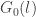
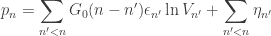
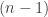

<!--yml

分类：未分类

日期：2024-05-18 13:54:04

-->

# 知情度悖论 | Quantivity

> 来源：[`quantivity.wordpress.com/2010/02/06/paradox-of-informedness/#0001-01-01`](https://quantivity.wordpress.com/2010/02/06/paradox-of-informedness/#0001-01-01)

所有交易者的集体买入/卖出决策是否优于随机？

这个问题虽然听起来很简单，但它对构建量化模型和高频交易系统有深远的影响。尽管许多人对这个问题进行了几十年的猜测，但经济物理学这个学科正在运用起源于统计物理学的技术（最初是 [统计力学](http://en.wikipedia.org/wiki/Statistical_mechanics)）来为这个问题提供见解。

经济物理学在这个问题背景下，从 *投资者 informedness* 的角度来探讨这个问题，这是衡量平均交易是否具有优于随机机会（50/50）的盈利可能性的一个手段。在这方面， Bouchaud *et al.* 的《金融市场中的波动与响应》和 Hopman 的《供需正在推动股价吗？》等论文很有趣。

通过对实验性高频订单/交易分析得出的对这个问题的结论出人意料地有趣，并直接导致了一个 *知情度悖论*：

> 绝大多数交易经验上被证明是不 informed 的（这意味着它们是基于随机的买入/卖出决策），但微观结构模型告诉我们价格是由先前交易的 historical sequence 决定的。因此，交易是不 informed 的，但却是后续价格发现的基础。

换句话说，*交易同时是不 informed 和 informed*。这对于那些（ presumably few，鉴于过去两年）相信理性代理和有效市场假说的的人来说，这是一个非常不安的发现。

这个悖论与前两篇博文中的观察有有趣的联系：

+   [因果关系、外生性和制度](https://quantivity.wordpress.com/2010/01/10/causality-exogeny-regimes/):价格不仅主要不是由经济基本面驱动，它们似乎还受到泛滥的不 informed 扩散随机性的驱动。

+   [限价簿模拟](https://quantivity.wordpress.com/2010/01/12/limit-book-simulation/):整个市场是否在自我安慰，集体表现出一种巨大的[跳空与抛售](http://www.cdam.lse.ac.uk/Reports/Abstracts/cdam-2005-12.html)行为（考虑到过去一年内市场两次 30%的波动，这个问题不容忽视）

鉴于在计算经济公平价值和日内时间范围内的流动性提供方面缺乏共识协议，30%的价格波动是否确实只是非共谋的集体跳跃和抛售行为？

布绍德*等人*提出了历史交易与当前价格（即交易间影响）之间的关系，如下所示，其中  是在  次后续交易之后单次交易的平均影响：

在这种情境下，考虑到之前的  次交易都是未知的，这种交易间影响函数才会变得更加引人入胜。
