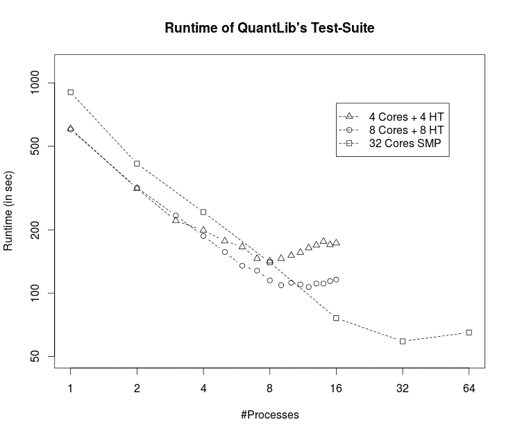

<!--yml

分类：未分类

日期：2024-05-17 23:28:04

-->

# 使用 MPI 的并行单元测试运行器 – HPC-QuantLib

> 来源：[`hpcquantlib.wordpress.com/2015/12/22/parallel-unit-test-runner-using-mpi/#0001-01-01`](https://hpcquantlib.wordpress.com/2015/12/22/parallel-unit-test-runner-using-mpi/#0001-01-01)

更新：2016 年 3 月 10 日：增加了最新 QuantLib 测试套件在 32 核对称多处理机上使用 boost interprocess 而不是 MPI 的构建性能结果。

在最近的一台计算机上运行 QuantLib 的测试套件大约需要 10 分钟。如果测试运行器利用当今多核 CPU 的多个核心并行运行测试，情况将会有很大改善。不幸的是，多线程无法工作，因为 boost 单元测试框架不是线程安全的。加快测试套件的一个合理方法是基于主从模型的多进程使用消息传递。跨平台的标准化 MPI 和 boost::mpi 为此任务量身定制。

缺少的部分是一个外部并行单元测试运行器，它使用 MPI 进行负载平衡和收集测试结果。QuantLib 测试套件的运行器需要 boost 版本 1.59 或更高，可以在[这里](http://hpc-quantlib.de/src/mpiparalleltestrunner.zip)找到。请替换 quantlibtestsuite.cpp 文件第 24 行

```
 #include <boost/test/unit_test.hpp> 
```

由

```
 #include <mpiparalleltestrunner.hpp> 
```

不要将可执行文件与 libboost_unit_test_framework.so 链接，因为新头文件包含了 boost 测试框架的仅头版本（感谢 Peter Caspers 的提示）。负载平衡是整体加速的关键点，因为 QuantLib 的测试套件中有很多长时间运行的测试（最多约 90 秒），应该首先安排这些测试。因此，MPI 测试运行器收集每个单元测试的运行时间统计信息，并将这些信息存储在本地文件中，以规划下一次运行的日程安排。



上面的图表显示了不同并行进程数和 CPU 配置下 QuantLib 测试套件的运行时间。最短运行时间由最长运行的测试用例决定，约为 50 秒。在单个 CPU 上，性能随着核心数的增加而线性扩展，并且超线程核心也有所帮助。使用超过十六个真实核心并不会进一步改善情况，因为总体运行时间已经由最长运行的测试用例主导。
