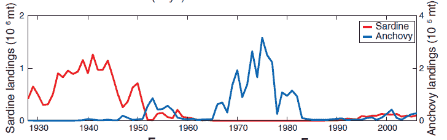

<!--yml

分类：未分类

日期：2024-05-18 06:59:34

-->

# 物理视角：因果关系的新看法

> 来源：[`physicsoffinance.blogspot.com/2012/12/a-new-take-on-causality.html#0001-01-01`](http://physicsoffinance.blogspot.com/2012/12/a-new-take-on-causality.html#0001-01-01)

在因果性这个话题上，新东西出现的频率并不高。这个观念是科学、哲学乃至所有人类思考（我猜非人类也是如此）中最基本的概念之一。发现因果关系有助于我们理解世界，做出预测，使周围的不确定环境变得稍微可预测一些。但我们仍有很多关于因果关系需要学习，尤其是如何使用数据来推断因果关系。

这从一篇迷人的

最近的研究[摘要](http://www.sciencemag.org/content/338/6106/496.abstract)

我认为这最终将对从经济学和金融学到生态学的因果关系应用研究产生相当大的影响。乔治·杉原及其同事的这篇论文 -- 它的标题是“在复杂生态系统中检测因果关系” -- 值得花几个小时去研究，因为它探讨了一些从经验数据中检测因果关系的历史尝试，然后展示了一种似乎比过去技术有重大进展的新技术。

当然，从数据中推断因果关系的关键问题是，仅仅相关并不意味着有因果关系。所讨论的 A 和 B 两件事可能都与其他因果因素 C 有关联，但实际上两者之间并没有因果关系。在经济学中，克莱夫·格兰杰因提出，在

[这篇论文](http://ideas.repec.org/a/ecm/emetrp/v37y1969i3p424-38.html)

1969 年，找到了一种超越相关性的方法。他推理，如果某个事物 X 因果上影响另一个事物 Y，那么在预测方案中包含 X 应该能提高对 Y 的预测。反之，排除 X 应该会使预测更差。换言之，因果因素可以被识别为那些在排除时减少预测准确性的因素。

这种“格兰杰因果关系”的观念直观上是有意义的，并且在计量经济学中找到了许多应用。然而，读一下原文论文，你就会很快发现这个理论是专门为随机变量开发的，尤其是在线性系统。正如格兰杰所指出的，“该理论实际上对于非随机变量并不相关。”这很不幸，因为世界上如此多的东西似乎更适合用非线性、确定性系统来描述。

我刚刚为

*Nature Physics* [一篇短文](http://www.nature.com/nphys/journal/v8/n12/full/nphys2497.html)

描述了杉原

等等。

工作。我假设很多人可能无法访问这篇文章（奇怪的是，我也没有！）所以我想在这里包括几句话。Granger 因果性的一种问题是，作者指出，任何非线性系统的部分之间的亲密联系使得“排除”变量变得几乎不可能。他们为描述狐狸和兔子等两个变量的简单非线性系统相互作用的方向提供了这个例子。称这些群体为 X 和 Y。按照 Granger 的方法，你可能排除 Y 并尝试预测 X。如果排除 Y 降低了你预测的能力，那么你找到了一个因果链接。但这个食谱在这种情况下毫无用处，因为非线性。他们研究的数学模型绝对，通过构造，两个变量之间有因果链接。但 Granger 方法却显示不出来。

为什么？动力系统理论的一个关键结果——被称为 Takens 嵌入定理——意味着人们总是可以从单个变量的滞后样本形式的数据中重建系统的动力吸引子。实际上，X（t）（狐狸数量随时间变化）总是可以从其足够早的先值中预测出来。因此，排除 Y 并不会使 X 变得更加不可预测。Granger 因果性的概念会错误地得出 Y 是非因果的结论。

为了解决这个问题， Sugihara 和他的同事利用嵌入定理的优势。重建技巧可以同时应用于变量 X 和 Y。我不会详述技术细节，这些可以在论文中找到，但这会得到两个数学“流形”——实际上，是可能动力学空间中的子集，描述实际发生的动力学。这两个都描述了整个系统的动力吸引子，一个使用变量 X，另一个使用变量 Y。现在，如果 X 对 Y 有因果影响，合理地，你期望这种影响会显示为这两个流形上动力学之间的直接联系。在一定时间知道一个流形（对于 Y）的状态应该使得在相同时间知道另一个流形（对于 X）的状态成为可能。

这确实很技术化，但实际上并不复杂。原论文提供了一些有助于理解的美丽模拟链接。论文的优势在于展示了如何通过进入动力系统理论的这一小步获得巨大的成果。首先，它在几个测试问题上的表现优于 Granger 方法。更令人印象深刻的是，它似乎已经解决了对现代生态学中一个悬而未决的难题。

生态学家们几十年来一直在争论两种鱼类物种的情况，即太平洋沙丁鱼和北方 anchovy，这两种物种的全球种群在十年时间尺度上强烈地交替变化（见下图中）。这些数据，一些人认为，暗示这些物种之间必须有一些直接的竞争或其他相互作用，例如当一种的数量增加时，另一种的数量就会减少。然而，由于没有直接的观察到这种相互作用，其他人则提出，这种全球同步性泄露了其他东西 —— 全球气候变化带来的海表温度的变化，而这种变化恰好对这两种物种有不同的影响。

令人瞩目的是，新方法 -- 池田和他的同事们给它起了个难忘的名字“收敛交叉映射” -- 似乎一举解决了这个问题。分析显示，两种物种之间没有任何直接的因果联系，而有明确的证据表明，从海表温度到每种物种之间存在联系。在这种情况下，相关性并不是反映因果关系，而是对第三个因素的同时响应，尽管这种响应是相反的。

所以就这样 -- 遵循动力系统理论的基本思想，实际上为非线性系统重建吸引子，这使得揭示因果关系比仅仅相关研究更有力。这是我们对因果关系理解的一个重大进展，我觉得很难相信这个技术不会立即应用于经济学和金融领域，以及生态学、神经科学等领域。如果你涉及到时间序列分析，寻找相关性和因果关系，给

[它](http://www.sciencemag.org/content/338/6106/496.abstract)

一个阅读。
