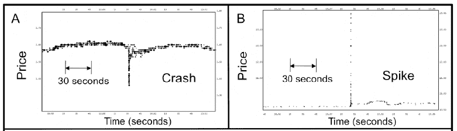

<!--yml

分类：未分类

日期：2024-05-18 07:01:20

-->

# 物理视角：全球金融逼近奇点

> 来源：[`physicsoffinance.blogspot.com/2012/02/approaching-singularity-in-global.html#0001-01-01`](http://physicsoffinance.blogspot.com/2012/02/approaching-singularity-in-global.html#0001-01-01)

在

[一篇新论文](http://arxiv.org/pdf/1202.1448)

关于高频交易趋势的分析，尼尔·约翰逊和同事们指出：

> ……正在修建一条新的专用跨大西洋电缆，仅为美国与英国交易者之间的跨大西洋通信时间缩短 5 毫秒，同时正在推出一种新型专用芯片 iX-eCute，可在 740 纳秒内准备交易……

这恰好说明了当前企业之间为了通过速度获得优势而进行的科技军备竞赛。这个市场上的玩家们并没有过多地担心这场军备竞赛对市场长期系统稳定性的影响；他们只是争先恐后，希望最好的情况出现。我以前写过（

[这里](http://physicsoffinance.blogspot.com/2011/09/high-frequency-trading-downside-part-i.html)

以及

[这里](http://physicsoffinance.blogspot.com/2011/09/high-frequency-trading-downside-part-ii.html)

）一些分析（特别是英格兰银行的安德鲁·霍尔丹的分析）表明，这场竞赛通常会增加市场波动性，并可能导致某种形式的灾难。

我们可能正在接近这个时刻。如果约翰逊和他的同事们是对的，市场已经显示出已经进入了一个由机器主导的阶段，人类在其中几乎没有控制力。

这里的多数读者可能都知道未来学家雷·库兹韦尔的

[预测](http://en.wikipedia.org/wiki/Technological_singularity)

逼近的“奇点”概念——随着我们的技术变得越来越智能，它将在某个时刻创造出自我维持的正反馈循环，推动科学和技术飞速发展，最终导致一种超级智能存在于机器中。人类将被排除在外，落后于时代。考虑到目前计算的未来愿景很大程度上集中在生物启发计算——这类计算机在运作上更类似于生物组织，能够进行自我修复和适应、真正繁殖等，超级智能最终可能具有强烈的生物形态，同时利用早期进化无法利用的技术（超导性、量子计算等）。在这种情况下，如果你认为这个猜想有一定的道理，那么最终所有的计算技术都可能作为一种助产士，帮助从

智人（*Homo sapiens*）

向未来非人类但超级智能物种的转变。

但忘了那件事。想想市场这个更小世界中的奇点。约翰逊和他的同事提出了一个问题，即当今的高频市场是否正在向一个速度边界移动，在那里人类干预和控制实际上是不可能的：

> 社会不断追求更大、更快、更加互联的社会技术系统（如全球金融市场）的负面影响是，未来的灾难可能更难以预见和管理——正如最近的金融闪崩所证实的。在传统的有人机系统中，如果未期望的变化发生在典型的人类反应时间内，实时的人类干预可能是可能的。然而……在人类活动的许多领域，某人能够注意到这种线索并做出物理反应的最快时间大约是 1000 毫秒（1 秒）。

显然，现在的交易速度比这快得多。这让人担忧吗？和作者们一起看看数据。

在 2006-2011 年期间，他们发现（观察多个交易所上的许多股票），在这段时间内，市场在不到 1.5 秒的时间内，有大约 18,500 个具体的事件，要么 1.连续 10 次或更多次下跌，跌幅超过 0.8%，要么 2.连续 10 次或更多次上涨，涨幅超过 0.8%。下面的图表显示了两个典型事件，一个崩溃和一个向上的尖峰，两者都只持续 25 毫秒。

显然，这些非常短暂且瞬间的向下崩溃或向上波动——作者称它们为“裂缝”或“黑天鹅事件”——是同样可能发生的。并且随着时间间隔的缩短，它们变得更有可能发生：

> ……我们的数据集显示，在给定的持续时间窗口内，随着我们转向更小的时间尺度，例如 100-200 毫秒的时间段，这些金融裂缝的发生倾向要远远大于 900-1000 毫秒的时间段。

但他们还发现了一些更加重要的事情。他们研究了这些事件的大小分布，并考虑了当观察在不同时间尺度上发生的事件时，这个分布是否发生变化。数据显示确实如此。对于大约 0.8 秒以上的时间，分布紧密地符合幂律分布，与无数其他关于市场回报在一秒或更长时间内的研究一致。对于小于大约 0.8 秒的时间，分布开始偏离幂律形式。（并不是它变得更加高斯，而是它变成了其他不是幂律的东西。）结论是，当达到小于 1 秒的时间时，市场上发生了非常重要的事情——大致上是人类行动的时间尺度。

好的，现在来说重点——理解这种转变可能如何发生所做的努力。在我上一篇博客文章中

[我写过关于少数派游戏的文章](http://physicsoffinance.blogspot.com/2012/02/minority-games.html)

-- 一个简单市场模型，其中适应性代理商试图通过使用各种不同的策略来获利。尽管简单，但它再现了真实市场的真实统计数据。我预计有些人可能会想知道这个模型是否真的能用于探索真实市场。如果是这样，约翰逊及其同事的新工作为少数游戏在实际中的价值提供了一个有力的例证。

他们的假设是，市场动态在一秒以下的观察转变反映了“从人类和机器的混合阶段到机器超快速全机器阶段的新的基本转变，在这个过程中，机器决定价格变化。” 他们在一个模型中探讨了这一点，该模型...

> ...]考虑一个由 N 个异质代理商（机器和人）组成的生态系统，他们反复竞争有限的资源。每个代理商拥有 s > 1 个策略。只有当代理商在过去最近的时间里有一个表现足够好的策略时，它才会参与。在给定的时间步骤，它使用自己的最佳策略。代理商们坐在那里，观察一个共同的信息来源，例如，最近价格变动编码为一个长度为 M 的二进制字符串，并采取他们观察到的潜在盈利模式行动。

这正是少数游戏

[正如我描述的](http://physicsoffinance.blogspot.com/2012/02/minority-games.html)

几天前。从研究中得出的一个真正重要的教训是，我们应该预计市场会有两个根本不同的动态阶段，这取决于参数α=P/N，其中 P 是代理商能感知的不同过去历史的数量，N 是游戏中的代理商数量。 [P=2

^M

如果代理商在形成自己策略时使用长度为 M 的二进制字符串]。如果α较小，那么相对于他们能感知的不同市场历史数量，玩家就很多。如果α很大，那么相对于只有少数人，就有很多不同的可能历史。这两种极端导致了市场行为非常不同。

约翰逊及其同事认为，这些模式之间的转变正好出现在一秒阈值的统计数据中。他们首先认为，对于大的α（每个代理商有很多策略）的阶段应该与超过一秒的交易模式相关联，在那里，人类和机器都参与其中。为什么？正如他们所建议的，

> 我们将这个时期（见图 3）与一个人类和机器都在决定价格的市场关联，因此这个时期的时标高于过渡时期（>1 秒），原因如下：人类积极交易的存在——以及他们“自由意志”以及他们可以手动重置算法的无数方式——意味着有效数量（即α > 1）。此外α > 1 意味着 m 很大，因此有更多的信息可用，这表明更长的时间尺度... 在这个α > 1 时期，每个策略的平均代理数小于 1，因此由于代理巧合地使用相同的策略而引起的任何拥挤效应都会很小。这种缺乏拥挤导致我们的模型预测，对于α > 1 的任何大价格变动都将是罕见且持续时间较长——正如我们在 1000 毫秒以上的时标数据中观察到的那样。实际上，我们的模型价格输出（例如图 3，右侧面板）重现了与金融市场较长时标相关的典型事实，包括幂律分布。

他们在这里要表达的是，策略空间的拥挤，通过在不同的代理策略之间创造强烈的相关性，应该会使得大市场变动更有可能发生。毕竟，如果很多代理都开始使用同一个策略，他们会在同一时间以同样的方式进行交易。在这个超过一秒的时期，有人的市场，他们认为不应该有太多的拥挤；这里的动态确实给出了动作的幂律分布，但这在所有这个时期的市场中都能找到。

相反，他们认为小于一秒的子时期应该与少数游戏的第α < 1 阶段相关联：

> 我们将α < 1 时期与全机器阶段关联的看法与这样一个事实一致，即在子秒时期内的交易算法需要非常快速地执行，因此相对简单，不涉及太多与过去信息有关的内存：α < 1 时期与全机器阶段的一致性也与子秒时期内的交易算法需要非常快速地执行，因此相对简单，不涉及太多与过去信息有关的内存：因此 M 会很小，所以总策略数会很少，因此... α < 1。我们的模型还预测，在这个超快速时期（α < 1）的黑天鹅大小分布不应该遵循幂律，因为所有大小的变化都不会出现——这再次与图 2 的结果一致。

而且...

> 我们的模型在α = 1 附近发生转变，进入一个由显著的策略拥挤和因此的大波动特征的领域。对于α < 1 的价格输出（图 3，左侧面板），显示由于代理商无意中以群体形式进入特定策略而频繁发生突然变化。因此，我们的模型预测，当我们向更小的α和更小的亚秒时间尺度移动时，超快速黑天鹅事件数量会迅速增加——正如我们的数据所观察到的一样。

作者接着对这个转变进行了更详细的量化。特别是，他们在简单的少数游戏模型中计算了价格波动的标准差。在α < 1 的领域中，这最终被发现与市场上代理商的数量 N 成正比。相比之下，在α > 1 的领域中，它只与 N 的平方根成比例。因此，模型预测，当进入一秒以下的机器主导阶段时，市场波动的大小将急剧增加。

整篇论文需要一些时间来理解，但我觉得这是一个很好的例子，说明一个简单的模型如何探索市场策略互动的丰富动态，并从中获得一些深刻的见解。分析首先表明，高频市场已经度过了“奇点”，它们的动态已经从根本上发生了变化——不再受到人类交易的控制，或至少受到人类交易的强大影响。它还表明，动态的变化直接源于在非常短的时间尺度上操作的策略的拥挤，这种拥挤是由于这些策略需要相对简单。

这种分析真的应该对考虑对 HFT 可能的新法规产生一些影响。但这是个另一个大话题。撇开实际问题不谈，这篇论文展示了视角和像少数游戏这样的玩具模型可能有多么有价值。
