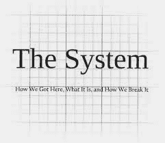

<!--yml

类别：未分类

日期：2024-05-18 06:54:11

-->

# 物理视角：预见下一次金融危机...

> 来源：[`physicsoffinance.blogspot.com/2013/11/foreseeing-next-financial-crisis.html#0001-01-01`](http://physicsoffinance.blogspot.com/2013/11/foreseeing-next-financial-crisis.html#0001-01-01)

（图片链接）

我在彭博社的最新专栏（今天发表，2013 年 11 月 15 日）稍微探讨了一些经济学家的愚蠢言论（诺贝尔经济学奖得主罗伯特·卢卡斯和尤金·法玛等人）认为“金融危机的性质就是不可预测的”。在我看来，这些言论如果经得起推敲，基本上是没有意义的；它们相当于一个借口：“不要责怪我们经济学家对整个系统即将爆炸一无所知！”这篇文章的论点是——这是重要的观点——许多经济学家并没有选择这条容易且可耻的道路，而是承担了发展测量系统性风险的艰苦工作，我们希望这能给我们更好的机会来检测金融市场出现的重大不稳定和失衡。许多人甚至开始与物理学家、工程师和其他这类人合作。如果他们稍有成功，那么我们可能做一些事情来避免未来潜在危机的最坏情况（当然，这需要监管体系在关键时刻不遭受大规模政治干预，这是一个很大的假设）。

作为另一个项目的一部分，我一直在研究最近发展各种系统性风险度量的努力，并且认为一些读者可能会感兴趣。我才刚开始，所以这是一个非常不完整的列表，但这里有一些有趣的东西：

首先，一些来自主流经济学文献的东西：

比西亚洲, D.，弗劳德, M.，洛, A. W.，瓦拉万, S.（2012）。

[系统性风险分析调查](http://www.annualreviews.org/doi/abs/10.1146/annurev-financial-110311-101754)

。

《年度金融经济学回顾》

，

4

（1），255–296。DOI:10.1146/annurev-financial-110311-101754

然后，一些其他人带来了更广泛的思想和方法：

巴蒂斯顿, S.，普尔加, M.，考希克, R.，塔斯卡, P.，卡尔达雷利, G.（2012）。

[DebtRank: too central to fail? 金融网络、美联储和系统性风险。](http://www.nature.com/srep/2012/120802/srep00541/full/srep00541.html)《科学报告》

，

2

541。

贝 ale, N.，兰德, D. G.，巴特雷, H.，克罗克森, K.，梅, R. M.，诺瓦克, M. A.（2011）。

个体风险与系统性风险及监管者的困境](http://www.pnas.org/content/early/2011/07/13/1105882108)

。

《美国国家科学院院刊》

，

108

(31), 12647–52. doi:10.1073/pnas.1105882108

Bookstaber, R. (2012). Office of Financial Research

[使用基于代理的模型分析对金融稳定的威胁](http://www.treasury.gov/initiatives/ofr/research/Documents/OFR_Working_Paper_No3_ABM_Bookstaber_Final.pdf)

.

Farmer, J. D., Gallegati, M., Hommes, C., Kirman, a., Ormerod, P., Cincotti, S., … Helbing, D. (2012).

[一个复杂系统方法构建更好的金融市场和经济管理模型。](http://epjst.epj.org/articles/epjst/abs/2012/14/epjst214013/epjst214013.html) *欧洲物理杂志特别专题*

,

**214**

(1), 295–324. doi:10.1140/epjst/e2012-01696-9

Markose, S. M. (2013).

[系统性风险分析：基于数据驱动的多代理金融网络。](http://www.palgrave-journals.com/jbr/journal/v14/n3/abs/jbr201310a.html)

(MAFN)方法。

**银行监管杂志**

,

*14*

(3-4), 285–305\. doi:10.1057/jbr.2013.10

这些人浪费时间和精力不是很奇怪吗？毕竟，我们仅用几秒钟的思考就知道危机是无法预测的。事实上，有效市场假说(EMH)不是已经告诉我们了吗？这个神圣的原则难道还不足以让我们停止进一步的思考吗？对我来说，这些人坚持他们正在做的事情是个谜。 [对不起，这个奇怪的缩进...我似乎无法摆脱它...]
