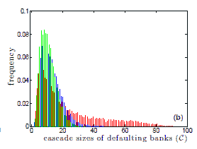

<!--yml

类别：未分类

日期：2024-05-18 06:58:51

-->

# 金融物理学视角：让光明来临

> 来源：[`physicsoffinance.blogspot.com/2013/02/let-there-be-light.html#0001-01-01`](http://physicsoffinance.blogspot.com/2013/02/let-there-be-light.html#0001-01-01)

***更新如下***

我本月在彭博社的专栏文章探讨了一个关于改进银行间借贷市场功能的设想。这个想法虽然激进，但概念上非常简单。它之所以激进，是因为它提出了对银行透明度的彻底变革。它揭示了透明度可能是实现整体银行稳定性和效率的最佳途径。有趣的是，看看自由市场意识形态者对这个想法有何看法，因为这与“让政府远离”或“无监管市场最优”等标准意识形态叙事不符。它提供了一种改进市场功能的方法——自由市场欢呼者们应该会支持这一点——但这样做却威胁到银行保密性，并且还需要一定的中央协调。

由于文章篇幅有限，我的专栏在细节上必然有些模糊，所以让我在这里再做一些讨论。提出这些想法的论文是

[这篇](http://arxiv.org/abs/1301.6115)

由 Stefan Thurner 和 Sebastian Poledna 撰写。首先重要的是要认识到，他们在这里考虑的不是所有市场，而是特定的银行间市场，银行在这个市场中互相借贷资金以管理流动性需求。这个市场在雷曼兄弟破产后闻名于世，因为银行突然意识到他们对潜在交易对手面临的风险毫无了解。Thurner 和 Poledna 提出的解决方案直接针对这种不确定性，通过提供一种计算这些风险并使它们对所有人可见的机制。

他们论点的基本逻辑是这样的。他们从一点出发，即标准的金融理论是基于对金融机构评估风险能力的完全不切实际的假设。即使这些机构中的个人是理性的，今天市场的复杂性如此之高，以至于由于信息不足，判断系统风险变得不可能：

> 从银行业诞生之初，贷款方评估潜在借款人风险的可能性就是必不可少的。在一个理性的世界里，这种评估的结果决定了贷款方-借款方关系（风险溢价）的条款，包括借款人似乎过于危险时可能不会建立任何交易的可能性。当潜在借款人是一个借贷网络中的节点时，该节点的风险性（或信用价值）不仅取决于其财务状况，还取决于与该节点有借贷关系的那些人。这些相邻节点的风险性取决于其邻居的条件，依此类推。在这种情况下，借款方与贷款方之间的风险概念失去了其局部特征，变成了系统性风险。
> 
> 对一个节点的风险性的评估变成了对整个金融网络的评估[1]。这样的练习只能通过有关资产负债网络的信息来完成。到目前为止，该网络中的单个节点还没有这些信息。从这个意义上说，金融网络——特别是银行间市场——是不透明的。这种不透明性使得单个银行在金融网络中无法做出合理的贷款条件决策，这导致了一个基本原则：金融网络中的不透明性排除了理性风险评估的可能性，因此，透明度，即获取系统范围内信息，是任何系统性风险管理的一个必要条件。

在这种情况下，回想一下艾伦·格林斯潘的著名坦白，他信任理性银行家通过控制对手方风险来使市场运作的能力。他在 2006 年宣称，

> “那些寄希望于贷款机构自身利益来保护股东权益的人——尤其是我——处于震惊和不相信的状态。”

问题至少部分在于，无论那些贷款机构多么自私，它们都不可能进行所需的复杂计算，以准确评估那些风险。系统太复杂，它们缺乏必要的信息。因此，正如 Thurner 和 Poledna 指出的，我们可以通过使这些信息更加透明来帮助解决这些问题。

那么问题变成了：这样做可能吗？嗯，这是一个想法。正如作者指出的，要计算与任何一家银行相关的系统性风险，所需的大部分信息已经报告给中央银行，至少在发达国家是这样。没有私人政党有这些信息。没有单一的投资银行有这些信息。也许甚至没有单一的中央银行有这些信息。但是，中央银行共同拥有这些信息，它们可以利用这些信息进行相当有价值的计算（再次，在银行间市场的背景下）：

> 在大多数发达国家，银行间贷款记录在中央银行的“中央信贷登记册”中，该登记册反映了国家的资产负债网络[5]。银行的资本结构可以通过向中央银行的标准报告获得。支付系统以一秒的时间分辨率记录金融流动，例如[6]。已经对资产负债网络的历史数据进行了多项研究[7-12]，包括隔夜市场[13]和金融流动[14]。
> 
> 给定这些数据，中央银行有可能实时计算资产负债表的网络指标，结合银行的资本结构，可以定义银行的系统风险评级。以下提到的系统风险银行是指如果它违约，将对网络中的其他节点产生重大影响（由于信贷失败造成的损失）。网络指标的想法是系统地捕捉这样一个事实，即通过从系统风险银行借款，借款人也变得更加系统风险，因为其违约可能会使贷款方陷入违约。这些指标受 PageRank 的启发，在 PageRank 中，一个链接到著名网页的网页会获得“名声”的一部分。与 PageRank 类似的指标，即所谓的债务等级（DebtRank），已最近用于捕捉金融网络的系统风险水平[15]。

我对这个债务等级的想法写了一点。

[在此处](http://physicsoffinance.blogspot.co.uk/2012/08/debtrank.html)

。这是一个应用于金融网络的计算算法，它提供了一种以连贯、自洽的方式评估系统风险的方法；它使网络效应变得可见。技术细节不是那么重要，但提出这个概念的原始论文是

[在此处](http://www.nature.com/srep/2012/120802/srep00541/full/srep00541.html)

。重要的是，债务等级算法与向中央银行提供的数据相结合，原则上可以计算出任何银行在网络中呈现的整体系统风险的良好估计。

所以想象一下：世界各地的中央银行明天聚在一起，并在一个月左右的时间内协调他们的信息流动（好吧，也许那是乐观的）。他们设置了一些计算机来运行计算，并设立了一个服务器来托管结果，这些结果将每天更新，甚至可能是每小时更新。很快，你、我或世界上任何银行家都能访问某个网站，并在几秒钟内查到任何发达世界银行的债务等级得分，还能看到按他们所呈现的系统风险排名的银行名单。那岂不是很美妙？即使中央银行不再采取进一步措施，这一点本身就是一个有价值的项目，利用全球信息为所有人产生一个全球有价值的信息资源。（注意，公布债务等级得分并不等同于公布银行向其中央银行提供的所有数据。可以保留这些详细信息，只公布整体系统风险的一个单一衡量指标。）

我真诚希望几乎所有人都会支持这样一个项目或类似的项目。当然，有一群人会坚决反对——那些因为系统风险最高而债务等级得分最高的银行。但是，他们的私人关切不应该超越减少这类风险的公共利益。公布这些数字是实现任何此类减少的第一步。

但是 Thurner 和 Poledna 在如何合理使用这些信息以降低系统风险方面走得更远。这是如何运作的。在银行间市场上，银行从其他银行借入不同期限的资金。通常，所有银行都有一个标准的银行间利率（据我了解）。因此，寻求借款的银行在选择贷款银行方面并没有太多的偏好；所支付的利息是相同的。但是，如果贷款银行对贷款银行的選擇并不重要，那么这对我们其他人来说非常重要，因为从系统风险高的银行借款威胁到整个金融系统。如果借款人无法偿还，那家高风险银行可能陷入困境，给整个系统带来麻烦。因此，我们真的应该让在银行间市场上寻求借款的银行首先从系统风险最低的银行借入，即从那些债务等级值低的银行借入。

这就是 Thurner 和 Poledna 的提议。让中央银行规定银行间市场上的借款人在借款时就是这样做的——首先寻找最安全的银行作为贷款人。这样，承担大量系统风险的银行因此被标记为太危险而不能进一步放贷。进一步的借款将由风险较低的银行承担，从而改善系统中的风险分散。不要相信自由市场奇迹会发生这种情况——它不会——但介入并提供一个使其发生的机制。正如作者所描述的：

> 这个想法是通过不允许借款人从风险节点借款来降低 IB 网络的系统风险。这样一来，系统性地风险较高的节点就会受到惩罚，同时为节点建立了一个系统风险性低的激励机制。注意，向一个系统危险节点放贷并不会增加放贷人的系统风险性。我们通过让所有希望借款的银行都能看到所有银行的 DebtRank 来实现这一方案。借款人看到所有潜在放贷人的 DebtRank，并被要求（这是规定的一部分）按照其相反的 DebtRank 顺序向放贷人申请 IB 贷款。换句话说，它必须首先向最安全的银行申请，然后是第二安全的，等等。这样，最危险的银行就被阻止了（盈利的）放贷机会，直到他们随着时间的推移减少其负债，使他们变得不那么危险。只有这样，他们才能再次找到放贷的可能性。这种机制通过网络均匀地分配风险。

在银行间市场上，总体效果至少在理想化模型中——会使得系统性银行业崩溃的可能性大大降低。Thurner 和 Poledna 运行了许多基于代理的模拟来测试这种市场的动态，结果令人鼓舞。这个模型涉及银行、公司和家庭以及它们之间的互动；对于有兴趣的人，论文中有详细信息。底线，如图下所示，是通过银行系统的级联违约变得可能性大大降低。这里红色表示在银行随机选择对手方的情况下，多次运行的银行级联统计可能性（涉及银行的数目）的不同大小；这是一种“例行公事”的情况，类似于今天的市场。相比之下，绿色和蓝色显示了如果借款人相反地寻求避免那些 DebtRank 值高的对手方（绿色和蓝色代表略有不同的条件），同样的分布。显然，系统性问题的可能性大大降低。

另一种说法是：银行在寻求借款时目前根本没有避免从在金融系统中发挥系统重要角色的银行借款的激励。他们不在乎向谁借款。但我们确实在乎，并且我们很容易强制他们——利用目前已经收集到的信息——以一种更负责任、更安全的方式借款。反对这一点能有什么理由呢？

这样一个合理想法实施的机会有多大？我一点也不知道。但我确实希望这些想法能迅速进入那些在新政策制定中起作用的人的视野。

[金融研究办公室](http://www.treasury.gov/initiatives/ofr/Pages/default.aspx)

。

**更新**

一位读者发邮件提醒我注意

[这篇博客](http://www.tyillc.blogspot.co.uk/p/fdr-framework.html)

他倡导“超透明度”理念，将其视为确保金融稳定的手段。乍一看，这很有道理，我认为我今天写的这项工作非常契合这个观点。这个想法很简单，就是政府可以向市场提供信息资源，以支持每个人在评估风险和收益时做出更好的决策。当然，我们需要独立的人士和公司以去中心化方式收集信息。但这还不够。在当今高度复杂的市场中，一些风险对缺乏大量数据和分析手段的人来说是看不见的。目前只有政府能够获取到这样的信息。
