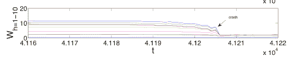

<!--yml

分类：未分类

date: 2024-05-18 07:06:12

-->

# 物理视角：杠杆控制——一个微妙的故事

> 来源：[`physicsoffinance.blogspot.com/2011/07/leverage-control-subtle-story.html#0001-01-01`](http://physicsoffinance.blogspot.com/2011/07/leverage-control-subtle-story.html#0001-01-01)

I

[最近提到](http://physicsoffinance.blogspot.com/2011/07/leverage-control-for-market-stability.html)

一些由 Stefan Thurner 及其同事进行的工作（正在进行中），探讨了杠杆如何影响竞争性、投机性市场中的稳定性（价格波动）。Thurner 在位于英国杜伦的一次关于临界点的会议上谈到了这个问题。我认为这项工作最吸引人的地方在于，它运用了一个足够丰富的模型来展示投机市场中我们看到的许多基本特征——对吸引投资者资金的私募股权基金和其他投资公司的竞争，使用杠杆放大潜在收益，银行对向投资公司贷款的杠杆进行监控，偶尔的市场急剧崩溃和破产等。

这是一个完美的模型吗？当然不是，没有这样的东西；模型是思考的工具。但可以说它比我们现在拥有的任何其他东西都更适合于进行“政策实验”，以测试如果监管机构采取这一步或那一步，这样的市场可能会发生什么——例如，设定允许杠杆的严格限制。

Stefan 友好地把他演讲的幻灯片发给了我，其中有一些我想在这里提一下。如我所说，这是正在进行中的工作，所以这些都是初步结果。它们之所以有趣，是因为它们表明通过杠杆限制来避免危险的市场不稳定是有代价的，而且我们的直觉根本不是可靠的指南——我们需要这类模型，这样我们才能发现意外的结果（在我们在现实中发现它们之前）。

我不会详细描述这个模型；可以在论文的早期草稿中找到

[这里](http://www.google.com/url?sa=t&source=web&cd=1&ved=0CBQQFjAA&url=http%3A%2F%2Fcowles.econ.yale.edu%2FP%2Fcd%2Fd17a%2Fd1745.pdf&rct=j&q=leverage%20causes%20fat%20tails&ei=WJMyTrGsFMySswaviKTpBg&usg=AFQjCNEsxENwyaZ27EMuMPq7UfONzS08KQ&cad=rja)

. Thurner 和同事们已经在改进这个模型好几年了，现在它能够很自然地再现许多现实市场的行为。Thurner 如下总结这些行为：

换句话说，私募股权基金的行为是为了消除误价（从市场中去除波动性），并通过这样做来获利。在激烈的竞争面前，基金必须采取激进的态度才能生存，但如果它们变得过大，就会遭受苦难。风险缩短了基金的生命周期。总体而言，这个模型还能再现市场中正确的统计波动。

正如我在

[我在这项工作早期的帖子](http://physicsoffinance.blogspot.com/2011/07/leverage-control-for-market-stability.html)

-   对冲基金之间的竞争自然会带来杠杆的增加，并推动市场具有肥尾收益分布；它像真实市场一样，受到大的价格波动的影响，这是由其自身的内部动态（无需外部影响）造成的。在这种情况下，市场极易因与噪声交易者（随机买入和卖出的不成熟投资者）相关的小价格波动而引发灾难性崩溃。下面的图表展示了一个典型例子，绘制了不同基金随时间的财富变化，有一个影响所有基金的同时性戏剧性崩溃（不同颜色代表不同的基金）：

-   现在，一个自然的问题是——这些事件可以通过适当的监管避免吗？一个想法是限制允许的杠杆量，以保持市场收益在高斯模式下，即消除肥尾。人们可能会就这种方法是否有效争论数十年而没有答案；这个模型使得进行实验以找到答案成为可能，这就是 Thurner 和他的同事所做的事情。

-   两张图表（下面）显示了一些结果，需要解释。不同的颜色对应于不同的可能监管制度，显示了最大允许对冲基金杠杆的行为如何变化：蓝色（没有其他监管），浅绿色（类似于巴塞尔 I 和 II 的监管，其中向对冲基金贷款的银行受到资本要求限制）和红色（银行监控对冲基金，并在其资产波动性增长时将对冲基金允许的杠杆降低到最大值以下的情况；一种适应性杠杆控制）。

-   首先，考虑一个图表，展示了对冲基金的作用以及它们利用波动性实际上是如何造福市场的——使市场更加有效（从某种意义上说）。

-   该图表显示了平均平方价格波动性与允许的杠杆之间的关系。提高杠杆让对冲基金能更积极地抓住机会，更有效地消除定价偏差。坚定的自由市场主义者应该会喜欢这个结果，因为它显示在没有任何监管的情况下，效果是最强的。受监管的市场需要更高的杠杆才能达到同样的波动性降低。

-   但这还不是全部。现在考虑另一个图表，用于计算对冲基金失败的概率（每单位时间）：

-   在这里，纯粹的自由市场解决方案并不那么好，因为随着杠杆的增加，这种概率会迅速上升。存在一个相对较低的杠杆值（在模型的单位中约为 5） where 市场杠杆的好处已经实现，而更多的杠杆只会导致更多的失败（因为它将市场带入肥尾收益的范畴；即使平均平方波动性保持较小，这也可能发生）。

在这种情况下，受监管的市场表现略有改善——规则减少了失败的次数，为此付出的代价是市场波动性略有增加。

一个令人惊讶的结果是，在这些高杠杆的条件下，这些相同的规则实际上比没有规则更糟糕——它们导致市场波动性增加，并且失败的次数也更多，这是一个真正逆向的规则。

总的来说，这个模型为我们提供了一个令人清醒的视角，让我们了解监管机构如何通过限制杠杆来试图避免与尾部风险相关的市场崩溃。显然，某些限制是有好处的。但是，过多的限制可能会有害，尤其是当与其他市场规则结合时。你不能孤立地测试一个想法，因为它们以意想不到的方式相互作用。

我可能在不久的将来对此有一些进一步的评论。这还在进行中，正如我对它的理解——以及它对更大局面的意义。
