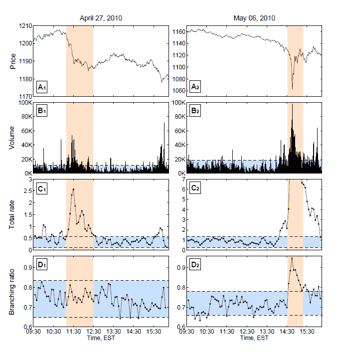

<!--yml

分类：未分类

日期：2024-05-18 07:01:30

-->

# 物理视角：市场——过去十年日益复杂的动态

> 来源：[`physicsoffinance.blogspot.com/2012/01/markets-increasingly-complex-dynamics.html#0001-01-01`](http://physicsoffinance.blogspot.com/2012/01/markets-increasingly-complex-dynamics.html#0001-01-01)

迪迪埃·索内特是我所认识的最有创造力的科学家之一，他总是能提出一种与之前任何人所做的都或多或少垂直的问题解决方法。在一篇刚刚发表的论文（作为预印本）中，他和弗拉基米尔·菲利莫诺夫对一个老问题进行了真正新颖的分析：市场运动是否由 A.外部因素如新闻（外生原因）引起，还是 B.市场内部因素如情绪、信念和意见的雪崩等（内生原因）引起。当然，这个问题直接触及到臭名昭著的效率市场假说，该假说坚持解释 A（全部 A，没有 B）。我以前写过（例如[这里](http://physicsoffinance.blogspot.com/2011/10/what-moves-markets-part-ii.html)和[这里](http://physicsoffinance.blogspot.com/2011/10/private-information-and-jumps-in-market.html)）关于一些试图将新闻源与市场大波动相匹配的研究，以查看后者是否可以由前者解释。通常，证据表明不是，这意味着 A 和 B 的某种混合。现在索内特和菲利莫诺夫采取了一种非常不同的方法，试图使用数学直接测量时间序列动态中有多少可以归因于内生、内部原因。这种数学技术本身很有趣。如果它可以被信赖，那么结果表明，与之前相比，过去十年的市场受到了更多的内生、内部动态的驱动。正如作者指出的，这可能很好地反映了算法交易的爆炸性增长，因为计算机以许多复杂的反馈循环相互交互。

作者们将他们的技术设想为一种测量市场“反射性”量的装置，这里指的是乔治·索罗斯用来描述人类感知和误判如何在市场中相互作用以推动变化的术语。如果能够实现的话，这是一个非常吸引人的想法。它是这样运作的。索内特和菲利莫诺夫将价格时间序列建模为统计“点过程”生成的——这个想法是通过模拟市场中的实际买入和卖出订单的到来生成价格动态。最简单的方法是使用泊松过程，所有时间点的概率相等。这产生了一个随机的价格变动时间序列，但这是一个不切实际的序列，缺乏真实市场最有趣的属性——收益分布的厚尾和波动性（以及成交量波动）的长期记忆。为了得到真实的时间序列，可以让买入和卖出订单的到达时间在时间上具有强的相关性，正如实际市场中所发生的那样。这种技术被称为“自我激励的霍克斯模型”。

另一种表述方式如下。在普通的泊松过程中，平均每单位时间 dt（比如说，1 秒）内发生的事件数量是一个常数，λ。在具有相关性的更丰富的过程中，现在这将是一个关于时间 t 的函数λ(t)。分析的关键在于将这个量（本质上，是关于时间 t 周围买入和卖出订单的到达率）表述为两个非常不同的过程的和——1.由于外部事件（如新闻）等驱动的市场而产生的背景贡献，以及 2.由于现在的订单具有后续影响，从而导致未来进一步订单的反馈贡献。结果就是论文中的方程(1)：

 这里，右侧的第一个项是背景（推动外部动态），第二个项是反馈，h 是某种反映事件在时间 t[i]生成另一个事件在稍后时间 t 的可能性函数。第一个项创造了一个稳定的事件流，第二个项创造了产生事件的事件，从而产生进一步后果的分支流。现在，将此类过程生成的 时间序列拟合到实际金融数据的任务更为复杂，依赖于一些标准的最大似然技术。作者还假设为了简化，函数 h 具有指数形式（事件倾向于在发生后不久引起其他事件，随时间增加则较少如此）。此类拟合中出现的的关键参数是 n，它可以解释为内生事件的份额，或实际上，由内部动态引起的市场活动的份额。统计拟合还估计了μ，这是由外部冲击的背景水平，随时间上升和下降。Sornette 和 Filimonov 使用大约 12 年的 E-mini 期货的每秒数据进行分析，其关键结果在下面的图表中得出。  向下四部分显示了成交量、价格，然后是估计的背景和由内部动态引起的事件的份额，n。最有趣的特点是过去十年中 n 的普遍上升，显示内部动态的 increasing 影响力，或通过内部市场机制引起进一步事件的事件。相比之下，外部冲击的背景——信息驱动的动态——保持相对恒定（除了在雷曼兄弟破产前后出现峰值）。从中，作者提出了一些评论：

> 第一个重要观察是，自 2002 年以来，n 始终高于 0.6，自 2007 年以来，在 0.7 和 0.8 之间，偶尔达到 0.9。这些值直接转化为结论，自 2007 年以来，超过 70%的价格变动本质上是内生的，即不是由于外部新闻而是由于过去价格变动的正反馈。第二个显著的事实是在 1998-2010 年期间存在四种市场体制：
> 
> (i) 在 1998 年第一季度到 2000 年第二季度的期间，互联网泡沫的最后冲刺与 n 围绕 0.3 的稳定分支比波动有关。
> 
> (ii) 从 2000 年第三季度到 2002 年第三季度，n 从 0.3 增加到 0.6。这个阶段对应于互联网泡沫破裂和经济衰退后的一系列涨跌和恐慌。
> 
> (iii) 从 2002 年第四季度到 2006 年第四季度，可以看到 n 从 0.6 缓慢增加到 0.7。这一时期对应于双房地产泡沫、金融产品 CDO 和 CDS 泡沫、股市泡沫和商品泡沫的“辉煌岁月”。
> 
> （iv）在 Q1-2007 之后，分支比稳定在 0.7 至 0.8 之间，这与次贷金融危机（首次警报于 2007 年 2 月）的开始相对应，而这场危机的余震在撰写本文时仍在共振。

应当强调的是，本文的分析仅对内生动态变化敏感，时间尺度仅约为 10 分钟或更短。这是由于需要一些假设来处理数据的高度非平稳特性，因为过去十年交易量爆炸式增长。因此，十年初期 n 的较低值可能反映了该分析未能检测到在更长时间尺度上（例如互联网泡沫破裂时）重要的内生反馈。现在谈谈可能是本文最吸引人的一点——这个分析或许能够区分由真实新闻或其他基本变化引起的大型市场波动，与纯粹由人类行为（恐慌等）或算法反馈引起的泡沫。Sornette 和 Filimonov 研究了两个具体事件，分别是 2010 年 4 月 27 日和 5 月 6 日，市场在这两天突然并以戏剧性方式移动。第一个事件是由标普下调希腊债务评级引起的，第二个事件当然是“闪崩”。使用他们的方法对这两个事件进行相同分析显示，这两个事件的结果截然不同： 这里的“分支比”就是我们一直在谈论的 n——市场动态中由内生动态引起的比例。最显著的发现是，尽管 4 月 27 日的第一个事件显示这个值绝对没有变化，这可以理解，因为该事件的明显外部信息起源，但 5 月 6 日的“闪崩”显示了内生动态的突然激增。因此，基于这个例子，看来这个参数 n 像是一面旗帜，标识由强大内生反馈引起的事件。正如作者所说的，

> 图 3 的顶部四个面板显示，2010 年 4 月 27 日和 5 月 6 日发生的两个极端事件具有相似的价格下跌和交易量。特别是，我们发现与前一日 95%的分位数相比，2010 年 4 月 27 日的交易量增加了 4.7 倍，而 2010 年 5 月 6 日的交易量增加了 5.3 倍。主要区别在于交易率和分支比。实际上，根据我们对 Hawkes 模型的校准，2010 年 4 月 27 日的事件可以被分类为一个纯粹的外生事件，因为分支比 n（图 3D1）与之前和之后的时期相比没有显示出任何统计上显著的变化。相比之下，对于 2010 年 5 月 6 日的闪崩，我们可以观察到统计上显著的 n（图 3D2）内生性水平的增加。在高峰时，n 从之前平均水平的 72%增加到 95%，这意味着在高峰时刻（东部时间下午 2:45），超过 95%的交易是由内生触发效应引起的，而不是真实新闻。

你相信吗？我觉得这个说法挺有道理的。我猜最好能看到的是这种方法应用于我们知道其动态来源的时间序列的一些彻底测试。也就是说，拿一个混沌振荡器这样的东西，用可控水平的 external noise 去驱动它，看看这个方法是否能 generally 给出可靠的结果，以判断发生的事情有多少是由噪声驱动的，有多少是由内部动态驱动的。也许这已经在描述自我激励 Hawkes 模型发展的某些论文中已经完成了。我会试着去查查这个。无论如何，我认为这无疑是一种对市场内生与外生动态这个古老问题的新颖且具有挑衅性的新方法。实际上，我一点也不觉得 n 在过去十年显著增加的结果令人惊讶。这正是随着交易转向以毫秒级对其他算法行为的反应的算法，我们所预期的精确结果。
