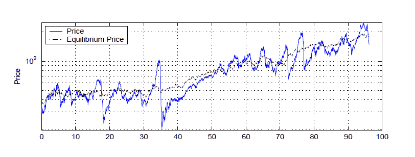

<!--yml

类别：未分类

date: 2024-05-18 07:01:38

-->

# 物理学视角：市场的自然模型

> 来源：[`physicsoffinance.blogspot.com/2012/01/natural-models-of-markets.html#0001-01-01`](http://physicsoffinance.blogspot.com/2012/01/natural-models-of-markets.html#0001-01-01)

我已经写了很多关于传统经济模型在市场中的缺陷。最值得注意的是，这样的模型——通常以理性行为的代表为特征，这些行为（根据假设）导致某种市场均衡——通常无法解释真实市场的基本动态特征。其中最突出的包括：1）所有市场都倾向于大幅价格波动； reflected in

["fat tailed" returns 分布](http://physicsoffinance.blogspot.com/2011/12/power-laws-in-finance.html)

，和 2）具有强烈和持久的波动性，具有精细的长期记忆特征，这与波动性“聚类”在市场中的方式密切相关。

这些现象在价格运动统计学中显示出特定的数学特征，这些特征呈现出市场上任何体面的模型都应该相当自然地复制的最明显细节之一。能够做到这一点的模型只在过去的二十年中出现，而且只有通过与平衡的新古典传统明确决裂才能成功。

[这篇简短的评论](http://people.brandeis.edu/%7Eblebaron/wps/style.pdf)

经济学家布雷克·勒巴隆（Blake LeBaron）于 2006 年撰写的一篇文章很好地介绍了进行这种工作的动机，这在很大程度上遵循了自然科学的传统（与现代经济学大部分不同），即通过做出合理的假设探索模型的解释并探索随之而来的结论。

这是我接下来几个月将要写的一个话题（与我正在进行的长期项目相关）。勒巴隆的评论有点陈旧（5 年前），需要更新，但他非常有效地描述了一些关键点。有几个要点值得一提：

勒巴隆首先概述了他称之为“金融市场主要谜团”的一些内容，这与我刚才提到的事物直接相关。首先是简单的波动性的存在：

> 波动性是金融领域最明显，也可能是最重要的谜团。为什么金融价格和外汇汇率相对于其他宏观系列在短期和长期基础上波动如此之大？金融波动性的整体困难首次在希勒（1981 年）中得到证明，更新见希勒（2003 年）。问题在于很难找到足够多的金融或宏观经济基本面来解释观察到的金融市场的大幅波动。作为一个潜在的政策问题，以及长期投资者的问题，这可能是金融模型师面临的最重要的难题。

正如勒巴伦所指出的，许多模型（如 ARCH、GARCH 等）已经产生，这些模型能够复现波动率的数学特性，但并没有试图去理解其根源。而且，在传统经济学中，大多数模型由于坚持认为个体大致相同且具有理性预期，从而完全回避了需要建模的非常现象：

> 许多金融市场波动率的持续性导致了大量模型的产生，并且在学术和商业领域引起了极大的兴趣。然而，尽管有很多实证活动，波动率持续性的微观经济动机仍然不被很好地理解。很少有模型甚至去解决这个问题。这可能是因为在均质代理框架下这个问题简直太难了。

勒巴伦列举的市场第二个难题我已经在上面提到过：市场回报的“肥尾”现象或者在统计学行话中所谓的“过度峰度”：

> 在相对较高频率（不到一个月）的金融回报并不呈正态分布。它们不需要呈正态分布有一个强有力的理论原因，但是常常寄希望于中心极限定理能够在时间累积后使回报接近正态分布。最近，一个新的领域——经济物理学出现，强调回报还具有其他可以通过幂律描述的结构。幂律的确定和检验仍然是一个相对开放的领域，产生可接受幂律图像的过程集合也不是很好理解。

除了波动率的长记忆和回报的肥尾现象外，他还提到了交易量的丰富动态，这一点和价格的动态一样有趣。不幸的是，勒巴伦指出，当涉及到交易量的动态时，“大多数传统金融模型仍然保持沉默。”

勒巴伦正确地指出，这些时间上的丰富动态几乎肯定与两件事直接相关：1）不同市场参与者在任何时刻有不同的预期（实际上，正是这些差异推动了交易）和 2）这些差异随时间不断演变。这表明，对于这些所谓“风格化事实”的起源（以及类似的事实）的合理解释，很可能源自于那些试图跟踪和捕捉关于在多样化互动个体群体中信念和预期动态的模型：

> 金融领域许多令人费解的结果都与行为异质性和异质性的动态问题有关。将市场异质性作为一种需要建模的复杂动态状态变量的研究，可能是基于主体模型的一个定义性特征。交易量等经验特征与市场中的异质性直接相关，并且需要能够解决这个问题的需求模型。其他经验特征可能与之间接相关。大波动、过度峰度以及市场崩溃都可能源于某种策略相关性，这种相关性使大数定律在市场整体上无法良好运作。这些变化模式只能在允许主体策略随时间适应和调整的框架内探索...

我认为关于大数定律失败的这一点，虽然显而易见，但仍值得强调。市场中的某些因素破坏了独立因素驱动价格变动的正常统计学简单图景。不知怎的，不同市场参与者的行为必须变得相关，从而导致非正常的肥尾回报和长记忆效应。当然，原则上可能有多种机制导致这种独立性的缺乏（例如，一些参与者跟随趋势就可能足够了）。

现在，我怀疑真正在金融领域工作的人会认为这个观察结论有什么新颖之处。然而，许多经济学家似乎决心继续将市场建模为并非如此。我对经济历史了解不够，不知道为什么同质性理性预期观点有如此多的追随者，但这确实让我感到非常奇怪。

勒邦的评论其余部分探讨了一个例子，即一种类型模型的例子——一个远离平衡状态的市场的主体基础模型——它自然地至少在定性上重现了上述特征。这个想法仅仅是尊重市场中的主体是不同的，并且随着时间的推移会改变他们的行为，适应市场中的发生的事情。并没有预设市场价格必须趋于平衡；市场就是人们在互动、交易和尽可能盈利的过程中所做的事情。这里探讨的简单模型是勒邦在 2002 年开发的，但与许多其他人开发的模型具有基本特征。主体可以在风险资产（股票）和无风险债券之间进行选择，并且他们使用各种信息来制定他们的交易策略：

> 代理商在一组投资组合策略中进行选择，这些策略将当前资产市场信息映射为风险资产推荐的投资组合财富比例。这个比例可以从零变到一，因为不允许卖空和借款。信息包括滞后回报、股息价格比率以及几个趋势指标。代理商必须使用过去的业绩来评估规则，而在这方面，他们被假设是异质的。代理商使用不同数量的历史信息来评估规则。换句话说，他们在评估策略时具有不同的记忆长度。一些代理商使用 30 年的数据，而其他人可能只使用 6 个月的数据。这样这个模型实现了行为特征。首先，代理商显然是有限理性的，因为他们不试图确定整个
> 
> 经济的状态空间，如果他们尝试这个，将会非常难以处理。此外，他们被假设具有“小样本偏差”，因为他们没有全部选择使用尽可能多的数据。

这篇论文容易阅读，所以我不会详细解释太多，但在这种环境下学习与适应性代理之间的互动立即使结果比传统模型更真实、更有趣。例如，下面的图表显示了风险资产价格随时间的变化。在该模型中，有一个真正的均衡价格，它以一种正常、高斯的方式（与股息相关）波动。市场中的实际价格很少处于这种均衡状态，而是围绕它有很大的波动，有时过高，有时过低，并且经常从一个点迅速移动到另一个点。

现在这个时间序列有些特征看起来并不真实。例如，似乎有一定的周期性。但这是一个非常简单的模型，令人兴奋的是它做对了什么——轻松地给出了一个市场模型，该市场永远不会稳定到价格，具有持续的波动性，收益分布的厚尾，交易量的丰富动态等。详细信息可以在论文中找到。

正如 Le Baron 在评论中总结的那样，

> 基于代理商的模式比其他框架在解释这些特征方面取得了更多的进展，因为它们的本质是一个处理信息不同的人的世界，并且努力不断地调整和适应他们的行为。这个市场可能永远也不会达到看起来像均衡有效市场的任何东西，但它正朝着这个目标不断斗争。这些模型解释的事实范围，以及它们对不同结构和参数的鲁棒性解释，令人印象深刻。目前，没有其他模型能以这种简单和风格捕捉这么多事实。

如我所说，那是五年前的事了。然而，最终的声明仍然非常真实。我认为，即使对大多数经济学家来说，基于代理的模型目前是超越均衡经济学中限制性和不切实际的平衡假设，并构建正确把握市场基本行为的模型的最佳技术。

我打算让这篇文章只是一个探索当前在更现实的非均衡市场模型发展中所发生的事情的开始。目前这个领域正在迅速发展，有很多有趣的问题需要解决。例如，这类模型通常涉及相当多的参数，描述代理人的策略等等。然而，许多模型尽管在这样参数上有很大差异，但仍然非常相似。一个开放的问题是，是否可能发展出一种可能的模型空间的地图，展示不同的模型所属的一组类别。物理学家 Luciano Pietronero 在这个方向上做了一些有趣的工作。

无论如何，我很难理解为什么今天还有人会继续研究同质理性平衡，至少在应用到金融市场方面。
