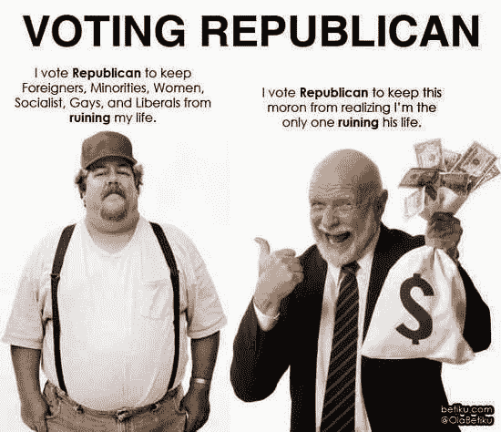

<!--yml

分类：未分类

日期：2024-05-18 06:50:33

-->

# 物理视角：政治极化——现在比以往任何时候都糟糕!!!!

> 来源：[`physicsoffinance.blogspot.com/2014/09/political-polarization-now-worse-than.html#0001-01-01`](http://physicsoffinance.blogspot.com/2014/09/political-polarization-now-worse-than.html#0001-01-01)

我认为上面的图片确实捕捉到了一个真相。但我也不确定推动民主党的政治力量有多少好转。无论如何，我有

一个新事物：[`medium.com/bull-market/political-polarization-is-worse-than-ever-d7cf1fa52f7c`](https://medium.com/bull-market/political-polarization-is-worse-than-ever-d7cf1fa52f7c)

在 Medium.com 上关于政治极化以及根据国会投票模式，现在的状况比以往任何时候都要糟糕：

> 政治极化和僵局。它比以往任何时候都糟糕，至少表面上看起来是这样。实际上，自从 65 年前以来，情况一直更糟。这是研究人员通过查看自 1949 年以来美国政治极化的历史，根据国会投票记录得出的结论。[最近的一项研究](http://www.santafe.edu/research/working-papers/abstract/263c5f6518c2dd9dd61e89418d009e9e/)发现，不同政党成员之间的合作现在比以往任何时候都缺乏。实际上，在尼克松时代，甚至在越南战争和水门事件最具有分裂性的日子里，当一个总统和副总统被迫辞职，甚至在马丁·路德·金 Jr. 和罗伯特·F·肯尼迪被暗杀后的混乱中，情况实际上要好得多。

整个（简短）内容是

在这里：[`medium.com/bull-market/political-polarization-is-worse-than-ever-d7cf1fa52f7c`](https://medium.com/bull-market/political-polarization-is-worse-than-ever-d7cf1fa52f7c)

.
